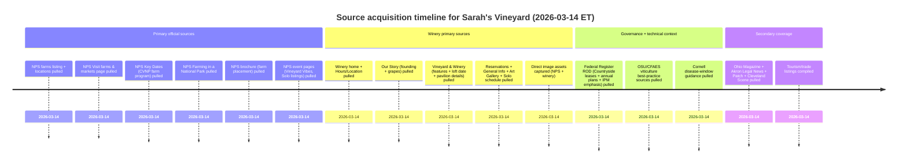
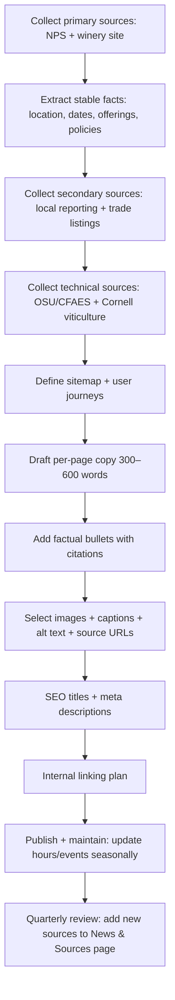

# Sarah’s Vineyard in Cuyahoga Valley National Park

## Executive summary

Sarah’s Vineyard is a vineyard + winery + art gallery operating inside entity["point_of_interest","Cuyahoga Valley National Park","ohio, us"] as part of the park’s farm leasing program (the Countryside Initiative). The entity["organization","National Park Service","us federal agency"] lists Sarah’s Vineyard as a Countryside farm site with indoor/outdoor dining and an annual Summer Solstice Wine, Art, & Music Festival. citeturn1view1turn14view1

The winery’s own pages provide operational facts needed for accurate web copy: founder story (founded 2007; opened May 2007; named in memory of Sarah), the nine grape varieties currently grown, typical hours, reservation thresholds, and site features (tasting room, loft built in 2011, butterfly garden, deck, pavilion with large fireplace). citeturn9view1turn9view2turn9view0turn18view1turn18view2turn18view3

For rigorous “unique content” that is not just brochure text, the strongest approach is to anchor each page in (a) NPS primary sources about the farming program and its constraints (long-term agricultural leases; annual operating plans; NPS approval; IPM emphasis; fencing expectations), then (b) Sarah’s Vineyard primary sources about its place, operations, and offerings, then (c) credible local reporting and (d) Ohio/Great Lakes viticulture extension sources to explain what “sound viticultural practices” plausibly entail in this climate (canopy management, disease windows, scouting, and common disease pressure). citeturn17view2turn17view0turn9view0turn14view2turn7search2turn7search0

## Research base and key verified facts

Sarah’s Vineyard appears in official NPS farm listings and “Visit farms and markets” guidance, naming the Lytz family, the business types (vineyard/winery/art gallery), and programming (annual Summer Solstice festival in June; live music/entertainment; indoor/outdoor dining). citeturn1view1turn14view1

Official NPS program documentation (Federal Register Record of Decision for CVNP’s rural landscape management plan) provides unusually concrete facts that most winery sites omit: the Countryside Initiative centers on long-term leases (up to 60 years), selection via RFP, annual operating plans requiring NPS approval (including pesticide/fertilizer/water use), and an emphasis on cultural practices, biological pesticides, and NPS integrated pest management. citeturn17view2

Sarah’s Vineyard’s own “Our Story” and “Vineyard & Winery” pages establish: founded 2007; the tasting room structure is built using a pre–Civil War hand-hewn timber frame; the loft addition completed May 2011; and the nine grape varieties grown (Cabernet Franc, Cayuga, Chambourcin, Frontenac, Niagara, Rubiana, Seyval, Traminette, Vidal). citeturn9view1turn9view0

Local reporting adds operational history and scale context (e.g., planting in 2003; opening to customers in May 2007; renovations; seating capacity claims) and situates the winery relative to entity["point_of_interest","Blossom Music Center","cuyahoga falls, oh"]. citeturn2search8turn2search1turn2search4

Viticulture extension sources relevant to Northeast Ohio (high humidity disease pressure) substantiate the technical explanations: canopy management practices (e.g., shoot thinning improves airflow and reduces disease pressure) and the critical disease management window around bloom (pre-bloom through ~2–3 weeks post-bloom). citeturn14view2turn7search2turn7search0

image_group{"layout":"carousel","aspect_ratio":"16:9","query":["Sarah's Vineyard Winery & Art Gallery Cuyahoga Falls Ohio vineyard rows","Sarah's Vineyard tasting room interior","Sarah's Vineyard pavilion fireplace","Sarah's Vineyard Summer Solstice Wine Art Music Festival"]}

## Visitor-flow sitemap and page map

The site map below is designed for a first-time visitor path: **Home → Plan Your Visit → Wines/Food → Events → Art & Grounds → Vineyard & Practices → Park & Program Context → More Info**. It matches what NPS visitors need (location + expectations) and what winery visitors need (hours/reservations/menus/events), while preserving program integrity (why this place is different inside a national park). citeturn14view1turn17view0turn9view2

```text
SarahsVineyardCVNP.com
├─ Home
├─ Visit
│  ├─ Hours & Location
│  ├─ Reservations
│  ├─ Accessibility & Policies
│  └─ FAQs
├─ Wines
│  ├─ What We Make
│  ├─ Estate vs. Sourced Fruit
│  └─ Tastings & How to Order
├─ Food
│  ├─ Kitchen Overview
│  └─ Wood-Fired Pizza Days
├─ Events
│  ├─ Solo at Sarah’s
│  ├─ Summer Solstice Festival
│  └─ Private Events & Rentals
├─ Art & Grounds
│  ├─ Art Gallery
│  └─ Garden / Deck / Pavilion
├─ Vineyard & Practices
│  ├─ Grapes We Grow
│  ├─ “Sound Viticultural Practices” Explained
│  └─ Seasonal Work in the Vineyard
├─ CVNP & Countryside Initiative
└─ More Info
   └─ News & Sources
```

Page mapping (targets + “primary anchors”):

| Page | Target draft words | Primary anchors (most authoritative first) |
|---|---:|---|
| Home | 450 | NPS farms listing; Sarah’s Vineyard Our Story; NPS Visit Farms & Markets |
| Visit | 550 | Sarah’s Vineyard Hours & Location; Reservations; NPS Visit Farms & Markets; NPS brochure |
| Wines | 550 | NPS farms listing; Sarah’s Vineyard site (varieties + story); Ohio Magazine profile; Akron Legal News |
| Food | 450 | NPS farms listing; NPS Vineyard Vibes event page (food + wood-fired pizza); Sarah’s Vineyard site (menus exist) |
| Events | 600 | NPS farms listing; Sarah’s Vineyard Solo at Sarah’s page; NPS event pages; local festival coverage |
| Art & Grounds | 550 | Sarah’s Vineyard Vineyard & Winery page; Art Gallery page; NPS farms listing |
| Vineyard & Practices | 600 | Sarah’s Vineyard grape varieties + “sound viticultural practices” statement; OSU/CFAES + Ohioline; Cornell disease window |
| CVNP & Countryside Initiative | 600 | Federal Register ROD (Countryside Initiative; leases; annual plans; IPM); NPS Farming in a National Park; NPS Countryside Initiative |
| More Info → News & Sources | 500 | All sources indexed + annotated |

Citations for the table’s anchors: citeturn1view1turn14view1turn9view1turn9view2turn18view1turn15view2turn15view0turn17view2turn17view0turn14view0turn2search4turn2search1turn7search0turn14view2turn7search2

## Web-ready content drafts by page

Below, each page includes: draft copy (300–600 words), factual anchors (3–5), image suggestions (with captions + alt + source URLs), SEO, internal links, and prioritized sources.

**Page: Home**  
**Draft content (≈450 words)**  
Sarah’s Vineyard is a working vineyard, winery, and art gallery located inside Cuyahoga Valley National Park. The site is part of the park’s Countryside Initiative—an unusual model that keeps historic agricultural landscapes active by leasing farm properties to operators who follow sustainability guidelines appropriate for a national park setting. citeturn1view1turn17view0turn17view2

For visitors, the experience combines three things in one place: wines produced from grapes grown on-site and from partner fruit sources when needed, a rustic tasting room housed in a timber-frame structure, and a rotating art gallery featuring local and national artists. The National Park Service notes that the Lytz family grows multiple grape varieties and makes nearly a dozen wines, including an estate wine, and that the site offers indoor and outdoor dining plus entertainment. citeturn1view1turn14view1

The vineyard’s story is personal and specific. The business was founded by entity["people","Margaret Lytz","winery co-founder"] and entity["people","Michael Lytz","winery co-founder"], named in memory of Sarah (died 1998), and opened to customers in May 2007 after years of development work. The winery also publishes the nine grape varieties currently grown at the site—giving visitors a clear sense of what “local fruit” means here. citeturn9view1turn2search1

Seasonally, Sarah’s Vineyard is also known for programming: “Solo at Sarah’s” midweek winter live music and a Summer Solstice Wine, Art, & Music Festival typically held in June, as highlighted by the park and by the winery’s own event pages. This site is designed so you can plan a visit quickly (hours, reservations, first-time tips) and then go deeper (how the vineyard works, what practices matter in Ohio’s climate, and how operating inside a national park changes the “rules of the road”). citeturn14view1turn18view2turn1view1

**Factual anchors (3–5)**  
- NPS identifies Sarah’s Vineyard as a Countryside farm site (vineyard/winery/art gallery) and notes “nearly a dozen wines,” including an estate wine. citeturn1view1turn14view1  
- Sarah’s Vineyard states it was founded in 2007 and that the doors opened in May 2007. citeturn9view1  
- Sarah’s Vineyard lists nine grape varieties grown on-site (Cabernet Franc, Cayuga, Chambourcin, Frontenac, Niagara, Rubiana, Seyval, Traminette, Vidal). citeturn9view1turn1view3  
- NPS notes the annual Summer Solstice Wine, Art, & Music Festival occurs in June. citeturn1view1turn14view1  
- NPS “Farming in a National Park” describes the park farm program as leases under “strict guidelines for sustainable farm management.” citeturn17view0  

**Suggested images (caption • alt • source URL)**  
- “Harvest day in the vines.” • Alt: “People harvesting grapes between lush green vineyard rows under dramatic clouds.” • Source:  
```text
https://www.nps.gov/cuva/learn/images/20240820-SV-Harvesting-teamwork-1-NPS-Bob-Trinnes.jpg
```  
citeturn8view0turn1view1  
- “Rustic tasting room interior.” • Alt: “Wood-beam tasting room with tables and natural light.” • Source:  
```text
https://www.sarahsvineyardwinery.com/sites/default/files/styles/square_medium/public/assets/gallery/tasting-room-001.jpg
```  
citeturn10view2  
- “Pavilion fireplace gathering space.” • Alt: “Stone fireplace inside an open-sided pavilion with café tables.” • Source:  
```text
https://www.sarahsvineyardwinery.com/sites/default/files/editor/medium_Pavilion%20Web.jpg
```  
citeturn11view4turn9view0  

**SEO**  
- Title: “Sarah’s Vineyard | Winery, Art Gallery, and Vineyard in CVNP”  
- Meta description: “Visit Sarah’s Vineyard in Cuyahoga Valley National Park—wine, dining, art, live music, and a working vineyard rooted in the park’s Countryside Initiative.”

**Internal links**  
```text
/visit
/wines
/events
/art-and-grounds
/vineyard-and-practices
/cvnp-and-countryside
/more-info/news
```

**Prioritized sources (direct URLs)**  
```text
https://www.nps.gov/cuva/learn/farms.htm
https://www.nps.gov/thingstodo/visit-cuyahoga-valley-farms-markets.htm
https://www.sarahsvineyardwinery.com/our-story
https://www.nps.gov/cuva/learn/historyculture/farming-in-a-national-park.htm
```

---

**Page: Visit**  
**Draft content (≈550 words)**  
Sarah’s Vineyard is located at 1204 W. Steels Corners Rd., Cuyahoga Falls, Ohio 44223. The winery publishes current hours and closure notes on its official “Hours & Location” page; as of access in March 2026, normal business hours are Wednesday–Saturday 12pm–9pm and Sunday 12pm–7pm, with occasional early closures and holiday closures posted. Treat hours as “live operational data” and re-check before driving. citeturn9view2turn14view1

Reservations are structured around group size. The winery states it takes reservations for groups of 8+ by phone, while groups under 8 are seated first-come/first-served. It also publishes additional rules that affect planning: dogs on leash are allowed at picnic tables; groups larger than 15 incur an automatic 20% gratuity; and it offers a private rental space (the loft) for groups of 20–40. citeturn18view1turn9view0

Because the vineyard sits inside Cuyahoga Valley National Park, first-time visitors also benefit from “park-context expectations.” The NPS “Visit farms and markets” guidance emphasizes that farms are working sites and that surfaces can be unpaved (turf, gravel, mulch) and muddy; accessibility varies by site and season, so planning should account for weather and footwear. The park brochure places Sarah’s Vineyard on Steels Corners Road north of Hampton Hills, in the southern portion of the park’s farm network. citeturn14view1turn15view2

On property, Sarah’s Vineyard describes multiple seating and service zones: table service in the tasting room, deck, and butterfly garden; bar service in the pavilion and adjacent picnic tables. Policies also matter for compliance: the winery states outside food is not permitted (except in specific private bookings) and that, by Ohio law, alcohol consumed on site must be purchased through Sarah’s Vineyard. (Publish these constraints on the Visit page so visitors see them before arrival.) citeturn18view0turn9view0

A minimal “visit checklist” that reduces friction: check hours; decide whether your party is 8+ (call ahead); pack for variable outdoor surfaces; and if you’re coming during peak event dates, expect longer waits and parking demand. For visitors building a full “park day,” Sarah’s Vineyard can be one stop among trails and park attractions; just remember it remains a working business site within a national park landscape. citeturn17view0turn14view1

**Factual anchors (3–5)**  
- Winery address: 1204 W. Steels Corners Rd., Cuyahoga Falls, OH 44223. citeturn9view2turn14view1  
- Winery’s posted normal business hours (as of March 2026 page view): Wed–Sat 12pm–9pm; Sun 12pm–7pm. citeturn9view2  
- Reservations: groups 8+ by phone; under 8 first-come/first-served; private loft rental for groups of 20–40; 20% gratuity for groups larger than 15. citeturn18view1turn9view0  
- NPS brochure locates Sarah’s Vineyard on Steels Corners Road north of Hampton Hills. citeturn15view2  
- NPS notes farms are generally not wheelchair accessible; surfaces are often turf/mulch/gravel and can be muddy. citeturn14view1  

**Suggested images (caption • alt • source URL)**  
- “The tasting room: main seating + bar + kitchen.” • Alt: “Large wood-beam room with tables arranged for dining.” • Source:  
```text
https://www.sarahsvineyardwinery.com/sites/default/files/styles/square_medium/public/assets/gallery/tasting-room-001.jpg
```  
citeturn10view2turn9view0  
- “Deck views over the vines.” • Alt: “Outdoor seating overlooking vineyard rows.” • Source:  
```text
https://www.sarahsvineyardwinery.com/sites/default/files/editor/medium_A0D_6089Web.jpg
```  
citeturn12view0turn9view0  
- “Garden seating (seasonal).” • Alt: “Outdoor garden area with chairs and flowering plants.” • Source:  
```text
https://www.sarahsvineyardwinery.com/sites/default/files/editor/medium_A0D_6081Web_0.jpg
```  
citeturn11view2turn9view0  

**SEO**  
- Title: “Visit Sarah’s Vineyard | Hours, Reservations, and What to Expect”  
- Meta description: “Plan your visit to Sarah’s Vineyard in CVNP: current hours, group reservations, seating areas, policies, accessibility notes, and directions.”

**Internal links**  
```text
/wines
/food
/events
/art-and-grounds
/cvnp-and-countryside
```

**Prioritized sources (direct URLs)**  
```text
https://www.sarahsvineyardwinery.com/hours-location
https://www.sarahsvineyardwinery.com/reservations
https://www.nps.gov/thingstodo/visit-cuyahoga-valley-farms-markets.htm
https://www.nps.gov/cuva/planyourvisit/park-brochure.htm
https://www.sarahsvineyardwinery.com/general-info
```

---

**Page: Wines**  
**Draft content (≈550 words)**  
Sarah’s Vineyard produces wines connected to its on-site vineyard while also operating as a full-service winery and restaurant. The National Park Service summarizes the core offering plainly: multiple grape varieties grown and “nearly a dozen wines,” including an estate wine. Use that NPS phrasing as your stable “evergreen” baseline (wine lists change; that does not). citeturn1view1turn14view1

To make the wine page “unique” (not just a list), orient it around how visitors actually decide: “What styles do you make?” “What does estate mean here?” “How do I choose if I don’t know wine?” The winery’s own story page provides the most important local fact: which grapes are grown onsite (nine named varieties). That list is meaningful because it indicates Northeast Ohio hybrid and cool-climate suitability alongside vinifera (e.g., Cabernet Franc) and labrusca-associated grapes (e.g., Niagara) that can perform reliably in regional conditions. citeturn9view1turn1view3

Local profiles add color without locking you into a volatile inventory. Ohio Magazine has described “staple wines” and identifies several specific labels as examples (use them as historical reference, not a promise): Blue Heron, Golden Solstice, Sarah’s Secret, Miserabile, Cuyahoga Valley Reserve, and Sweet Elisa (also described as a best-seller in that profile). Akron Legal News similarly notes the nine planted varieties and describes sourcing grapes from other places as a hedge against local hazards (e.g., frost risk), which is a credible explanation visitors should understand: sourcing can be a quality and resilience choice in Ohio’s climate, not a contradiction. citeturn2search4turn2search1

For a visitor-facing tasting model, the winery explicitly invites new wine drinkers to talk with staff and offers per-wine samples for a small fee (as posted on its General Info page). Including that detail makes the wine page more usable than a static list: it sets expectations for exploratory tasting, and it nudges questions toward “style and preference” rather than “I need the exact right bottle.” citeturn18view0

To keep the page accurate over time, structure it in two layers: (1) evergreen categories (dry white, aromatic white, blush/rosé, red, sweet/dessert, seasonal), and (2) a “current list” component that can be replaced by a simple embed or link to the winery’s maintained wine list page. The NPS framing plus the winery’s grape list give you stable content even when the on-menu list updates. citeturn1view1turn9view1

**Factual anchors (3–5)**  
- NPS states Sarah’s Vineyard “make[s] nearly a dozen wines, including an estate wine.” citeturn1view1turn14view1  
- Sarah’s Vineyard lists nine grape varieties grown: Cabernet Franc, Cayuga, Chambourcin, Frontenac, Niagara, Rubiana, Seyval, Traminette, Vidal. citeturn9view1turn1view3  
- Akron Legal News reports the first vineyard planting was in 2003 and that the business opened to customers in May 2007; it also reports sourcing additional grapes from other regions to hedge climate risk. citeturn2search1  
- Ohio Magazine reports the winery opened in 2007 and references staple wines and the “Sweet Elisa” label as a best-seller in that profile. citeturn2search4  
- Sarah’s Vineyard General Info page states it offers samples of any wines for a per-sample fee (posted as $0.50). citeturn18view0  

**Suggested images (caption • alt • source URL)**  
- “Grapes on the vine.” • Alt: “Close-up of pale grape clusters hanging under green leaves.” • Source:  
```text
https://www.sarahsvineyardwinery.com/sites/default/files/styles/square_medium/public/assets/gallery/vidal3.jpg
```  
citeturn10view0turn9view1  
- “Bar + tasting-room environment.” • Alt: “Timber-frame interior arranged for tasting and dining.” • Source:  
```text
https://www.sarahsvineyardwinery.com/sites/default/files/styles/square_medium/public/assets/gallery/tasting-room-001.jpg
```  
citeturn10view2  
- “Harvest work (proof of working vineyard).” • Alt: “Harvesters reaching into trellised vines with yellow picking bins.” • Source:  
```text
https://www.nps.gov/cuva/learn/images/20240820-SV-Harvesting-teamwork-1-NPS-Bob-Trinnes.jpg
```  
citeturn8view0turn1view1  

**SEO**  
- Title: “Wines at Sarah’s Vineyard | Estate Roots, Ohio Craft, and How to Choose”  
- Meta description: “Explore Sarah’s Vineyard wines: what ‘estate’ means here, grapes grown on-site, tasting guidance for beginners, and how Ohio climate shapes winemaking.”

**Internal links**  
```text
/vineyard-and-practices
/visit
/food
/events
/more-info/news
```

**Prioritized sources (direct URLs)**  
```text
https://www.nps.gov/cuva/learn/farms.htm
https://www.sarahsvineyardwinery.com/our-story
https://www.sarahsvineyardwinery.com/general-info
https://www.ohiomagazine.com/food-drink/wineries/article/sarah-s-vineyard
https://www.akronlegalnews.com/editorial/7686
```

---

**Page: Food**  
**Draft content (≈450 words)**  
Sarah’s Vineyard functions as both a winery and a dining destination. The National Park Service explicitly notes indoor and outdoor dining as part of the visitor experience. Build the food page around that stable NPS statement, then connect to the winery’s seasonal seating zones (tasting room, deck, butterfly garden, pavilion) and service model (table service vs bar service). citeturn1view1turn14view1turn18view0turn9view0

Because menus change, avoid pretending the website can “freeze” a current menu without maintenance. Instead, define the kitchen in terms of what visitors reliably get: prepared menu items every day, wine-friendly plates, and wood-fired pizza on select days. This “select days” phrasing appears in the winery’s own home page and is reinforced by an NPS event listing that explicitly mentions wood-fired pizzas alongside wine and food during a music series. citeturn1view3turn15view0

If you want the food page to be genuinely useful, add “pairing heuristics” rather than fixed pairings. For example: aromatic whites with herb-forward dishes; medium reds with roasted or smoked flavors; sweeter wines with spice; and a “try before you commit” CTA tied to the winery’s posted sample policy. That connects the food story to the wine story without making claims about specific dishes that could change next week. citeturn18view0turn1view1

Also surface the constraints that matter for visitors: Sarah’s Vineyard posts that outside food is not permitted (with limited exceptions for private bookings). Including that on the food page reduces conflict at check-in and improves visitor satisfaction—especially for families and group outings. citeturn18view0

**Factual anchors (3–5)**  
- NPS lists Sarah’s Vineyard as offering indoor and outdoor dining. citeturn1view1turn14view1  
- Sarah’s Vineyard home page states it offers prepared menu items every day and wood-fired pizzas on select days. citeturn1view3  
- NPS “Vineyard Vibes” event page describes food, wine, and wood-fired pizzas as part of the offer during event programming. citeturn15view0  
- Sarah’s Vineyard states it offers table service in the tasting room/deck/garden and bar service in the pavilion/picnic-table areas. citeturn18view0turn9view0  
- Sarah’s Vineyard states outside food is not permitted (except certain private bookings). citeturn18view0  

**Suggested images (caption • alt • source URL)**  
- “Pavilion: seasonal dining overflow.” • Alt: “Open pavilion with stone fireplace and dining tables.” • Source:  
```text
https://www.sarahsvineyardwinery.com/sites/default/files/editor/medium_Pavilion%20Web.jpg
```  
citeturn11view4turn9view0  
- “Deck seating overlooking vines.” • Alt: “Outdoor deck seating with vineyard beyond.” • Source:  
```text
https://www.sarahsvineyardwinery.com/sites/default/files/editor/medium_A0D_6089Web.jpg
```  
citeturn12view0turn9view0  

**SEO**  
- Title: “Food at Sarah’s Vineyard | Dining, Pizza Days, and Seating Areas”  
- Meta description: “Indoor/outdoor dining at Sarah’s Vineyard: how service works across tasting room, deck, garden, and pavilion—plus wood-fired pizza days and planning tips.”

**Internal links**  
```text
/wines
/visit
/events
/art-and-grounds
```

**Prioritized sources (direct URLs)**  
```text
https://www.nps.gov/cuva/learn/farms.htm
https://www.sarahsvineyardwinery.com/
https://www.sarahsvineyardwinery.com/general-info
https://www.nps.gov/planyourvisit/event-details.htm?id=D70994A4-9489-32AD-B4BB03FED5F6F628
```

---

**Page: Events**  
**Draft content (≈600 words)**  
At Sarah’s Vineyard, events are not just “calendar items”—they are part of how the site operates as a year-round destination within a national park boundary. The National Park Service highlights an annual Summer Solstice Wine, Art, & Music Festival in June and broadly notes live music and entertainment. Treat this as your stable “pillar event” framing. citeturn1view1turn14view1

The clearest recurring program is “Solo at Sarah’s.” Sarah’s Vineyard publishes this as weekly live music every Wednesday evening from November through April, with specific performer listings by date (including a posted schedule through early 2026). NPS event listings corroborate the concept and describe the atmosphere: live local musicians and a post-and-beam tasting room experience, with no reservations required and free admission (food and wine available for purchase). Build the Solo page section around these primary sources: schedule, time window, and expectations (first come seating, what areas are open). citeturn18view2turn15view1turn13search19

For summer, the “Summer Solstice” festival is the anchor. NPS lists it as an annual event; local regional outlets and event postings reflect multi-day festival formats and typical time windows (example schedules published for earlier years). Because festival format can change, your content should emphasize what is stable (wine + art + music + vendors + peak-season setting) while linking to a maintained event detail page for current-year schedule. citeturn1view1turn13search15turn13search23

A second style of programming is “mini-series” events like Vineyard Vibes. NPS provides a verified example from June 2022: a multi-night series featuring vineyard wines, food, and wood-fired pizzas; no reservations required; first-come seating. Use this as proof that the venue supports multi-night programming beyond the Solstice festival and winter Solo series, without promising exact future lineups. citeturn15view0

Finally, private events are already structurally supported by the site’s built environment. Sarah’s Vineyard describes the Loft (completed May 2011) as a rental and event space, and it publishes policies relevant to group bookings (reservation thresholds, gratuity rules, size ranges for loft rental). Your event page should split visitor intent: “I’m coming for public music” vs “I’m booking a private gathering.” That separation reduces confusion and helps staff manage expectations. citeturn9view0turn18view1

**Factual anchors (3–5)**  
- NPS lists an annual “Summer Solstice Wine, Art, & Music Festival” in June at Sarah’s Vineyard. citeturn1view1turn14view1  
- Sarah’s Vineyard posts “Solo at Sarah’s” every Wednesday from November through April, 6pm–8:30pm, with published performer lists. citeturn18view2turn13search2  
- NPS “Vineyard Vibes” listing documents a live music mini-series (June 15–19, 2022) with wine, food, and wood-fired pizzas; first-come seating; no reservations required. citeturn15view0  
- Sarah’s Vineyard says the Loft addition was completed in May 2011 and is used as a party rental space. citeturn9view0  
- Reservations policy: 8+ by phone; groups larger than 15 incur 20% gratuity; loft rentals for 20–40. citeturn18view1  

**Suggested images (caption • alt • source URL)**  
- “The loft: private event space.” • Alt: “Wooden loft interior arranged for a small gathering.” • Source:  
```text
https://www.sarahsvineyardwinery.com/sites/default/files/styles/square_medium/public/assets/gallery/loft-001.jpg
```  
citeturn10view3turn9view0  
- “Pavilion fireplace: potential live-music ambiance.” • Alt: “Large stone fireplace in pavilion with seating.” • Source:  
```text
https://www.sarahsvineyardwinery.com/sites/default/files/editor/medium_Pavilion%20Web.jpg
```  
citeturn11view4  
- “Working vineyard as event backdrop.” • Alt: “People harvesting grapes adjacent to event grounds.” • Source:  
```text
https://www.nps.gov/cuva/learn/images/20240820-SV-Harvesting-teamwork-1-NPS-Bob-Trinnes.jpg
```  
citeturn8view0  

**SEO**  
- Title: “Events at Sarah’s Vineyard | Solo at Sarah’s, Summer Solstice, and Private Rentals”  
- Meta description: “Live music, festivals, and private events at Sarah’s Vineyard in CVNP—winter Solo series, June Solstice festival, and rental options with clear booking rules.”

**Internal links**  
```text
/visit
/food
/wines
/art-and-grounds
/more-info/news
```

**Prioritized sources (direct URLs)**  
```text
https://www.nps.gov/cuva/learn/farms.htm
https://www.sarahsvineyardwinery.com/events/solo-sarahs
https://www.nps.gov/planyourvisit/event-details.htm?id=D70994A4-9489-32AD-B4BB03FED5F6F628
https://www.sarahsvineyardwinery.com/reservations
https://www.akronlife.com/arts/330-area-blog/sarah%27s-vineyard-celebrates-summer-sol/
```

---

**Page: Art & Grounds**  
**Draft content (≈550 words)**  
Sarah’s Vineyard is not a “tasting room with a token art corner.” The winery positions art as a core part of the experience—integrated into the tasting room and supported by a dedicated Art Gallery page that inventories categories of work (blown glass, pottery, jewelry, photography, mixed media, and more) and explicitly notes support for both local and national artists. citeturn18view3turn9view0

Grounds and built features matter here because they shape how visitors experience the vineyard through seasons. Sarah’s Vineyard describes multiple zones, each with its own role:

- The tasting room is the central hub (kitchen, bar, primary seating) and doubles as the art gallery browsing space. citeturn9view0turn18view3  
- The loft (completed May 2011) overlooks the main room and functions as both overflow seating and private rental/event space. citeturn9view0  
- The butterfly garden forms the arrival corridor and includes plants and features such as a koi pond and small waterfall, positioned as both aesthetic and “educational.” citeturn9view0turn0search7  
- The deck provides direct views over vineyard rows and is framed by the winery as a place to watch vineyard seasonal change; the winery also requests that visitors do not eat grapes in the rows. citeturn9view0  
- The pavilion is a seasonal expansion space positioned for views and groups; the winery describes a large multi-story wood-burning fireplace and structural details (large white oak trusses). citeturn9view0  

For web content, the strategic move is to treat “Art & Grounds” as an itinerary page. Visitors who are not wine-native often decide on vibe first: “Can I sit outside?” “Is it quiet?” “Is there something else to do if I’m not a wine person?” This page should answer those, using the winery’s own descriptions and photos, while setting accurate expectations (seasonal pavilion access; seating-size limits for deck tables; and how service differs by zone). citeturn9view0turn18view0turn9view2

Because the site is within a national park, it also has an inherent “landscape story”: open space maintained through farming, scenic views, and a working vineyard adjacent to public park attractions. The NPS farm listing and park materials provide the official anchor that this is part of the park’s agricultural landscape preservation effort. citeturn1view1turn17view0

**Factual anchors (3–5)**  
- Sarah’s Vineyard states the Loft addition was completed in May 2011 and is used for rentals and extra seating. citeturn9view0  
- Sarah’s Vineyard describes the butterfly garden with exotic plants, a koi pond, and a small waterfall. citeturn9view0turn0search7  
- Sarah’s Vineyard states the tasting room functions as both dining hub and art gallery browsing/purchasing space. citeturn9view0turn18view3  
- Sarah’s Vineyard Art Gallery page lists categories of art offered (blown glass, pottery, jewelry, photography, etc.). citeturn18view3  
- NPS lists Sarah’s Vineyard as a vineyard/winery/art gallery within the park’s farms program. citeturn1view1turn14view1  

**Suggested images (caption • alt • source URL)**  
- “Gallery-in-the-tasting-room concept.” • Alt: “Wide view of timber-frame tasting room where art can be displayed on walls and shelves.” • Source:  
```text
https://www.sarahsvineyardwinery.com/sites/default/files/styles/square_medium/public/assets/gallery/tasting-room-001.jpg
```  
citeturn10view2  
- “Garden seating zone.” • Alt: “Outdoor chairs and flowers in a landscaped garden beside the winery.” • Source:  
```text
https://www.sarahsvineyardwinery.com/sites/default/files/editor/medium_A0D_6081Web_0.jpg
```  
citeturn11view2  
- “Pavilion focal point.” • Alt: “Stone fireplace in open pavilion used for seasonal seating.” • Source:  
```text
https://www.sarahsvineyardwinery.com/sites/default/files/editor/medium_Pavilion%20Web.jpg
```  
citeturn11view4  

**SEO**  
- Title: “Art & Grounds | Gallery, Garden, Deck Views, and Pavilion at Sarah’s Vineyard”  
- Meta description: “Explore Sarah’s Vineyard beyond the glass: art gallery browsing, butterfly garden, deck views of the vines, and the seasonal pavilion—plus how seating and service work.”

**Internal links**  
```text
/visit
/events
/wines
/food
```

**Prioritized sources (direct URLs)**  
```text
https://www.sarahsvineyardwinery.com/vineyard-winery
https://www.sarahsvineyardwinery.com/art-gallery
https://www.sarahsvineyardwinery.com/general-info
https://www.nps.gov/cuva/learn/farms.htm
https://clevelandhistorical.org/items/show/879
```

---

**Page: Vineyard & Practices**  
**Draft content (≈600 words)**  
Sarah’s Vineyard states it is committed to “quality wine making and sound viticultural practices” and identifies nine grape varieties it currently grows. A strong vineyard page converts that sentence into concrete, Ohio-relevant meaning—without claiming practices you can’t prove. The correct method is: (1) cite the winery’s statement, then (2) describe the recognized best-practice framework for Ohio/Great Lakes vineyards, with clear attribution to extension sources. citeturn1view3turn9view1

Start with “what we grow.” Sarah’s Vineyard publishes its varieties (Cabernet Franc, Cayuga, Chambourcin, Frontenac, Niagara, Rubiana, Seyval, Traminette, Vidal). This list is also supported in local reporting that describes planted acreage and the same set of grapes. Present this as a vineyard identity marker: it implies a blend of vinifera and hybrid/cool-climate grapes that can align with Northeast Ohio weather realities. citeturn9view1turn2search1

Then explain “what practices matter here.” In humid eastern climates, fungal disease pressure is a defining constraint, and multiple credible sources emphasize that the most important disease management period is clustered around bloom. Cornell’s grape pathology guidance describes a “critical window” from immediate pre-bloom through approximately 2–3 weeks post-bloom for managing downy mildew, black rot, and powdery mildew; after several weeks post-bloom, berries become naturally more resistant. OSU’s grape disease fact sheets reinforce that powdery mildew can be severe and (unlike some other diseases) does not require free water on the plant surface to infect—meaning canopy humidity and airflow are central. citeturn7search2turn7search0

Canopy management is where “sound viticulture” becomes visible. Ohio State’s Buckeye Appellation extension notes that shoot thinning is a key canopy practice in Ohio and the eastern U.S. because humidity/precipitation make disease management harder; shoot thinning opens the canopy to sunlight and airflow and can reduce disease pressure and improve fruit composition. That’s the type of practice you can describe on-site (with photos of crews thinning shoots or tucking canopy) without divulging proprietary spray schedules. citeturn14view2

Finally, talk about monitoring and decision-making. OSU extension publishing describes grape diseases as major limiting factors in Ohio and emphasizes frequent monitoring and rapid diagnosis as essential to management—useful language for a visitor-facing “we care for the vines” explanation. If you choose to publish more technical details later, Ohio’s grape program also distributes fungicide spray guidance documents (industry + extension), which you can reference as “regional standards exist” without reproducing them. citeturn7search4turn7search10

Close with a farm-program reality: within Cuyahoga Valley National Park’s leasing program, annual operating plans and NPS approvals are part of how land stewardship is governed, and integrated pest management is emphasized in the program’s design. That context explains why you may not see the same signage or “vineyard tourism marketing” style as you would outside a national park boundary. citeturn17view2turn17view0

**Factual anchors (3–5)**  
- Sarah’s Vineyard states it grows nine grape varieties and commits to “sound viticultural practices.” citeturn1view3turn9view1  
- Cornell grape pathology guidance: key management window for downy mildew/black rot/powdery mildew is immediate pre-bloom through ~2–3 weeks post-bloom. citeturn7search2  
- OSU Ohioline: powdery mildew does not require free water on plant tissue to infect; uncontrolled disease can reduce yield/fruit quality and winter hardiness. citeturn7search0  
- OSU Buckeye Appellation: shoot thinning opens canopy, increases sunlight/airflow, and can lower disease pressure in humid Ohio/eastern conditions. citeturn14view2  
- Federal Register ROD for CVNP program: long-term leases include annual farm operating plans requiring NPS approval; IPM and cultural/biological approaches are emphasized over chemical use. citeturn17view2  

**Suggested images (caption • alt • source URL)**  
- “Grape variety detail (example cluster photo).” • Alt: “Grape clusters with sunlight filtering through leaves.” • Source:  
```text
https://www.sarahsvineyardwinery.com/sites/default/files/styles/square_medium/public/assets/gallery/vidal3.jpg
```  
citeturn10view0  
- “Working vineyard proof point (harvest).” • Alt: “Harvest team picking grapes into bins along trellised rows.” • Source:  
```text
https://www.nps.gov/cuva/learn/images/20240820-SV-Harvesting-teamwork-1-NPS-Bob-Trinnes.jpg
```  
citeturn8view0  
- “Canopy work photo concept (original to shoot): shoot thinning / tucking.” • Alt: “Hands removing excess grape shoots to open the canopy.” • Source: original photography recommended; practice rationale: citeturn14view2  

**SEO**  
- Title: “Vineyard & Practices | Grapes We Grow and What ‘Sound Viticulture’ Means in Ohio”  
- Meta description: “Meet the grapes grown at Sarah’s Vineyard and learn how Ohio’s climate shapes vineyard care—canopy management, disease windows, scouting, and stewardship inside CVNP.”

**Internal links**  
```text
/wines
/visit
/cvnp-and-countryside
/more-info/news
```

**Prioritized sources (direct URLs)**  
```text
https://www.sarahsvineyardwinery.com/our-story
https://ohioline.osu.edu/factsheet/plpath-fru-37
https://ohiograpeweb.cfaes.ohio-state.edu/blog/may-21-2022-1031am/best-viticulture-practices-shoot-thinning
https://blogs.cornell.edu/goldlab/grape-pathology-extension/grape-pathology-updates-for-2025/
https://www.federalregister.gov/documents/2004/05/18/04-11165/record-of-decision-final-rural-landscape-management-program-environmental-impact-statement-cuyahoga
```

---

**Page: CVNP & Countryside Initiative**  
**Draft content (≈600 words)**  
Sarah’s Vineyard is not simply “near a park.” It operates within the boundaries of Cuyahoga Valley National Park as part of the park’s farm leasing program—originating in the Countryside Initiative. NPS describes the purpose of this model as preserving the valley’s pastoral landscape and protecting natural and cultural resources by inviting farmers to lease land under strict sustainable management guidelines. That single fact explains many visitor-facing realities: why land use is governed, why stewardship language is prominent, and why working agriculture exists in a national park corridor between Akron and Cleveland. citeturn17view0turn14view0turn1view1

The most rigorous public description of the program’s mechanics appears in the Federal Register Record of Decision for the park’s rural landscape management plan. In that document, the selected action (Alternative 2: Countryside Initiative) describes long-term leases “up to 60 years,” with private lessees conducting sustainable agricultural activities and revitalizing a “sense of place.” It also specifies governance: farmers are selected through a request-for-proposals process and must submit annual farm operating plans describing activities including crop/livestock selection, practices, and pesticide/fertilizer/water use—subject to NPS approval. The ROD further states that integrated pest management, cultural practices, and biological controls are emphasized over chemical uses, and that fencing is expected to increase substantially but must conform to program guidelines. citeturn17view2

On the ground, NPS frames the broader impact: maintaining open agricultural landscapes and historic farm properties as meaningful cultural resources. The Countryside Initiative history notes that the program’s partner organization (Countryside Conservancy) was established in 1999 and supported farm rehabilitation and educational programming; NPS reports eight operational farms and more than a dozen restored farm properties in the park at the time of that summary. citeturn14view0turn17view0

For visitor planning, NPS “visit farms and markets” guidance cautions that farms are working sites and access varies, and provides accessibility notes (surfaces may be turf/mulch/gravel and muddy; farms are generally not wheelchair accessible). Even when Sarah’s Vineyard itself is a public-facing business with stable hours, this park context matters for how the broader “farm network” behaves and what visitors should expect when combining winery time with trails and other park visits. citeturn14view1turn15view2

This page’s job is to make the site legible: Sarah’s Vineyard is both a private business and a participant in a public land stewardship program. That dual identity is a feature, not a contradiction—and it is part of why this winery exists where it does. citeturn1view1turn17view2

**Factual anchors (3–5)**  
- NPS: the park created a farming program inviting farmers to lease land; participants must follow “strict guidelines for sustainable farm management.” citeturn17view0  
- Federal Register ROD: Countryside Initiative long-term leases are “up to 60 years” under the selected action; farmers selected via RFP; annual operating plans require NPS approval. citeturn17view2  
- Federal Register ROD: IPM, cultural practices, and biological controls are emphasized; fencing increases expected but must conform to guidelines. citeturn17view2  
- NPS Countryside Initiative history: Countryside Conservancy established in 1999; NPS reports eight operational farms and over a dozen restored farm properties in the park. citeturn14view0  
- NPS brochure: there are 11 Countryside Initiative farms in the park; Sarah’s Vineyard is located on Steels Corners Road north of Hampton Hills. citeturn15view2  

**Suggested images (caption • alt • source URL)**  
- “Working farms as park landscape.” • Alt: “Vineyard harvest showing agriculture inside a national park setting.” • Source:  
```text
https://www.nps.gov/cuva/learn/images/20240820-SV-Harvesting-teamwork-1-NPS-Bob-Trinnes.jpg
```  
citeturn8view0  
- “NPS context photo concept (original): trail + vineyard day.” • Alt: “Towpath Trail sign with vineyard in distance (concept).” • Source: original recommended; guidance basis: citeturn15view2turn14view1  

**SEO**  
- Title: “Sarah’s Vineyard in CVNP | What the Countryside Initiative Means”  
- Meta description: “Understand how Sarah’s Vineyard operates inside Cuyahoga Valley National Park—long-term farm leases, stewardship requirements, and why working agriculture is part of the park landscape.”

**Internal links**  
```text
/visit
/vineyard-and-practices
/more-info/news
/home
```

**Prioritized sources (direct URLs)**  
```text
https://www.nps.gov/cuva/learn/historyculture/farming-in-a-national-park.htm
https://www.federalregister.gov/documents/2004/05/18/04-11165/record-of-decision-final-rural-landscape-management-program-environmental-impact-statement-cuyahoga
https://www.nps.gov/cuva/learn/farms.htm
https://www.nps.gov/cuva/learn/historyculture/countryside.htm
https://www.nps.gov/cuva/planyourvisit/park-brochure.htm
```

---

**Page: More Info → News & Sources**  
**Draft content (≈500 words)**  
This page is the reference library for all external and primary sources used across the site. It serves two functions: (1) transparency for factual claims (addresses, dates, program rules, event recurrence), and (2) a reading list for visitors who want deeper context on farming inside a national park and on Ohio viticulture.

Use notes: prioritize NPS and official winery pages for operational facts; use local reporting for narrative and historical context; use extension and research sources for viticulture explanations; treat user-generated reviews and travel blogs as “experience anecdotes,” not evidence.

**Complete source inventory (all sources found during this research session)**  
Primary/official (NPS + winery):
- NPS farms listing (includes Sarah’s Vineyard summary and locations). citeturn1view1  
- NPS “Visit farms and markets” (includes Sarah’s Vineyard listing and visitor guidance). citeturn14view1  
- NPS key dates (CVNP farm program entry naming Sarah’s Vineyard). citeturn1view0  
- NPS “Farming in a National Park” (program purpose + sustainability guidelines + oral history excerpts). citeturn17view0  
- NPS Countryside Initiative history page. citeturn14view0  
- NPS park brochure (Countryside farms placement). citeturn15view2  
- NPS event pages: Vineyard Vibes (2022), Solo at Sarah’s (2018), Solo at Sarah’s (2019–2020 reference). citeturn15view0turn15view1turn0search14  
- Winery pages: Home; Hours & Location; Our Story; Vineyard & Winery; Art Gallery; General Info; Reservations; Events landing; Solo at Sarah’s schedule. citeturn1view3turn9view2turn9view1turn9view0turn18view3turn18view0turn18view1turn5search15turn18view2  

Original documents / program governance:
- Federal Register Record of Decision (2004) describing Countryside Initiative lease model and management requirements. citeturn17view2  

Local news + interviews + regional coverage:
- entity["organization","Ohio Magazine","state magazine"] profile of Sarah’s Vineyard. citeturn2search4  
- entity["organization","Spectrum News 1","news network"] Countryside Initiative story referencing Sarah’s Vineyard history. citeturn1view4  
- Akron Legal News long-form feature (2013). citeturn2search1  
- Patch (2011) renovation/expansion story. citeturn2search8  
- Cleveland Scene (2007) mention of opening “since May.” citeturn2search20  
- Akron Life (2012) Summer Solstice schedule (historical example). citeturn13search15  
- CoolCleveland Summer Solstice listing (historical). citeturn13search21  
- Weekly Villager Solstice listing (historical). citeturn13search1  
- AARP CVNP guide mentioning the winery as an in-park experience. citeturn5search20  

Tourism/trade listings:
- Ohio Wine Producers Association listing. citeturn2search21  
- Find Ohio Wines (state site) listing. citeturn2search11  
- Ohio.org tourism listing. citeturn2search17  
- Ohio & Erie Canalway listing. citeturn0search24  
- Visit Akron–Summit listing. citeturn0search15  
- Cleveland Historical “Spice Acres” page section referencing Sarah’s Vineyard. citeturn0search7  
- Northeast Ohio Thrive event listing. citeturn13search9  

Viticulture extension / technical:
- OSU Ohioline: powdery mildew of grape. citeturn7search0  
- OSU Extension Publishing: grape disease/disorder scouting guide listing and 2025 Ohio fungicide spray guide PDF. citeturn7search4turn7search10  
- OSU CFAES “Buckeye Appellation” shoot thinning best practices. citeturn14view2  
- Cornell grape pathology updates (critical disease window around bloom). citeturn7search2  

Lower-reliability / user-generated / travel-blog sources found (listed for completeness; not used as evidence):
- TripAdvisor restaurant/attraction pages. citeturn0search8turn13search7turn13search8  
- Winedering. citeturn0search21  
- Mindtrip.ai. citeturn0search25  
- Family Destinations Guide. citeturn5search16  
- Lost and Found Outdoors blog. citeturn5search18  
- Postcard.inc. citeturn5search26  

Direct URL index (copy/paste):  
```text
# NPS / CVNP
https://www.nps.gov/cuva/learn/farms.htm
https://www.nps.gov/thingstodo/visit-cuyahoga-valley-farms-markets.htm
https://www.nps.gov/articles/000/cuyahoga-valley-key-dates.htm
https://www.nps.gov/cuva/learn/historyculture/farming-in-a-national-park.htm
https://www.nps.gov/cuva/learn/historyculture/countryside.htm
https://www.nps.gov/cuva/planyourvisit/park-brochure.htm
https://www.nps.gov/planyourvisit/event-details.htm?id=D70994A4-9489-32AD-B4BB03FED5F6F628
https://www.nps.gov/planyourvisit/event-details.htm?id=027B639B-C742-4BBC-90B72852BB60A992
https://www.nps.gov/planyourvisit/event-details.htm?id=67CE7902-B348-F6FA-18E4842D8A202D51

# Winery official pages
https://www.sarahsvineyardwinery.com/
https://www.sarahsvineyardwinery.com/hours-location
https://www.sarahsvineyardwinery.com/our-story
https://www.sarahsvineyardwinery.com/vineyard-winery
https://www.sarahsvineyardwinery.com/art-gallery
https://www.sarahsvineyardwinery.com/general-info
https://www.sarahsvineyardwinery.com/reservations
https://www.sarahsvineyardwinery.com/events
https://www.sarahsvineyardwinery.com/events/solo-sarahs

# Original program governance
https://www.federalregister.gov/documents/2004/05/18/04-11165/record-of-decision-final-rural-landscape-management-program-environmental-impact-statement-cuyahoga

# Local / regional coverage
https://www.ohiomagazine.com/food-drink/wineries/article/sarah-s-vineyard
https://spectrumnews1.com/news/2021/06/25/countryside-initiative-in-the-cuyahoga-valley-national-park-
https://www.akronlegalnews.com/editorial/7686
https://patch.com/ohio/cuyahogafalls/fruit-of-the-vine-flows-as-winery-adds-second-floor
https://www.clevescene.com/food-drink/city-bar-country-bar-1502587/
https://www.akronlife.com/arts/330-area-blog/sarah%27s-vineyard-celebrates-summer-sol/
https://coolcleveland.com/2016/06/sarahs-vineyard-holds-its-14th-annual-summer-solstice-festival/
https://weeklyvillager.com/the-annual-summer-solstice-wine-art-and-music-festival/
https://www.aarp.org/travel/vacation-ideas/outdoors/cuyahoga-valley-national-park-guide/

# Tourism / trade
https://www.ohiowines.org/sarahs-vineyard
https://findohiowines.ohio.gov/discover/wineries/sarah-s-vineyard
https://ohio.org/wps/portal/gov/tourism/things-to-do/destinations/sarahs-vineyard-winery-2
https://www.ohioanderiecanalway.com/plan/listings/sarahs-vineyard/
https://www.visitakron-summit.org/listing/sarahs-vineyard/383/
https://clevelandhistorical.org/items/show/879
https://www.northeastohiothrive.com/event/solo-at-sarahs-2/2025-12-17/

# Viticulture extension
https://ohioline.osu.edu/factsheet/plpath-fru-37
https://extensionpubs.osu.edu/pocket-guide-for-grape-diseases-and-disorders-pdf/
https://ohiograpeweb.cfaes.ohio-state.edu/blog/may-21-2022-1031am/best-viticulture-practices-shoot-thinning
https://blogs.cornell.edu/goldlab/grape-pathology-extension/grape-pathology-updates-for-2025/
https://ohiograpeweb.cfaes.ohio-state.edu/sites/grapeweb/files/imce/pdf_factsheets/2025Grape%20Fungicide%20Spray%20Guide%20FINAL.pdf

# Lower-reliability completeness listing
https://www.tripadvisor.com/Attraction_Review-g50253-d1070820-Reviews-Sarah_s_Vineyard-Cuyahoga_Falls_Ohio.html
https://www.tripadvisor.com/Restaurant_Review-g50253-d2454786-Reviews-Sarah_s_Vineyard-Cuyahoga_Falls_Ohio.html
https://www.winedering.com/winery-sarah-s-vineyard_d4139
https://mindtrip.ai/attraction/cuyahoga-falls-ohio/sarahs-vineyard/at-VubyNrjr
https://familydestinationsguide.com/wonderful-perfect-winery-ohio/
https://lostandfoundoutdoors.wordpress.com/2020/07/25/insiders-guide-to-cuyahoga-valley-national-park/
https://www.postcard.inc/places/sarahs-vineyard-santa-clara-county-kqDpC8l3sJV
```

## Appendices

Mermaid timeline of source acquisition (research log for 2026-03-14 ET):



Mermaid flowchart of content production workflow:

