# Executive summary

The Cuyahoga Valley’s agricultural history is best understood as a long sequence of land-use “regimes”: Indigenous hunting–gathering and early horticulture; floodplain village farming and mound-building; late pre-contact fortified villages relying heavily on maize/beans/squash; early Euro-American subsistence farming and forest clearance in the Western Reserve; canal- and rail-enabled commercialization (dairy/cheese, grain, produce); twentieth-century mechanization, market reorientation (truck farming, roadside stands, urban markets), and rapid land-use change; then an explicitly designed preservation-and-working-land model inside entity["point_of_interest","Cuyahoga Valley National Park","ohio, us"] via the Countryside farming program. Image/content sources: `https://www.nps.gov/cuva/learn/kidsyouth/native-americans.htm` ; `https://www.nps.gov/places/000/south-park-exhibits.htm` ; `https://www.ohiohistory.org/research/museum-collections/archaeology/`. citeturn2view0turn13view1turn1search26

In the next sections, timeline markers emphasize where agriculture happened (floodplains vs uplands; villages and farmsteads; canal/rail corridors; market towns), what was produced (maize/beans/squash → corn/wheat/pigs → dairy/cheese → diversified produce and niche farms), and how institutions shaped outcomes—from treaties and land surveys to transportation infrastructure, county fairs/markets, and, most recently, a long-term-lease farming model purpose-built to keep historic farmsteads active. Image/content sources: `https://www.nps.gov/articles/000/history-of-the-ohio-erie-canal.htm` ; `https://www.nps.gov/cuva/learn/historyculture/countryside.htm` ; `https://www.govinfo.gov/content/pkg/GOVPUB-I29-PURL-gpo54915/pdf/GOVPUB-I29-PURL-gpo54915.pdf`. citeturn11view6turn5search3turn7view10

## Indigenous pre-contact lifeways and agriculture

**c. 13,000 years ago (Paleoindian; timestamp expressed as “years ago” in NPS interpretation):** The first people documented in the valley are described as Paleoindian hunters who followed Ice Age mammals into the region, using mobile camps rather than permanent villages; subsistence depended on hunting and seasonal wild foods, setting the baseline for later food-system transitions. Practical locations: the Cuyahoga Valley broadly, especially river/stream corridors supporting fish and game. Image/content sources: `https://www.nps.gov/cuva/learn/kidsyouth/native-americans.htm` (includes NPS images of artifacts). citeturn2view0

**Post–Ice Age (Archaic; timestamp unspecified):** NPS interpretation describes Archaic groups as hunting deer and other game, fishing river/streams, and gathering nuts/berries/seeds; settlement remained mobile (no permanent villages), which is anthropologically important as a contrast to later floodplain villages and field agriculture. Practical locations: throughout the valley’s river, tributary, and forest mosaics. Image/content sources: `https://www.nps.gov/cuva/learn/kidsyouth/native-americans.htm`. citeturn2view0

**Late Archaic plant domestication and early horticulture (timestamp range unspecified; stated as “late Archaic” and “~2,800 years ago” in NPS materials):** The park’s farming interpretation explicitly links the onset of local plant domestication to the late Archaic and states that vegetable farming in the counties around the valley began “as early as 2,800 years ago.” This matters because it frames agriculture as an Indigenous innovation in the region rather than a purely European-era practice. Practical locations: valley landscapes broadly; exact sites unspecified. Note: one NPS page lists “apples” among Indigenous crops; whether this refers to pre-contact apples vs later introduced orchard apples is unspecified in that interpretive text. Image/content sources: `https://www.nps.gov/cuva/learn/farms.htm` ; `https://www.nps.gov/cuva/learn/historyculture/growing-vegetables.htm`. citeturn7view8turn3view0

**Hopewell influence in Northeast Ohio (c. 2,100 years ago; Middle Woodland context):** NPS interpretation places Hopewell cultural influence reaching Northeast Ohio about 2,100 years ago, with small scattered villages in fertile floodplains and cultivation of foods “like squash,” alongside hunting/fishing and long-distance exchange networks; this marks a clear shift toward settled floodplain land-use and mixed subsistence. Practical locations: fertile floodplains within the valley; NPS points specifically to the Everett area for archeological evidence of habitation features. Image/content sources: `https://www.nps.gov/cuva/learn/kidsyouth/native-americans.htm` (includes “Hopewell site in Everett Village” artifact imagery). citeturn2view0

**Everett Knoll Complex agriculturalists and mound–village linkage (A.D. 200–400):** The National Register inventory for the Everett Knoll Complex identifies an associated mound and habitation areas dating around A.D. 200–400 and explicitly characterizes the inhabitants as agriculturalists who likely used the entity["place","Cuyahoga River","ohio, us"] floodplain for producing crops; analytically, this is a rare documented linkage between ceremonial mound contexts and daily village/agricultural life in the river valley. Practical locations: Everett area; Cuyahoga River floodplain. Image/content sources: `https://npshistory.com/publications/cuva/nr-everett-knoll-complex.pdf` (primary documentation). citeturn2view5

**Whittlesey Tradition intensification and village farming (A.D. 1000–1600):** NPS interpretation describes Whittlesey communities as living in small villages and growing corn/squash/beans (with bow-and-arrow hunting), while the Encyclopedia of Cleveland History provides a more detailed model of intensification—shifting from mixed foraging and limited gardening (A.D. 1200–1350) toward heavier reliance on agriculture (A.D. 1350–1500) and later fortified villages with maize/beans/squash and multi-family long houses (after ~A.D. 1500). Significance: this is the clearest pre-contact “agricultural core” for the lower Cuyahoga corridor and informs why certain bluff/floodplain locations contain dense archeological signatures. Practical locations: valley bluffs and river terraces; exact village locations often protected/unstated. Image/content sources: `https://www.nps.gov/places/000/south-park-exhibits.htm` ; `https://case.edu/ech/articles/p/prehistoric-inhabitants`. citeturn13view1turn13view2turn2view0

**South Park Village and cultivated fields (A.D. 1000 to “about 400 years ago”):** At the South Park interpretive exhibits, NPS states that a thriving village occupied/abandoned/reoccupied a bluff across the river over roughly six centuries and used adjacent fields to cultivate corn/beans/squash, contextualizing agriculture as both a food system and a place-making practice (walled settlement, repeated occupation). Practical details: the exhibits are accessed by parking at the Canal Exploration Center in Valley View and hiking north on the Towpath Trail. Image/content sources: `https://www.nps.gov/places/000/south-park-exhibits.htm` (includes on-site photo/panel imagery). citeturn13view1

**Late pre-contact depopulation and later reoccupation (c. A.D. 1640; mid-1740s):** The Encyclopedia of Cleveland History reports Whittlesey sites dating to ~A.D. 1640 with no evidence of European contact and a lack of permanent occupation until mid-1740s movement of Wyandot or Ottawa groups from Detroit into the area; the NPS kids’ page presents competing hypotheses for Whittlesey disappearance (conflict tied to fur-trade dynamics and/or disease diffusion), with the exact cause ultimately unspecified. Practical locations: Northeast Ohio broadly; Cuyahoga corridor. Image/content sources: `https://case.edu/ech/articles/p/prehistoric-inhabitants` ; `https://www.nps.gov/cuva/learn/kidsyouth/native-americans.htm`. citeturn13view2turn2view0

## Treaties, land transfer, and settler farming

**Late eighteenth century Indigenous-to-settler transition pressures (timestamp unspecified):** NPS framing for the early nineteenth century describes the broader U.S. as frontier “sparsely settled by independent Indian nations,” while regional Western Reserve histories emphasize that legal and jurisdictional changes (treaties, land-company purchases, surveys) created conditions for rapid forest clearance and farm establishment. Practical locations: the Western Reserve region around the Cuyahoga corridor. Image/content sources: `https://www.nps.gov/articles/000/history-of-the-ohio-erie-canal.htm` ; `https://case.edu/ech/articles/w/western-reserve`. citeturn11view6turn2view7

**Treaty framework enabling large-scale settlement and farming (1795 and 1805):** In Western Reserve histories, Indigenous title east of the Cuyahoga River was treated as extinguished in 1795 (opening much of the Reserve), while the 1805 Treaty with the Wyandot and others (Fort Industry) formally describes a boundary line and land cession; for agricultural history, these treaties matter because they altered land access, governance, and the persistence of hunting/fishing rights in ceded territories. Practical locations: Cuyahoga River boundary contexts; broader Western Reserve. Primary documentation links: `https://avalon.law.yale.edu/18th_century/greenvil.asp` ; `https://treaties.okstate.edu/treaties/treaty-with-the-wyandot-etc-1805-0077` (includes scan links). citeturn18search7turn2view6turn2view7turn2view8

**Connecticut Land Company land-sale model and survey-based agricultural settlement (1795–1797; 1806 surveys referenced):** The Encyclopedia of Cleveland History describes the land company as an investment group acquiring Western Reserve land for resale and notes that company survey work laid out townships and farm-lot systems; this is significant because survey geometry and land-title clarity shaped where early farms consolidated and how quickly markets could develop. Practical locations: the Western Reserve and townships around the Cuyahoga River. Image/content sources: `https://case.edu/ech/articles/c/connecticut-land-co` ; `https://case.edu/ech/articles/w/western-reserve`. citeturn2view8turn2view7

**Federal acceptance of Western Reserve jurisdiction cession (April 1800; “Quieting Act” terminology varies by source):** A federal statute approved in April 1800 authorized the President to accept Connecticut’s cession of jurisdiction of the Western Reserve, a key legal step in stabilizing governance conditions for settlement, land improvement, and farm investment. Practical locations: Western Reserve as a jurisdictional unit; administrative effects propagated to farm communities. Primary documentation: `https://www.govinfo.gov/content/pkg/STATUTE-2/pdf/STATUTE-2-Pg56.pdf`. citeturn18search20turn18search1turn18search36

**New England migration and frontier farm-making (late 1700s into early 1800s; examples in 1810s–1820s):** NPS describes families from New England moving into the Western Reserve as settlers (not primarily traders/missionaries), clearing thick forest for crops and gardens, building log structures, and producing cash via pigs and grains; this is the valley’s foundational Euro-American agricultural anthropology—household production, mutual aid, and “self-provisioning plus small cash streams.” Practical locations/communities: Western Reserve corridor; examples tied to Hale Farm & Village and the Frazee House. Image/content sources: `https://www.nps.gov/cuva/learn/kidsyouth/western-reserve-pioneers.htm` ; `https://www.nps.gov/cuva/learn/historyculture/hale-farm.htm`. citeturn11view1turn11view0

**Early settlement and pioneer farming period (1797–1827):** A state heritage context report frames 1797–1827 as a subsistence-farming period (simple log structures, corn as a key crop, pigs as primary livestock) before canal completion; analytically, this identifies a clear pre-market baseline against which canal-era commercialization can be measured. Practical locations: Cuyahoga Valley and entity["place","Cuyahoga County","ohio, us"] farmsteads. Image/content sources: `https://www.ohiohistory.org/wp-content/uploads/2022/01/5_Agricluture.pdf`. citeturn17view0

**Hale Farm as a long-run case study in frontier farming → “gentleman farming” (1810; early 1900s):** NPS documents Jonathan Hale arriving in 1810 to begin farming in Bath and describes later early-twentieth-century management under C.O. Hale as “gentleman farming,” including hiring labor and entertaining tourists—an anthropological shift toward leisure/visitor economies layered onto working agriculture. Practical location: Bath area, southwestern edge of the valley; Hale Farm site. Image/content sources: `https://www.nps.gov/cuva/learn/historyculture/hale-farm.htm` ; `https://www.wrhs.org/do-see/historic-sites/hale-farm-village` (museum context). citeturn11view0turn10search8

## Canal-era and nineteenth-century diversification

**Internal improvements and farm-to-market feasibility (early 1800s; lead-in to canal construction):** NPS frames early settlers as struggling to move surplus crops to markets (time/cost/spoilage constraints), making transportation infrastructure central to when valley farming could expand beyond subsistence. Practical locations: farm hinterlands feeding Cleveland/Akron markets; river and portage corridors. Image/content sources: `https://www.nps.gov/articles/000/history-of-the-ohio-erie-canal.htm`. citeturn11view6

**Ohio & Erie Canal construction and completion milestones (1825 start; 1827 to Cleveland; 1832 system completion):** NPS states construction began in 1825, and the Ohio history agriculture context notes the canal was completed to Cleveland in 1827; a canal history partner site describes canal digging between 1825 and 1832 and emphasizes hand labor by immigrant workers. Significance: lowered shipping costs, increased market access, shifted crop/livestock emphasis, and stimulated farm-related industries. Practical locations: canal corridor through the valley connecting Cleveland and Akron; locks/boat landings and towpath landscapes. Image/content sources: `https://www.nps.gov/articles/000/history-of-the-ohio-erie-canal.htm` ; `https://www.ohiohistory.org/wp-content/uploads/2022/01/5_Agricluture.pdf` ; `https://www.canalwaypartners.com/canal-basin-park/history`. citeturn11view6turn17view0turn0search21

image_group{"layout":"carousel","aspect_ratio":"16:9","query":["Ohio & Erie Canal Towpath Cuyahoga Valley National Park historic canal boat","Cuyahoga Valley National Park farms fields Riverview Road","Hale Farm & Village Bath Ohio historic farm","Cuyahoga Valley Farmers Market Howe Meadow Peninsula Ohio"] ,"num_per_query":1}

**Canal Era agricultural expansion (1827–1850):** NPS explicitly labels a Canal Era (1827–1850) during which farming “greatly expanded” because the canal gave farmers access to new markets; the analytic point is that this period reorganized the valley into a market-facing agricultural landscape (more specialization, more shipping, more input purchases). Practical locations: canal-adjacent farms; market towns and canal landings. Image/content sources: `https://www.nps.gov/cuva/learn/historyculture/making-a-living.htm`. citeturn7view6

**Crop/livestock transition associated with canal access (nineteenth century; specific timing varies by source):** The Ohio history agriculture context reports that after canal access, wheat began to replace corn and farming shifted from pig livestock toward cattle and dairy; NPS pages align with this by describing late nineteenth-century movement toward dairy dominance and canal/rail making livestock breeding profitable. Significance: a structural transition from grain-and-hogs subsistence toward dairy-industrial supply chains. Practical locations: valley farms; canal-side cheese factories/creameries. Image/content sources: `https://www.ohiohistory.org/wp-content/uploads/2022/01/5_Agricluture.pdf` ; `https://www.nps.gov/cuva/learn/historyculture/raising-livestock.htm`. citeturn17view0turn8view4

**Rise of cheese factories and dairy specialization (late 1840s through early 1900s):** NPS states cheese factories began springing up along the canal by the late 1840s; it also reports that milk value nearly tripled between 1870 and 1910 and that local creameries processed surplus milk into cheese and butter. This matters because it shows how processing infrastructure (factories) restructured household labor (less home cheese-making) and enabled longer-distance commerce. Practical locations: canal corridor; examples include creameries in Bath Township contexts. Image/content sources: `https://www.nps.gov/cuva/learn/historyculture/cheese-factories.htm` ; `https://www.nps.gov/cuva/learn/historyculture/raising-livestock.htm`. citeturn7view4turn8view4

**Heritage Farms as a documented mid-nineteenth-century farm landscape (1844–1878 purchase; 1846 barn):** NPS describes Heritage Farms as the oldest family-run farm in Peninsula and notes a barn in continuous use since 1846; oral history framing emphasizes diversified outputs (grains, livestock) and adaptive product shifts by generation. Significance: illustrates “mixed farming” and long-term farmstead evolution under market pressures. Practical location: Peninsula area near historic downtown. Image/content sources: `https://www.nps.gov/cuva/learn/historyculture/bishop-farm.htm`. citeturn7view2

**Welton Farm and measured production in an agricultural census context (1841 settlement; 1850 census output):** NPS gives a tightly dated microhistory: Allen Welton settled on 125 acres in Peninsula in 1841, expanded holdings, owned ~40 cows, and records from the 1850 agriculture census list 500 pounds of butter and 600 pounds of cheese. Significance: connects household-scale farming, land improvement, and dairy-processing entrepreneurship to documented outputs. Practical location: Peninsula/Oak Hill area; Major Road/Oak Hill Road vicinity. Image/content sources: `https://www.nps.gov/cuva/learn/historyculture/welton-farm.htm`. citeturn7view3

**Institutionalization of “better farming” culture (1841 agricultural society; fairs as technology-transfer venues):** A state heritage agriculture context reports the founding of the county agricultural society in 1841 and frames county fairs as mechanisms to showcase produce/livestock, spread new technology, and introduce markets; this is agricultural anthropology in institutional form—organized learning, competition, and community identity around production. Practical locations: countywide fairgrounds and demonstration venues; exact early locations unspecified here. Image/content sources: `https://www.ohiohistory.org/wp-content/uploads/2022/01/5_Agricluture.pdf`. citeturn17view0

## Twentieth-century mechanization, markets, and land-use change

**Railroads and the valley’s industrial/agricultural linkage (rail in use by 1852; Valley Railway finished 1880):** NPS notes that the railroad was in use by 1852 for shipping and buying machinery and identifies the Valley Railway’s completion in 1880 as accelerating industrial expansion; analytically, rail reduced seasonality constraints that limited canals and intensified the integration of farm outputs with urban industrial centers. Practical locations: valley rail corridor; Cleveland–Akron connectivity. Image/content sources: `https://www.nps.gov/cuva/learn/historyculture/farmers-markets.htm` ; `https://www.nps.gov/cuva/learn/historyculture/railroads.htm`. citeturn7view1turn7view0

**Farm marketing geographies: Cleveland and Akron markets (1840s onward; 1920s–1970s):** NPS states that from the 1840s many regional farmers traveled to Cleveland’s West Side Market (and other city markets), and that Akron’s farmers market operated on Beaver Street from the 1920s through the 1970s; this is a key cultural transition from neighbor-to-neighbor exchange to structured urban market systems requiring transport logistics and long workdays. Practical locations: Cleveland market district; Akron market site(s); farm-to-city transport routes. Image/content sources: `https://www.nps.gov/cuva/learn/historyculture/farmers-markets.htm`. citeturn7view1

**Canal flooding and the symbolic end of an “agricultural era” in the county (1913):** A state heritage agriculture context reports a major 1913 canal flood that led to destruction of many locks/dams and states the canal was not rebuilt, framing this as marking the end of an agricultural era in Cuyahoga County and aligning with broader industrial boom pressures drawing labor away from farming. Practical locations: canal infrastructure in Cuyahoga County; surviving locks and NR listings are noted but specific lock IDs are outside the park-focused scope here. Image/content sources: `https://www.ohiohistory.org/wp-content/uploads/2022/01/5_Agricluture.pdf`. citeturn17view0

**Industrial boom → truck farming and roadside-scale diversification (early 1900s):** NPS states that as Cleveland and Akron industrial jobs lured farmers away, agriculture in the valley became more focused on “truck farming” (diverse fruits/vegetables sold locally), an adaptive strategy that preserved household food security and generated cash through stands and markets. Practical locations: valley farms with roadside stands; local market nodes. Image/content sources: `https://www.nps.gov/cuva/learn/historyculture/growing-vegetables.htm` ; `https://www.nps.gov/cuva/learn/historyculture/making-a-living.htm`. citeturn3view0turn7view6

**Szalay family sweet-corn continuity as a twentieth-century anchor (since 1931):** NPS documents continuous sweet-corn selling by the Szalay family since 1931 along Riverview Road in the Everett area, making it a rare continuity marker across depression-era, postwar, and late twentieth-century land-use change. Practical locations: Riverview Road; Everett area. Image/content sources: `https://www.nps.gov/cuva/learn/historyculture/growing-vegetables.htm`. citeturn3view0

**Depression-era adaptive labor and infrastructure (1930s; WPA roadwork):** NPS oral history framing connects 1930s Works Progress Administration road improvements with farmers seeking secondary income; alongside electrification and paved roads, these changes altered farm logistics (faster delivery, reduced spoilage, improved household refrigeration). Practical locations: valley roads connecting farms to Route 8 and to Akron/Cleveland corridors; specific segments described in oral histories. Image/content sources: `https://www.nps.gov/cuva/learn/historyculture/electricity-paved-roads-and-model-ts.htm`. citeturn8view5

**Electrification and water as food-system technology (c. 1939–1940 in Everett area; based on oral history memory):** NPS records an oral-history recollection dating local electricity arrival to “’39 maybe ’40,” linking it to refrigerators, stoves, and running water—technologies that changed food storage, labor allocation, and farm household routines. Practical locations: Everett area households and farmsteads. Image/content sources: `https://www.nps.gov/cuva/learn/historyculture/electricity-paved-roads-and-model-ts.htm`. citeturn8view5

**Postwar mechanization and “weekend farming” (after 1945):** NPS reports that within two to three years after 1945, most valley farmers shifted from horses to tractors, compressing labor time and enabling part-time (“weekend”) farming alongside industrial employment—an important anthropological hybrid of wage labor + farm identity. Practical locations: valley farms broadly; oral histories point to Northfield and other communities. Image/content sources: `https://www.nps.gov/cuva/learn/historyculture/farming-equipment.htm`. citeturn7view5

**Communal labor traditions persisting into the mid-twentieth century (early 1900s; 1940s recollections):** NPS describes early twentieth-century wheat threshing as a communal labor pool moving field-to-field using a steam engine, with later recollections describing similar patterns into the 1940s; this matters because it documents a cooperative labor anthropology that coexisted with mechanization. Practical locations: valley farms; Brecksville/Bath-area memoir contexts; Hale Farm vicinity in recollections. Image/content sources: `https://www.nps.gov/cuva/learn/historyculture/straw-and-hay.htm`. citeturn8view2

**Women’s farm ownership and production documentation (after 1861; specific owner example):** NPS notes research indicating at least one woman (Elizabeth Hynton) is listed as farm owner after 1861 and reports quantified outputs (eggs, butter) above average for the area, showing that gendered labor and ownership patterns were more varied than a simple “farm wife” model. Practical locations: Frazee House-associated farm area; exact farm boundaries unspecified in the summary text. Image/content sources: `https://www.nps.gov/cuva/learn/historyculture/women-on-the-farm.htm`. citeturn8view1

**Greenhouse/urban-edge horticulture and migrant labor (late 1800s–early 1960s):** A Cleveland Historical synthesis reports that Cleveland’s greenhouse industry expanded to “400 acres under glass” and employed “1,000 hothouse farmers,” many Puerto Rican migrants, by the early 1960s—an agricultural anthropology marker tying crop specialization, labor migration, and peri-urban land use to the broader Cuyahoga region’s food system. Practical locations: greenhouse districts along Schaaf Road and other Cleveland-area clusters noted in the synthesis; exact CVNP in-park locations are unspecified because much of this industry was outside the park boundaries. Image/content sources: `https://clevelandhistorical.org/items/show/713` ; `https://clevelandmemory.contentdm.oclc.org/digital/collection/urbanfarm/id/1523/` (Cleveland Memory urban agriculture collection). citeturn15search0turn15search4

**Agricultural fairs as enduring cultural infrastructure (since 1893; continuing):** Regional sources emphasize that the county fair tradition persisted even as agriculture waned, with the West Cuyahoga County Fair Society established in 1893; analytically, fairs function as “memory institutions” preserving agricultural identity amid urbanization. Practical locations: Berea fairgrounds. Image/content sources: `https://case.edu/ech/articles/c/cuyahoga-county-fair` ; `https://www.clevelandmemory.org/countyfair/`. citeturn18search3turn18search38

## Farmland preservation, the park, and the Countryside program

**Creation of the national recreation area framework (December 1974; June 1975 establishment steps):** NPS states Congress created the park unit on December 27, 1974 (Public Law 93-555), and the park’s “key dates” chronology situates this in a decades-long coalition effort to preserve scenic and cultural resources in an urban-adjacent valley. Significance to agriculture: NPS later frames farming heritage as part of the resources Congress intended to protect, providing a statutory/policy rationale for later farmstead rehabilitation. Practical locations: the river corridor between Cleveland and Akron; parkland acquisition zones. Image/content sources: `https://www.nps.gov/cuva/cvnp50.htm` ; `https://www.nps.gov/articles/000/cuyahoga-valley-key-dates.htm` ; `https://www.govinfo.gov/content/pkg/GOVPUB-I29-PURL-gpo54915/pdf/GOVPUB-I29-PURL-gpo54915.pdf`. citeturn2view9turn13view0turn7view10

**Land acquisition consequences for remaining farmers (post-1974; timestamp range unspecified):** NPS reports that after establishment many remaining farmers sold property to the federal government—often unhappily—highlighting the social costs of preservation and the tension between continued farming and park-based land management. Practical locations: remaining private farmsteads within expanding park ownership; specific communities vary across oral histories. Image/content sources: `https://www.nps.gov/cuva/learn/historyculture/making-a-living.htm`. citeturn7view6

**Countryside Initiative launch and goals (1999; rehabilitating mid-1800s to mid-1900s farms):** NPS states the farming program began in 1999 as the Countryside Initiative, intending to rehabilitate ~20 “picturesque old farms” that had operated from the mid-nineteenth to mid-twentieth centuries and had fallen into disrepair as agriculture disappeared in the 1900s. Significance: this is a deliberate “working landscape” preservation model (agriculture as conservation tool), rather than a static museum approach. Practical locations: park-owned farm properties under lease. Image/content sources: `https://www.nps.gov/cuva/learn/historyculture/farming-in-a-national-park.htm` ; `https://www.nps.gov/cuva/learn/historyculture/countryside.htm`. citeturn5search4turn5search3

**Nonprofit partnership and long-term lease model (1999; pilot farms by 2002):** An NPS publication describes a nonprofit partner created in 1999 to provide sustainable agriculture expertise, with farmers selected through a competitive RFP process and granted long-term leases; it also states the first pilot farms were established in 2002 and describes a vision for over 20 farms using ~1,350 acres (~5% of park lands). Practical details: NPS owns farms; farmers provide sustainable practices and educational/recreational opportunities. Image/content sources: `https://www.govinfo.gov/content/pkg/GOVPUB-I29-PURL-gpo54915/pdf/GOVPUB-I29-PURL-gpo54915.pdf`. citeturn7view10

**Countryside lease RFPs and consumer-facing market creation (2001–2004):** The Conservancy for CVNP summarizes that the first RFPs for Countryside farm leases were distributed in 2001 and that the first Countryside Farmers’ Market opened in 2004 at Heritage Tree Farm, enabling direct consumer access to park-linked farms and regional producers. Significance: the market operationalized “preservation through commerce,” creating a revenue interface for small farms and a public-facing education space. Practical locations: Peninsula market sites (first at Heritage Tree Farm). Image/content sources: `https://www.conservancyforcvnp.org/experience/connecting-with-your-park/cuyahoga-connections-womens-history-and-the-history-of-the-cvnp/`. citeturn7view9

**Market relocation and food-access programming (2009):** The Conservancy for CVNP reports the market moved to Howe Meadow in 2009 and that Countryside launched food-access programming the same year (SNAP acceptance and Produce Perks matching, plus WIC and senior vouchers), reframing local-food markets as both economic development and equity infrastructure. Practical locations: Howe Meadow (Peninsula) plus expanded Akron markets. Image/content sources: `https://www.conservancyforcvnp.org/experience/connecting-with-your-park/cuyahoga-connections-womens-history-and-the-history-of-the-cvnp/`. citeturn7view9

**Continuity and governance narrative (1999 → present; market nonprofit shift in 2022):** The Cuyahoga Valley Countryside Conservancy’s history page presents a concise internal timeline: Countryside Initiative launched 1999; first market began 2004, moved 2009, expanded winter offerings in 2010; and the market became its own nonprofit organization in 2022. Treat this as a partner narrative that is best verified against NPS/Conservancy pages for specific claims. Practical details: partner-run farms/markets; governance details beyond these milestones are unspecified on that page. Image/content sources: `https://cuyahogavalleycountrysideconservancy.org/history.html`. citeturn14view0

**Current operational footprint and public-facing farm activity (recent; date-stamped by NPS updates):** NPS describes a current farming program inviting farmers to live and farm on park-owned properties using sustainable methods and states that nine farms currently operate on leased park land, with some hosting roadside stands or events. Practical locations: leased farm properties across the park; specifics depend on farm. Image/content sources: `https://www.nps.gov/cuva/learn/farms.htm`. citeturn7view8

**Present-day year-round farmers market scheduling (current schedule shown without a year label):** The Cuyahoga Valley Farmers Market site describes a year-round Saturday market (9am–12pm) with a summer season at Howe Meadow (May 3–October 25) and a winter season at Old Trail School (November 1–April 25), and states it was registered as a 501(c)(3) in 2022 to carry on the tradition of Countryside Market. Practical locations: Howe Meadow (Peninsula) and Old Trail School (Akron). Image/content sources: `https://cvfm.org/`. citeturn14view2

## Comparative table and mermaid timeline

Major markers below prioritize entries with strong primary documentation and useful image repositories. Image/content sources: `https://www.nps.gov/cuva/learn/historyculture/stories.htm` ; `https://npshistory.com/publications/foundation-documents/cuva-fd-2013.pdf` (park planning/history context). citeturn4search14turn0search25

| Timestamp | Marker | Significance to agriculture & anthropology | Primary image/content lead |
|---|---|---|---|
| c. 13,000 years ago | Paleoindian occupation | Baseline subsistence and mobility before village farming | `https://www.nps.gov/cuva/learn/kidsyouth/native-americans.htm` citeturn2view0 |
| ~2,800 years ago (approx; calendar year unspecified) | Early Indigenous vegetable farming (as interpreted by NPS) | Frames agriculture as Indigenous and long-term | `https://www.nps.gov/cuva/learn/historyculture/growing-vegetables.htm` citeturn3view0 |
| c. 2,100 years ago | Hopewell influence reaches NE Ohio | Floodplain villages; cultivation + trade networks | `https://www.nps.gov/cuva/learn/kidsyouth/native-americans.htm` citeturn2view0 |
| A.D. 200–400 | Everett Knoll Complex | Mound + village sites; explicit agricultural floodplain use | `https://npshistory.com/publications/cuva/nr-everett-knoll-complex.pdf` citeturn2view5 |
| A.D. 1000–1600 | Whittlesey Tradition farming | Intensified maize/beans/squash; fortified villages | `https://www.nps.gov/places/000/south-park-exhibits.htm` ; `https://case.edu/ech/articles/p/prehistoric-inhabitants` citeturn13view1turn13view2 |
| Late 1700s–early 1800s | Western Reserve pioneers | Forest clearance; household production; cash via pigs/grains | `https://www.nps.gov/cuva/learn/kidsyouth/western-reserve-pioneers.htm` citeturn11view1 |
| 1797–1827 | Pioneer farming period (county context) | Subsistence baseline before canal market integration | `https://www.ohiohistory.org/wp-content/uploads/2022/01/5_Agricluture.pdf` citeturn17view0 |
| 1825–1832 (with 1827 milestone) | Ohio & Erie Canal built; to Cleveland by 1827 | Shipping costs drop; market economy; crop/livestock shifts | `https://www.nps.gov/articles/000/history-of-the-ohio-erie-canal.htm` ; `https://www.ohiohistory.org/wp-content/uploads/2022/01/5_Agricluture.pdf` citeturn11view6turn17view0 |
| Late 1840s–1910 | Dairy/cheese processing boom | Factory purchase of milk; milk value increase; gendered labor shift | `https://www.nps.gov/cuva/learn/historyculture/cheese-factories.htm` citeturn7view4 |
| 1931–present | Szalay sweet-corn continuity | Rare long-run farm continuity amid land-use change | `https://www.nps.gov/cuva/learn/historyculture/growing-vegetables.htm` citeturn3view0 |
| After 1945 | Tractor adoption | Weekend/part-time farming + industrial work hybrid | `https://www.nps.gov/cuva/learn/historyculture/farming-equipment.htm` citeturn7view5 |
| 1893–present | Cuyahoga County Fair | Cultural continuity of agriculture via exhibition/competition | `https://www.clevelandmemory.org/countyfair/` citeturn18search38 |
| 1974 | Park created (Public Law 93-555) | Policy platform later used to preserve farm heritage | `https://www.nps.gov/cuva/cvnp50.htm` citeturn2view9 |
| 1999–present | Countryside farming program | Long-term leases + rehabilitation keep farms working in park | `https://www.nps.gov/cuva/learn/historyculture/farming-in-a-national-park.htm` ; `https://www.govinfo.gov/content/pkg/GOVPUB-I29-PURL-gpo54915/pdf/GOVPUB-I29-PURL-gpo54915.pdf` citeturn5search4turn7view10 |
| 2004–2009–2022 | Farmers market milestones | Direct-to-consumer interface; later nonprofit transition | `https://www.conservancyforcvnp.org/experience/connecting-with-your-park/cuyahoga-connections-womens-history-and-the-history-of-the-cvnp/` ; `https://cvfm.org/` citeturn7view9turn14view2 |

Mermaid key-marker timeline (pre-contact → present). Image/content sources: `https://www.nps.gov/cuva/learn/kidsyouth/native-americans.htm` ; `https://www.nps.gov/cuva/learn/historyculture/countryside.htm`. citeturn2view0turn5search3

```mermaid
timeline
    title Cuyahoga Valley agriculture and countryside key markers
    c. 13,000 years ago : Paleoindian occupation (mobile hunting/foraging)
    ~2,800 years ago : Early Indigenous horticulture / vegetable farming (NPS interpretation)
    c. 2,100 years ago : Hopewell influence; floodplain villages; cultivation + trade
    A.D. 200–400 : Everett Knoll Complex (mound + village; agricultural floodplain use)
    A.D. 1000–1600 : Whittlesey Tradition; intensified maize/beans/squash; villages
    Late 1700s : New England settlers move into Western Reserve; forest clearing begins
    1797–1827 : Pioneer subsistence farms (corn + pigs emphasized in county context)
    1825–1832 : Ohio & Erie Canal built (with 1827 Cleveland completion milestone)
    Late 1840s–1910 : Dairy/cheese processing growth; milk value rises (NPS interpretation)
    1913 : Canal flood damage and non-rebuild (county context); industrial pressures rise
    1930s–1940 : Depression-era trucking and infrastructure; electrification remembered c. 1939–40
    Post-1945 : Tractors and mechanization; “weekend farming” expands
    1974 : Cuyahoga Valley recreation area established (later national park)
    1999 : Countryside farm program launched; long-term lease model begins
    2002 : First pilot farms established (NPS publication)
    2004–2009–2022 : Farmers market milestones (launch, move to Howe Meadow, nonprofit shift)
    Present : NPS farm leases continue; regional year-round farmers market operates
```

## Primary image archives and verification contacts

Official park verification and media starting points: entity["organization","National Park Service","us federal agency"] “Contact Us” page for entity["point_of_interest","Cuyahoga Valley National Park","ohio, us"] (email/phone/addresses), plus the park’s site pages that embed “NPS Collection” images and oral-history transcripts. Contact/verification links: `https://www.nps.gov/cuva/contacts.htm` ; `https://www.nps.gov/cuva/learn/historyculture/stories.htm` ; `https://www.nps.gov/cuva/cvnp50.htm`. citeturn16search0turn4search14turn2view9

Partner organizations with substantial photo/content inventories tied to agriculture and the Countryside program include entity["organization","Conservancy for Cuyahoga Valley National Park","nonprofit partner | peninsula oh"] (blog/event content and partner histories) and entity["organization","Cuyahoga Valley Farmers Market","nonprofit farmers market | peninsula oh"] (photos, vendor lists, and seasonal logistics). Contact/verification links: `https://www.conservancyforcvnp.org/contact-us/` ; `https://www.conservancyforcvnp.org/experience/connecting-with-your-park/cuyahoga-connections-womens-history-and-the-history-of-the-cvnp/` ; `https://cvfm.org/contact-us/` (site navigation). citeturn16search4turn7view9turn14view2

Primary archeology/Indigenous material culture image sources: NPS pages (artifacts photographed as part of “NPS Collection”), the entity["organization","Ohio History Connection","state history organization | ohio"] archaeology collections portal, and park-linked interpretive exhibit pages that document location and access details for archeological interpretation (e.g., South Park exhibits). Contact/verification links: `https://www.ohiohistory.org/research/museum-collections/archaeology/` ; `https://www.ohiohistory.org/about-us/contact-us/` ; `https://www.nps.gov/places/000/south-park-exhibits.htm`. citeturn1search26turn16search5turn13view1

Regional photo archives central to agriculture/land-use anthropology include entity["organization","Cleveland State University","public university | cleveland oh"]’s Cleveland Press Collection (hundreds of thousands of photos/clippings) and the Cleveland Memory platform that provides digitized access pathways (including agriculture-related sets like the county fair collection). Contact/verification links: `https://library.csuohio.edu/services/clevepress.html` ; `https://www.clevelandmemory.org/press/` ; `https://www.clevelandmemory.org/countyfair/`. citeturn9search0turn9search1turn18search38

Local-history repositories for Western Reserve settlement and farmstead interpretation include entity["organization","Western Reserve Historical Society","history museum and archives | cleveland oh"] (including its stewardship of the living history site within the park), plus township historical societies credited in NPS photo captions (notably Bath Township Historical Society). Contact/verification links: `https://www.wrhs.org/about/contact-us` ; `https://www.wrhs.org/plan-visit/places-to-visit/library/services` ; `https://www.bathhistoricalsociety.org/archives.html`. citeturn16search2turn16search10turn9search9

Federal primary-source hubs for treaty documents and historical maps include the entity["organization","National Archives and Records Administration","us federal archives"] (via scan/catalog links embedded in the Fort Industry treaty page) and the entity["organization","Library of Congress","us national library"] (maps, prints, digitized texts). Verification links: `https://treaties.okstate.edu/treaties/treaty-with-the-wyandot-etc-1805-0077` (scan/catalog links) ; `https://avalon.law.yale.edu/18th_century/greenvil.asp` ; `https://www.loc.gov/collections/` (LOC collections portal). citeturn2view6turn18search7