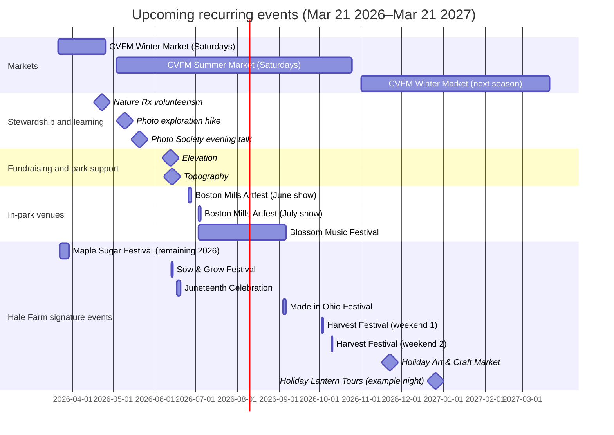

# Recurring events and ongoing programs in

## Executive summary

This report is scoped to the Cuyahoga Valley National Park in Ohio and its in-park partners. citeturn15search9turn15search12

Within the next 12 months (March 22, 2026–March 21, 2027), the most reliably recurring, publicly trackable offerings are: the year‑round Saturday farmers market (winter indoor / summer at Howe Meadow), a dense slate of signature festivals at Hale Farm & Village (Maple Sugar, Sow & Grow, Juneteenth, Made in Ohio, Harvest, Lantern Tours), the Cleveland Orchestra’s annual Blossom Music Festival at Blossom Music Center, Conservancy fundraising events (Elevation and Topography at Howe Meadow), recurring volunteer drop‑ins and “Days of Service,” and frequent scenic excursions and themed rides on the Cuyahoga Valley Scenic Railroad. citeturn7view0turn17view0turn16view1turn27view0turn29view0turn26search2

Practical baseline: the park does not charge an entrance fee, but many partner venues and events have their own admissions/tickets. citeturn26search5turn15search12

## Recurring food and market culture around entity["organization","Cuyahoga Valley Farmers Market","Peninsula, OH, US"]

The market is explicitly “every Saturday,” rain or shine, 9:00am–12:00pm, with a seasonal location shift: winter indoors (November–April) and summer outdoors (May–October) “located in the scenic” national park. The market also publishes policies that affect visit planning (dog-free first hour, restroom availability, handicap parking availability but uneven meadow terrain, etc.). Photos/content are available directly on the market site (embedded images) and via its official social accounts linked from the site. citeturn7view0turn8view1turn9view0turn9view1turn9view2

image_group{"layout":"carousel","aspect_ratio":"16:9","query":["Howe Meadow farmers market Peninsula Ohio","Cuyahoga Valley Farmers Market winter market Old Trail School Akron","Cuyahoga Valley National Park Howe Meadow","Cuyahoga Valley Farmers Market Tomato Tasting Festival"],"num_per_query":1}

**Year‑round Saturday Farmers Market (Summer/Winter locations)**  
- Description: Producer-only farmers market (local produce, meats, baked goods, prepared foods; vendor mix varies). citeturn8view1turn9view0  
- Typical recurrence: Every Saturday, 9:00am–12:00pm (rain or shine). citeturn7view0turn9view0turn9view1  
- Next dates (next 12 months): Saturdays weekly; the next Saturday after March 21, 2026 is **March 28, 2026** (then weekly). Seasonal anchors below. citeturn7view0turn9view0  
- Seasonal schedule and venue:
  - **Winter market**: “November – April” Saturdays 9–12 at entity["place","Old Trail School","Akron, OH, US"] (2315 Ira Rd, Akron, OH 44333). citeturn9view0turn9view2  
  - **Summer market**: “May – October” Saturdays 9–12 at entity["point_of_interest","Howe Meadow","Peninsula, OH, US"] (4040 Riverview Rd, Peninsula, OH 44264). citeturn8view1turn7view0turn9view2  
  - Published 2026 season markers: Summer market runs **May 3–October 25**; winter market runs **November 1–April 25** (winter season extends into early 2027). citeturn7view0turn9view2  
- Organizer/contact: info@cvfm.org; vendor inquiries via marketmanager@cvfm.org. citeturn9view2  
- Tickets/cost: Market entry fee is not stated on the official market pages (purchases vary by vendor). citeturn7view0turn9view2  
- Practical details (from official policies/FAQ):
  - Restrooms: porta‑potties (summer market). citeturn9view1  
  - Dogs: dog‑free 9–10am; dogs allowed 10am–12pm (policy phrased for summer market). citeturn9view1  
  - Accessibility: handicap parking spaces available; market is “on a meadow” with natural uneven ground. citeturn9view1  
  - Weather: rain or shine; severe weather cancellations are posted to website/social. citeturn9view1turn7view0  
- Photos/content sources: the market website (images and updates) and its official Facebook/Instagram linked in the footer; the summer/winter market pages also provide location context. citeturn7view0turn8view1turn9view0  

**Annual Tomato Tasting Festival**  
- Description: Market “Tomato Tasting Festival” featuring 35+ varieties to sample, plus live music and kid‑friendly activities (2025 write‑up). citeturn7view2  
- Typical recurrence: Annual; late summer; the published example is a Saturday morning 9:00am–12:00pm. citeturn7view2turn7view1  
- Next dates (next 12 months): **unspecified** on current market pages for 2026/2027; market advises following social for “latest updates.” citeturn7view2turn7view1  
- Location: Howe Meadow (summer market site). citeturn7view2turn8view1  
- Organizer/contact: Cuyahoga Valley Farmers Market (info@cvfm.org). citeturn7view0turn9view2  
- Tickets/cost: described as “free to the public” (2025 page). citeturn7view2  
- Practical details: scheduled 9:00am–12:00pm in the published example; parking/access follows summer market policies (meadow terrain; dog-free first hour). citeturn7view2turn9view1  
- Photos/content sources: the festival page includes multiple highlight images; the page also points to the market’s Instagram for updates. citeturn7view2turn7view0  

**Other repeated “special events” and programs at the market**  
- Description: The market describes recurring chef demonstrations and seasonal gatherings and lists “signature festivals” (Roots & Shoots, Tomato Tasting, and planned Christmas Market). citeturn7view1  
- Typical recurrence: annual / seasonal, but not date-fixed on the public page. citeturn7view1  
- Next dates (next 12 months):
  - “Annual Seed Swap & Share” is listed for **Jan 31, 2026** (already past); future date **unspecified**. citeturn7view1  
  - “Fungi, Spore, and Fermentation Fest” shows **Oct 25, 2025** (past); future date **unspecified**. citeturn7view1  
  - “Christmas Market” is described as planned; date **unspecified**. citeturn7view1  
- Organizer/contact: CVFM; follow market social for date announcements. citeturn7view1turn7view0  
- Tickets/cost: these are characterized as “free to attend” for chef demos/festivals on the special events page, but individual event pages should be checked when published. citeturn7view1  
- Photos/content sources: CVFM “Special Events” page and linked detailed event pages (when live), plus official social channels linked from the site footer. citeturn7view1turn7view0  

## Annual festivals and venue series within the park’s partner network

The park press materials explicitly identify multiple publicly oriented operations “within park boundaries,” including Blossom Music Center, Hale Farm & Village, and the Boston Mills/Brandywine ski resorts—each of which operates its own ticketed event calendar. Photos/content are available via partner sites and the park’s own “Music & Arts” content and press kit. citeturn15search12turn15search0

image_group{"layout":"carousel","aspect_ratio":"16:9","query":["Hale Farm & Village Maple Sugar Festival photographs","Blossom Music Center lawn concert Cleveland Orchestra","Cuyahoga Valley National Park Brandywine Falls and Blossom Music Center","Boston Mills Artfest Peninsula Ohio"],"num_per_query":1}

**Hale Farm & Village signature-event cycle** (annual, multiple weekends)  
- Operator: entity["organization","Western Reserve Historical Society","Cleveland, OH, US"] states this site is a living history museum in the national park and publishes a “series of annual events.” citeturn18search8turn17view0  
- Location: entity["point_of_interest","Hale Farm & Village","Bath, OH, US"] (published address: 2686 Oak Hill Road, Bath, OH 44210). citeturn18search8turn17view1  
- Tickets: “Purchase Tickets Here” links route to the WRHS ticketing platform (330tix) for many events; admission rates “may vary.” citeturn17view0turn17view1  
- Photos/content sources: individual event pages (with embedded images), WRHS site photography, and (for some events) dedicated event websites and local arts press. citeturn17view1turn24search9turn16view1  

Key signature events within the next 12 months (dates/time published for 2026):

**Maple Sugar Festival & Pancake Breakfast**  
- Description: annual spring tradition featuring maple sugaring programming plus period crafts/trades demonstrations; pancake breakfast is part of ticketed options. citeturn17view0turn17view1  
- Recurrence: four weekends in March (2026 schedule published). citeturn17view1  
- Upcoming dates (relative to March 21, 2026): **March 22, 2026** and **March 28–29, 2026**, 10:00am–3:00pm. citeturn17view1turn17view0  
- Cost (published for 2026): adult + pancake breakfast $25; youth (3–12) + breakfast $16; member/military + breakfast $10; youth member + breakfast $8; other ticket types listed. citeturn17view1  
- Practical details: breakfast served 10:00am–2:00pm; ticketing via 330tix; other logistics (parking/accessibility) not specified on the event page and should be verified on the ticketing page. citeturn17view1  
- Photos/content sources: the Maple Sugar Festival page contains images and press-ready descriptive copy; WRHS pages are the primary reference. citeturn17view1  

**Sow & Grow Festival and Plant Sale**  
- Description (typical content, based on the most recent detailed event page available): 19th‑century farm demonstrations and seasonal work, including draft horse and oxen/animal demonstrations; community partner demos (2025 description). citeturn20search0  
- Recurrence: annual / early summer (listed as a signature event series). citeturn17view0turn18search1  
- Upcoming dates (2026): **June 13–14, 2026**, 10:00am–4:00pm. citeturn18search1turn19search2  
- Tickets/cost: 2026 admission pricing is **unspecified** on the WRHS calendar listing; verify in ticketing for the specific 2026 event instance. citeturn18search1turn17view0  
- Practical details: daytime (10–4) programming; accessibility/parking details **unspecified** on the public calendar page. citeturn18search1  
- Photos/content sources: WRHS event pages and WRHS site imagery; the 2025 event page provides program description framing that typically carries forward. citeturn20search0turn17view0  

**Juneteenth Celebration**  
- Description (typical content, per latest detailed event page): historically framed commemoration with interpretive storytelling and programming (2025 description). citeturn20search1  
- Recurrence: annual (listed as a signature event; 2026 dates are posted). citeturn17view0turn18search1  
- Upcoming dates (2026): **June 17–20, 2026**, 10:00am–4:00pm. citeturn18search1turn19search2  
- Tickets/cost: 2026 pricing is **unspecified**; the latest detailed pricing example (2025) lists adult $15, child $8, and free for WRHS members/active military/children under 2 (verify for 2026). citeturn20search1  
- Practical details: multi-day daytime schedule; confirm any special timed programs via the specific 2026 ticketing page. citeturn18search1  
- Photos/content sources: WRHS Juneteenth event page copy (for content) and WRHS site imagery; the organization’s event calendar is the authoritative schedule reference. citeturn20search1turn18search1  

**Made in Ohio Art & Craft Festival**  
- Description: Labor Day weekend art & craft festival at Hale Farm & Village with vendors and food/drink (WRHS describes the event as a community favorite). citeturn17view0turn20search2  
- Recurrence: annual over Labor Day weekend. citeturn17view0  
- Upcoming dates (2026): **September 4–6, 2026**, 10:00am–5:00pm. citeturn17view0turn14search24  
- Tickets/cost (published by the festival site): $12 adults; $6 children (3–12). citeturn14search24  
- Location: Hale Farm & Village; festival site publishes address (2686 Oak Hill Road, Peninsula/Bath area). citeturn14search24turn18search8  
- Practical details: hours 10–5 each day; parking/accessibility details **unspecified** on the festival site excerpt and should be verified on the ticketing/venue pages. citeturn14search24turn17view0  
- Photos/content sources: the festival site includes multiple images; WRHS “Made in Ohio” event page provides additional descriptive copy (even when dated to a prior year). citeturn14search24turn20search2  

**Harvest Festival**  
- Description: fall festival programming emphasizing 19th‑century seasonal work and community partner demonstrations (WRHS event detail). citeturn18search2  
- Recurrence: annual; two weekends (pattern shown in WRHS event calendars). citeturn18search7turn18search2  
- Upcoming dates (2026): **October 3–4 and October 10–11, 2026**, 10:00am–4:00pm. citeturn18search7turn18search2  
- Tickets/cost: “Purchase Tickets Here” is provided on the event detail page; price **unspecified** on the visible excerpt. citeturn18search2  
- Practical details: daytime schedule; verify parking/accessibility on the ticketing page. citeturn18search2turn18search7  
- Photos/content sources: the WRHS event page (content + imagery) is the primary source; WRHS calendars provide the authoritative list of weekend dates. citeturn18search2turn18search7  

**Holiday Art & Craft Market**  
- Description: a holiday market at the Gatehouse Visitor Center / MarketPlace area (vendor application describes it as “Holiday Art & Craft Market” with “free admission for shoppers”). citeturn19search5turn17view0  
- Recurrence: annual (listed on signature events and vendor documentation). citeturn17view0turn19search5  
- Upcoming date (2026): **Sunday, November 22, 2026**, 12:00pm–4:00pm (vendor application). citeturn19search5turn17view0  
- Tickets/cost: **Free admission for shoppers** (explicit in vendor application); vendors pay booth fees per application rules (not visitor-facing). citeturn19search5  
- Organizer/contact: show contact email in application: jmoretuzzo@wrhs.org. citeturn19search5  
- Practical details: indoor market (Gatehouse Visitor Center) with setup rules; parking/accessibility **unspecified** in the excerpt and should be verified with the venue. citeturn19search5turn18search8  
- Photos/content sources: the vendor application is a content/verification artifact; WRHS/venue pages provide broader photo context. citeturn19search5turn18search8  

**Holiday Lantern Tours**  
- Description: lantern-lit walking tours through the historic village; homes decorated; seasonal treats and museum store shopping. citeturn32view0  
- Recurrence: annual; now in its “31st year” as of the 2026 listing. citeturn32view0  
- Upcoming dates (within next 12 months): multiple dates in December 2026 are listed on the signature events calendar (examples include Dec 5–6, 11–13, 18–23, 26–28). citeturn17view0turn32view0  
- Example instance with full published logistics: **December 26, 2026**, 4:40pm–9:00pm; tours depart every 20 minutes starting at 4:40pm; each tour ~90 minutes. citeturn32view0  
- Tickets/cost: ticket price **unspecified** on the visible excerpt; “Purchase Tickets Here” and refund policy are provided (all sales final; non-refundable/non-transferable). citeturn32view0  
- Accessibility/terrain (explicit): ~0.85 miles on gravel/grass; uneven/muddy in wet conditions; some buildings require 2–3 steps and are not wheelchair/stroller accessible. citeturn32view0  
- Photos/content sources: the WRHS event detail page includes descriptive copy and is a stable reference for accessibility language; WRHS digital collections are linked site‑wide for broader imagery. citeturn32view0turn32view0  

**Annual Blossom Music Festival at Blossom Music Center**  
- Blossom is described by the park as “nestled within Cuyahoga Valley” and the park’s “Music & Arts” page positions the Blossom Festival as an annual anchor. citeturn15search0  
- Where/what: entity["point_of_interest","Blossom Music Center","Cuyahoga Falls, OH, US"] is the summer home of entity["organization","The Cleveland Orchestra","Cleveland, OH, US"], located in Cuyahoga Falls within the national park (per the Orchestra’s venue guide). citeturn16view0  
- 2026 season window: **July 3–September 6, 2026** (published festival calendar). citeturn16view1  
- Specific 2026 festival dates (published list; titles abbreviated here): Jul 3; Jul 4; Jul 11–12; Jul 18; Jul 25; Jul 26; Aug 1; Aug 8; Aug 15; Aug 22; Aug 23; Aug 29; Sep 4–6. citeturn16view1  
- Tickets/cost: varies by performance; a dedicated youth-access policy is published—each regular-priced Lawn ticket offers two Under‑18 free Lawn passes for “most” Blossom Music Festival concerts. citeturn16view0turn16view1  
- Practical details: wheelchair/companion seating areas are reserved and selectable; ramps and ADA restrooms are noted; parking/directions are published by the Orchestra. citeturn16view0turn16view1  
- Photos/content sources: the Orchestra’s festival calendar and Blossom venue guide pages include photography and are primary sources; the park’s “Music & Arts” page also provides official context and imagery. citeturn16view1turn16view0turn15search0  

**Boston Mills Artfest (two-weekend fine art festival)**  
- The park’s press kit names “Boston Mills/Brandywine Ski Resorts” as within park boundaries. citeturn15search12  
- Recurrence: annual; multi‑weekend fine-art festival; 2026 dates are published for participants in artist‑facing systems and regional coverage. citeturn24search1turn24search6turn24search9  
- Upcoming dates (2026): Boston Mills I (“June Show”) **June 26–28, 2026**; Boston Mills II (“July Show”) **July 3–5, 2026** (artist‑call summary). citeturn24search6turn24search1  
- Location: at entity["point_of_interest","Boston Mills Ski Resort","Peninsula, OH, US"] (site listings for prior editions and venue references place the event at the Boston Mills property in Peninsula). citeturn24search5turn24search19  
- Organizer/contact: artist system lists a contact phone for the event (330.657.2334) and provides an event gallery and “contact event” workflow. citeturn24search1  
- Tickets/cost: public admission pricing for 2026 is **unspecified** in the primary sources above; regional coverage for recent editions indicates paid admission and free on‑site parking (verify on official 2026 pages when accessible). citeturn24search5turn24search9  
- Parking: the venue’s general parking guidance states Boston Mills parking is directly in front of the lodge off Riverview Road. citeturn25view3  
- Photos/content sources: the ZAPP listing includes an “Event Gallery”; regional coverage (Ohio Magazine) provides images and background. citeturn24search1turn24search9  

## entity["organization","Cuyahoga Valley Scenic Railroad","Peninsula, OH, US"] excursions and themed rides

The railroad is a nonprofit excursion railway that explicitly positions its rides as experiences “through” the national park and publishes a date-indexed ticket calendar with departure times, stations, and price ranges. Photos/content are available on the railroad’s site and official social channels linked from the site. citeturn26search4turn26search8  

**National Park Scenic (core excursion)**  
- Description: “National Park Scenic” is presented as the flagship excursion experience; the calendar shows multiple departures per operating day. citeturn26search11turn26search2  
- Typical recurrence: frequent (often weekends and peak periods); exact days vary month to month. citeturn26search2turn26search8  
- Next published date within 12 months (example): **Sunday, March 29, 2026** departures include 10:00am from Peninsula Depot with a listed price range **$25–$38** (plus other same-day departures at different stations). citeturn26search8  
- April 2026 examples (published): multiple National Park Scenic departures on April weekends with the same $25–$38 range shown. citeturn26search2  
- Stations/nearby: commonly listed stations include Peninsula Depot, Akron Northside Station, and Rockside Station in the calendar listings. citeturn26search2turn26search8  
- Tickets/cost: as published per-date in the calendar (varies by ride and seat type); food options such as “Café Car” appear for many scenic departures. citeturn26search2turn26search8  
- Accessibility: details are handled on the railroad’s “Accessibility” planning pages and should be verified per ride and car type (not fully visible in the calendar excerpt). citeturn31view1turn26search4  
- Organizer/contact: customer service email and phone are published; hours Monday–Friday 9am–4pm. citeturn26search4turn31view1  
- Photos/content sources: CVSR excursion pages include images and embedded media; CVSR also links to social channels from its site navigation. citeturn26search4turn31view2turn26search15  

**Family Fun Loop and Themed Events (umbrella series)**  
- Description: “Family Fun Loop” is described as an event series designed for families; “Themed Events” are a separate excursion category. citeturn31view1turn31view3  
- Typical recurrence: scheduled on select dates (not a fixed weekly pattern); the ticket calendar is the authoritative source for next departures and pricing. citeturn31view1turn26search2  
- Next dates within 12 months (examples from April 2026 calendar):
  - “Create‑A‑Critter” (Family Fun Loop) appears **Saturday, April 18, 2026** with builder/helper ticket pricing shown in the calendar block. citeturn26search2turn26search10  
  - “Western Locomotive” (Themed Events) appears **Friday, April 24, 2026** (evening departure). citeturn26search2turn26search25  
- Organizer/contact: CVSR; see contact block above. citeturn26search4  
- Photos/content sources: the Family Fun Loop / Themed Events landing pages contain images and descriptive copy; the calendar provides the transactional “tickets” path. citeturn31view1turn31view3turn26search2  

## Park programs, volunteer stewardship, and Conservancy-led public programming

The park and its partners position volunteering as an ongoing biodiversity and trail-support strategy with multiple formats: small “drop-ins,” larger “Days of Service,” and skills/education programs that mix learning with stewardship. Photos/content sources are embedded in the NPS and Conservancy pages and reinforced through linked social/media channels. citeturn29view0turn29view1turn10view0  

**Recurring NPS volunteer drop‑ins (invasive removal, plantings, seed collection)**  
- Description: the park solicits volunteers to “preserve biodiversity,” with three core drop‑in types—Invasive Plant Removal, Native Plantings, and Native Seed Collection. citeturn29view0  
- Typical recurrence: offered throughout spring/summer/fall; “advanced registration required” and “calendar listings include a registration link.” citeturn29view0  
- Next dates (next 12 months): **unspecified** on the static volunteer page because it points to the (dynamic) calendar feed for specific dates; see the event table below for concrete drop‑in examples already published by partners. citeturn29view0turn29view1  
- Contact: volunteer@forcvnp.org for groups of 5+; youth requirements and what-to-bring list are specified (boots/closed-toe, water, etc.). citeturn29view0  
- Practical details: projects rain or shine except thunderstorms; tools/PPE provided; age suitability differs by activity. citeturn29view0  
- Photos/content sources: the NPS drop‑in page includes a project photo and is a stable reference; the Conservancy volunteer pages also include photos and link-outs. citeturn29view0turn29view1  

**Conservancy “Days of Service” (large volunteer days)**  
- Description: large-scale, done-in-a-day volunteer events; projects vary by season (invasive removal, plantings, seed collection). citeturn29view2  
- Typical recurrence (explicit planned anchors): Earth Day (April), National Public Lands Day (September), Make a Difference Day (October). citeturn29view2  
- Next dates in next 12 months: specific 2026/2027 event dates are **unspecified** on the program description page; verify via event listings. citeturn29view2turn30view0  
- Photos/content sources: Conservancy volunteer pages and the event calendar listings carry imagery and can be reused for briefs/press. citeturn29view2turn30view0  

**Nature Rx public program (example: stewardship + mindfulness session)**  
- Example event: “Nature Rx | Reciprocity through Volunteerism” (Earth Day themed tree planting + guided reflection). citeturn30view0  
- Typical recurrence: Nature Rx appears as an ongoing program with periodic events (exact cadence varies). citeturn30view0turn29view1  
- Upcoming date (published): **April 22, 2026**, 5:30pm–7:30pm. citeturn30view0  
- Location: specific parking/location emailed to registrants two days before; walking required (~0.25 miles). citeturn30view0  
- Tickets/cost: registration is routed via Eventbrite; ticket price **unspecified** on the visible event page excerpt. citeturn30view0  
- Photos/content sources: the event page includes images and provides links to the Nature Rx program page for broader context. citeturn30view0  

**Photography programs (example cluster)**  
- “Photo Exploration Hike: Frazee House (Sagamore Creek)”:
  - Date/time: **May 9, 2026**, 10:00am–12:00pm. citeturn31view0  
  - Location: 7733 Canal Road, Valley View, OH 44125 (site-listed). citeturn31view0  
  - Practical details: <2 miles, some hills; bring your own camera/phone; all skill levels welcome; ticketing via Eventbrite. citeturn31view0  
- “Cuyahoga Valley Photo Society | Juxtapositions…”:
  - Date/time: **May 20, 2026**, 7:00pm–9:00pm at entity["point_of_interest","Hines Hill Conference Center","Peninsula, OH, US"] (address in listing). citeturn30view1turn10view0  
  - Ticketing via Eventbrite; cost **unspecified** on the visible excerpt. citeturn30view1  
- Photos/content sources: Conservancy event pages include images and speaker/leader context; Eventbrite links provide promotional graphics where posted. citeturn31view0turn30view1turn26search12  

**Conservancy fundraising events (annual; trail/visitor-amenity impact)**  
- Elevation (annual fundraiser):
  - When/where: **Friday, June 12, 2026** at Howe Meadow; schedule published 6:30pm–11:00pm with band times and food service windows. citeturn27view0  
  - Cost: member and non-member ticket pricing is shown in the ticketing snippet (**$100 member / $160 non-member**). citeturn26search0turn27view0  
  - Practical details: rain or shine; trail casual attire; ticket includes food and drink-ticket allotments; contact phone/email listed. citeturn27view0  
  - Photos/content sources: the Elevation page contains event photography and narrative copy suitable for briefs. citeturn27view0  
- Topography (annual dinner):
  - When/where: **Saturday, June 13, 2026** at Howe Meadow with arrival/cocktail/dinner schedule and **valet parking provided**. citeturn27view1  
  - Cost: ticket price appears in the ticketing snippet (**$350 individual ticket**). citeturn26search6turn27view1  
  - Photos/content sources: the Topography page includes imagery and program framing. citeturn27view1  

## Ongoing initiatives, comparison table, and 12‑month timeline

### Ongoing initiatives and programs to track

**Countryside / sustainable farming in the valley (NPS-described program)**  
The park describes an ongoing farming program (originally the “Countryside Initiative”) in which historic farmsteads were rehabilitated and leased to farmers using sustainable practices, preserving the agricultural landscape and related resources. Photos/content: the NPS “Farming in the Valley” story page is a stable narrative reference for context and terminology. citeturn15search18  

**Trails Now Fund (Conservancy impact channel)**  
Both Elevation and Topography explicitly route proceeds to trail maintenance, trailheads, and visitor amenities (“Trails Now Fund”), making these events recurring “fundraising + trails” initiatives rather than standalone parties. Photos/content: event pages provide reusable copy and imagery; the fund itself is linked from those pages. citeturn27view0turn27view1  

**Accessibility and inclusion mechanisms (examples)**  
- Blossom Music Festival: under‑18 free lawn passes are embedded in the ticket policy; accessible seating and ADA restrooms are described in the venue guide. citeturn16view0turn16view1  
- Hale Farm Holiday Lantern Tours: the event page provides unusually explicit route/terrain constraints, enabling accurately scoped visitor messaging. citeturn32view0  

### Event comparison table

| Event / program | Recurrence pattern | Next date (Mar 22, 2026–Mar 21, 2027) | Primary source to verify + get media |
|---|---|---|---|
| CVFM Saturday Farmers Market (winter/summer locations) | Every Saturday 9:00am–12:00pm; winter Nov–Apr, summer May–Oct | Next: **Mar 28, 2026** (weekly Saturdays); summer season starts **May 3, 2026**; winter starts **Nov 1, 2026** citeturn7view0turn9view2 | CVFM site + policies + contact (photos + updates) citeturn7view0turn9view1turn9view2 |
| Maple Sugar Festival & Pancake Breakfast (Hale Farm) | Annual; multiple March weekends | Remaining 2026 dates: **Mar 22, 2026**; **Mar 28–29, 2026** (10am–3pm) citeturn17view1turn17view0 | WRHS event page + ticket link (images + pricing) citeturn17view1 |
| Nature Rx: Reciprocity through Volunteerism | Program series; scheduled event instance | **Apr 22, 2026** (5:30–7:30pm) citeturn30view0 | Conservancy event page (images + logistics + Eventbrite link) citeturn30view0 |
| CVSR National Park Scenic | Frequent scheduled departures; varies by month | Example next: **Mar 29, 2026** (10:00am, Peninsula Depot; $25–$38 shown) citeturn26search8 | CVSR ticket calendar (official schedule/pricing) citeturn26search8turn26search2 |
| Photo Exploration Hike: Frazee House | Periodic photography program | **May 9, 2026** (10am–12pm) citeturn31view0 | Conservancy event page + ticket link (media + details) citeturn31view0 |
| Cuyahoga Valley Photo Society talk (Juxtapositions) | Periodic speaker/workshop nights | **May 20, 2026** (7–9pm) citeturn30view1 | Conservancy event page + Eventbrite link (media + description) citeturn30view1 |
| Sow & Grow Festival and Plant Sale (Hale Farm) | Annual early-summer weekend | **Jun 13–14, 2026** (10am–4pm) citeturn19search2 | WRHS June 2026 calendar (schedule) + prior-year detail page (program framing) citeturn19search2turn20search0 |
| Elevation | Annual fundraiser (June) | **Jun 12, 2026** citeturn27view0 | Conservancy Elevation page (schedule + media) citeturn27view0turn26search0 |
| Topography | Annual fundraiser dinner (June) | **Jun 13, 2026** citeturn27view1 | Conservancy Topography page (timeline + media) citeturn27view1turn26search6 |
| Boston Mills Artfest | Annual; two weekends (late June + early July) | **Jun 26–28, 2026** and **Jul 3–5, 2026** citeturn24search6turn24search1 | ZAPP event listing (gallery/contact) + regional coverage; verify official 2026 public ticketing when available citeturn24search1turn24search9 |
| Blossom Music Festival | Annual summer festival | **Jul 3–Sep 6, 2026** (multiple dates listed) citeturn16view1 | Cleveland Orchestra festival calendar + venue guide (photos + policies) citeturn16view1turn16view0 |
| Juneteenth Celebration (Hale Farm) | Annual multi-day | **Jun 17–20, 2026** (10am–4pm) citeturn19search2 | WRHS calendar + prior-year detail page for typical content citeturn19search2turn20search1 |
| Made in Ohio Art & Craft Festival (Hale Farm) | Annual; Labor Day weekend | **Sep 4–6, 2026** (10am–5pm) citeturn14search24turn17view0 | Festival site (photos + ticket pricing) + WRHS signature-event context citeturn14search24turn17view0 |
| Harvest Festival (Hale Farm) | Annual; two October weekends | **Oct 3–4 and Oct 10–11, 2026** citeturn18search7turn18search2 | WRHS October calendar + event page (description) citeturn18search7turn18search2 |
| Holiday Art & Craft Market (Hale Farm) | Annual | **Nov 22, 2026** (12–4pm) citeturn19search5turn17view0 | Vendor application (free admission stated) + WRHS signature-event listing citeturn19search5turn17view0 |
| Holiday Lantern Tours (Hale Farm) | Annual; multiple December nights | Example: **Dec 26, 2026** (4:40–9:00pm) citeturn32view0 | WRHS event detail page (accessibility language + tour cadence) citeturn32view0 |

### 12‑month timeline chart



### Contact and verification links

```text
NPS – Cuyahoga Valley National Park calendar:
https://www.nps.gov/cuva/planyourvisit/calendar.htm

NPS – Drop-in volunteer opportunities:
https://www.nps.gov/cuva/getinvolved/drop-in-opportunities.htm

Cuyahoga Valley Farmers Market – contact + hours:
https://cvfm.org/contact-us/
https://cvfm.org/policies-and-faqs/

Cuyahoga Valley Scenic Railroad – contact + ticket calendar:
https://www.cvsr.org/
https://www.cvsr.org/book-tickets/calendar

Hale Farm & Village / WRHS – signature events + event calendar:
https://www.wrhs.org/plan-visit/places-to-visit/hale-farm-village/things-to-do/signature-events
https://www.wrhs.org/do-see/events

The Cleveland Orchestra – 2026 Blossom season + venue guide:
https://www.clevelandorchestra.com/tickets/calendar/2026-blossom-season
https://www.clevelandorchestra.com/visit/blossom-music-center

Conservancy for Cuyahoga Valley National Park – calendar + fundraising events:
https://www.conservancyforcvnp.org/calendar/
https://www.conservancyforcvnp.org/donate/fundraising-events/
```

