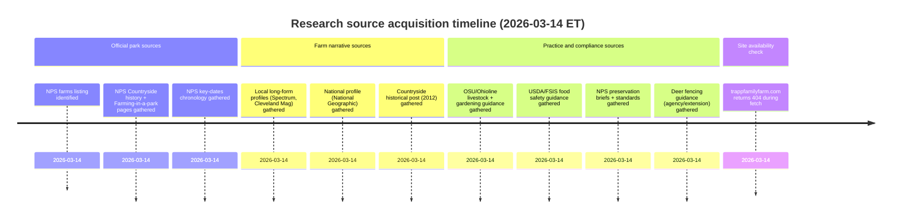

# Unique, Sourced Content Plan and Web-Ready Drafts for TrappFamilyFarm.com

## Executive summary

TrappFamilyFarm.com can be populated with credible, page-specific content using a “primary-source spine” (park + program docs + dated news features) and then layering “practice-specific authority” (Ohio State Extension/Ohioline + USDA food-safety + historic-preservation guidance) to support every husbandry, crop, and project page. Core farm facts (location, start date, relationship to the Countryside Initiative, draft-horse power, on-site seasonal sales, and role in training/education) are strongly supported by official park pages and multiple independent profiles. citeturn6view3turn3search4turn6view0turn8view3turn8view1turn19view0

The domain `trappfamilyfarm.com` appears unavailable (HTTP 404) as of this research window, so “official farm site” content could not be used as a primary source; the closest authoritative substitutes are (1) the park’s farm listings and history pages, (2) Countryside’s historical program materials, and (3) farm-owned social channels referenced by the park. citeturn2view0turn3search4turn6view0turn6view1

## Source acquisition and fact base

Primary sources available now include official farm listings and program history from the park service (farm description, address, draft-horse use, seasonal on-site sales, and program framing), plus the park’s key-dates chronology that explicitly names the farm’s establishment date and the former Holland property. citeturn3search4turn6view3turn6view0turn6view1turn6view2

For farm narrative and day-to-day practices, high-signal secondary sources include a long-form local profile and a feature describing the farm’s role in the New Farmer Academy, including draft-horse plowing, on-site stand presence, and livestock mentioned on-farm. citeturn8view3turn8view1turn5search1

For technical credibility on livestock, crops, food safety, fencing, and historic structures, the most useful authorities for Ohio and U.S. audiences are:
- entity["organization","Ohio State University Extension","land-grant extension, ohio"] publications (Ohioline and county Extension PDFs) for broilers, layers/winter care, egg biology, parasite management, gardening calendars, and seed starting. citeturn21search0turn22search9turn22search26turn22search3turn20search1turn20search11  
- entity["organization","U.S. Department of Agriculture","federal agriculture agency"] food-safety guidance (including entity["organization","Food Safety and Inspection Service","usda meat poultry safety"]) for safe internal temperatures, egg refrigeration, and the “danger zone.” citeturn7search1turn20search2turn20search6  
- State/Extension wildlife fencing guidance for deer-exclusion design targets (8 ft+ as a common “deer-proof” benchmark; some authorities recommend taller for highest assurance). citeturn7search3turn7search7turn7search15  
- entity["organization","National Park Service","us federal land agency"] preservation standards and briefs for the “Barn” project framing (Preservation Brief 20; Secretary’s Standards). citeturn18search3turn19view1turn18search0  

## Sitemap and information architecture

```text
TrappFamilyFarm.com
├─ About
│  ├─ Us
│  ├─ Farm
│  ├─ Countryside
│  └─ CVNP
├─ Making the Crops
│  ├─ Vegetables
│  ├─ At the Stand Now
│  └─ Setting the Table
├─ Animal Husbandry
│  ├─ Layers
│  ├─ Broilers
│  ├─ Turkeys
│  └─ Sheep
├─ For Your Homestead
│  ├─ Ready-to-Lay Hens
│  └─ Transplants
├─ Newsletters
│  ├─ Winter '25-'26
│  ├─ Fall '25
│  ├─ Fall '24
│  └─ Spring '24
├─ More Info
│  ├─ Podcasts
│  └─ News
└─ Projects
   ├─ Deer Fencing
   └─ Barn
```

Draft word-count targets below are designed to land in your requested 300–600 range while keeping pages scannable.

| Page | Target words | Primary sources to anchor claims |
|---|---:|---|
| About → Us | ~450 | NPS farms listing; Spectrum profile; Cleveland Mag profile |
| About → Farm | ~450 | NPS farms listing; NPS key dates; Countryside 2012 post |
| About → Countryside | ~450 | NPS Countryside Initiative history; NPS key dates; NatGeo Countryside articles |
| About → CVNP | ~450 | NPS “Visit farms & markets”; NPS “Farming in a National Park”; Ideastream buildings |
| Making the Crops → Vegetables | ~450 | Cleveland Mag (rotation + crops); OSU garden calendar PDFs; NPS farm listing |
| Making the Crops → At the Stand Now | ~350 | Spectrum (stand exists); NPS listing; farm social posts (hours/newsletter) |
| Making the Crops → Setting the Table | ~450 | Cleveland Mag tomato recipe; EatBetterFoodToday recipe; USDA/FSIS temps |
| Animal Husbandry → Layers | ~450 | NPS listing; Countryside 2012 post; OSU egg biology + winter care; USDA eggs |
| Animal Husbandry → Broilers | ~450 | OSU “Raising Meat Chickens”; PSU pastured broilers; USDA/FSIS temps |
| Animal Husbandry → Turkeys | ~450 | USDA/FSIS temps; farm social turkey notes; small-flock turkey guidance |
| Animal Husbandry → Sheep | ~450 | Spectrum (sheep on farm); OSU parasite management; rotational grazing guidance |
| For Your Homestead → Ready-to-Lay Hens | ~450 | OSU egg biology; OSU breed selection; USDA egg refrigeration |
| For Your Homestead → Transplants | ~450 | OSU seed-starting tips; OSU garden calendar; OSU veg-garden basics |
| Newsletters → Winter ’25-’26 | ~350 | Farm quarterly-newsletter note; OSU seed-starting; NPS farm/program context |
| Newsletters → Fall ’25 | ~350 | OSU harvest/storage; USDA danger zone; market/program seasonality |
| Newsletters → Fall ’24 | ~350 | Same as above + program history as evergreen context |
| Newsletters → Spring ’24 | ~350 | OSU planting calendars; seed starting; stand/market seasonality |
| More Info → Podcasts | ~350 | EatBetterFoodToday episode/recipe pages; (optional) YouTube/Spotify listings |
| More Info → News | ~500 | Consolidated list of all sources found (below) |
| Projects → Deer Fencing | ~450 | Deer fence guidance (8 ft+); NPS “farming in a park” constraints; NFA fence example |
| Projects → Barn | ~450 | NPS Preservation Brief 20; Secretary’s Standards; Ideastream buildings context |

## Page-by-page content drafts

### About → Us

**Draft content (web-ready)**  
Trapp Family Farm is a family-run, mixed crop-and-livestock farm on Route 303 in Peninsula, part of the living agricultural landscape preserved inside Cuyahoga Valley National Park. The farm was established in 2012 through the park’s Countryside Initiative—an unusual model that pairs long-term leases with stewardship expectations, public-facing education, and farming practices designed to protect natural and cultural resources.

The work here is deliberately small-scale and hands-on. Instead of treating the farm as an industrial site, Trapp Family Farm is built around daily decisions: how to keep soil covered, how to rotate animals so fertility is returned to fields, how to grow food without overworking the land, and how to keep the farm welcoming to neighbors who want to learn where their food comes from.

Mark and Emily Trapp came to farming by taking the long way around—bringing outside careers and experiences into a place where practical problem-solving matters. Mark has spoken publicly about moving from engineering work toward farming after becoming more concerned with energy use and the modern food system. Over time, the farm’s focus has stayed consistent: healthy soil, healthy plants, healthy animals, and a community that can support itself with local food.

Because the farm sits inside a national park, it’s also part of something bigger than one business. The farm contributes to the valley’s rural character—fields that stay fields, barns that stay in use, and working land that remains accessible in meaning (and sometimes in person) to the people who live around it. You may encounter Trapp Family Farm at the on-site stand during growing season, through educational visits, and through the broader network of Countryside farms and markets that connect the park to regional eaters.

**Factual anchors (3–5)**  
- Trapp Family Farm is listed by the park as a Countryside farm with draft-horse power since its inception in 2012 and seasonal on-site sales of eggs, produce, and meat. citeturn3search4turn6view3  
- The park’s key-dates history records: “May 1, 2012 – Mark Trapp establishes Trapp Family Farm on the former Holland property.” citeturn6view0  
- A 2021 profile describes the farm as ~30 acres on West Streetsboro Road (Route 303 corridor) and notes the on-site farm stand during growing season. citeturn8view3  
- A 2016 feature notes Mark and Emily leased their 30-acre farm in 2012 and describes an approach that rotates animals for fertility instead of relying on tractors. citeturn8view1  

**Suggested images (caption + alt text)**  
- Draft-horse field work: “Horse-powered cultivation in the valley.” Alt: “Two draft horses pulling farm equipment through green crop rows.” (Use a credited program/park image where available.) citeturn6view1  
- Roadside farm stand: “Seasonal stand at the farm entrance.” Alt: “Farm stand with baskets of seasonal produce at a roadside entrance.” citeturn8view3turn3search4  
- Portrait/work shot (original): “A day’s work—feeding, moving shelters, checking fields.” Alt: “Farmer walking toward pasture shelters with feed bucket in hand.”

**SEO**  
Title: “About Us | Trapp Family Farm in Cuyahoga Valley”  
Meta description: “Meet the family behind Trapp Family Farm—an Ohio mixed crop-and-livestock farm established in 2012 in Cuyahoga Valley National Park, powered by draft horses and focused on soil health.”

**Internal links (site-relative)**  
```text
/about/farm
/about/countryside
/making-the-crops/at-the-stand-now
/animal-husbandry/layers
/more-info/news
```

**Prioritized sources (direct URLs)**  
```text
https://www.nps.gov/cuva/learn/farms.htm
https://www.nps.gov/articles/000/cuyahoga-valley-key-dates.htm
https://spectrumnews1.com/news/2021/06/29/trapp-family-farm-in-cuyahoga-valley-national-park
https://clevelandmagazine.com/articles/the-trapp-family-turns-to-traditional-farming-methods/
```

---

### About → Farm

**Draft content (web-ready)**  
Trapp Family Farm sits along West Streetsboro Road in Peninsula—an easy-to-spot stretch of working fields inside Cuyahoga Valley National Park. This farm is part of the Countryside Initiative, a park program created to keep historic farm landscapes alive by leasing restored farm properties to working farmers who agree to manage land responsibly and engage the public.

The farm’s current chapter began when the former Holland farmstead was restored and reoccupied by new farmers in 2012. Early program notes describe how an abandoned, deteriorating property was brought back to life through restoration work and a competitive proposal process. What you see today—open fields, active barns, and a functioning farmstead—reflects that unusual partnership between public land stewardship and private farm work.

On this site, power matters. Trapp Family Farm is known for using draft horses rather than tractors for key fieldwork—an approach chosen for practicality, energy stewardship, and the kind of careful pace that suits small-scale, diverse production. Horses can do both “big” work (like pulling tillage tools) and delicate work (like cultivating between vegetable rows), and they fit the farm’s long-term view: invest in a system that stays resilient even when fuel prices, equipment costs, or supply chains change.

This is a mixed farm—crops and livestock are managed together, with animals supporting the cropping plan and fields supporting the animals. The farm sells seasonal eggs, produce, and meat on-site. During growing season, visitors often encounter a farm stand at the entrance stocked with whatever is at peak harvest that week.

Because this land is inside a national park, it’s also a place with boundaries and responsibilities. Some parts of the farm may not be visitor-ready every day, and farm schedules shift with weather and livestock needs. The best way to plan a visit is to treat the farm like a working place first: check the stand update page, look for on-site signage, and expect a real farm day—not a staged attraction.

**Factual anchors (3–5)**  
- Park listing: location “1019 West Streetsboro Road, Peninsula 44264,” and description of draft-horse power since 2012 plus seasonal on-site sales. citeturn3search4turn6view3  
- Park key dates: farm established May 1, 2012 on the former Holland property. citeturn6view0  
- Countryside Conservancy (2012) notes the couple moved into the old Holland Farm on Route 303 between Hudson and Peninsula in May and describes pastured chickens in portable shelters along Route 303. citeturn11search1  
- NPS “Visit farms & markets” notes farms are working farms and many are not open except during events; visitors should check signage/web/social for specifics. citeturn6view3  

**Suggested images (caption + alt text)**  
- Farm roadside fields: “Working fields along Route 303.” Alt: “Wide green farm fields bordering a rural road with a farm sign in view.” citeturn8view3  
- Produce stand (credited): “The produce stand at Trapp Family Farm.” Alt: “Tables with colorful produce under a roof at a farm stand.” citeturn3search4  
- Historic farmstead detail: “Restored farmstead structures in the park.” Alt: “A barn and farmhouse set back from the road with fenced pasture.”

**SEO**  
Title: “The Farm | Horse-Powered, Mixed Farming in the Valley”  
Meta description: “Explore Trapp Family Farm’s land base, history, and how a restored Holland farmstead became a working, horse-powered crop-and-livestock farm inside Cuyahoga Valley National Park.”

**Internal links (site-relative)**  
```text
/about/us
/about/countryside
/making-the-crops/vegetables
/making-the-crops/at-the-stand-now
/projects/barn
```

**Prioritized sources (direct URLs)**  
```text
https://www.nps.gov/cuva/learn/farms.htm
https://www.nps.gov/articles/000/cuyahoga-valley-key-dates.htm
https://countrysideconservancy.wordpress.com/2012/06/25/new-life-for-an-old-farm/
https://www.nps.gov/thingstodo/visit-cuyahoga-valley-farms-markets.htm
```

---

### About → Countryside

**Draft content (web-ready)**  
“Countryside” is the reason farms like this still exist in the middle of a national park.

Cuyahoga Valley’s Countryside Initiative was created to preserve the valley’s rural heritage while protecting natural and cultural resources. The core mechanism is straightforward: the park restores and maintains historic farm properties, then leases them to farmers who agree to operate with sustainable land practices and a public-facing educational mindset.

A nonprofit partner was established in 1999 to help make that model work—first focusing on farm rehabilitation, then expanding into education, farmer support, and community programming. Over time, the program has grown into a recognizable local-food network: farms producing diversified crops and livestock, plus markets and learning opportunities that connect Northeast Ohio residents to working land and local producers.

For visitors, Countryside shows up in several ways:
- The farms themselves: distinct farmsteads with different enterprises (vegetables, livestock, orchards, vineyards, and more), operating under park lease.  
- Markets and outreach: year-round Saturday markets (outdoor in warm months; indoor in winter) that are intended to make local food accessible—both geographically and economically.  
- Farmer training: the New Farmer Academy internship model places interns on farms in and around the park, pairing hands-on work with structured learning.

Trapp Family Farm participates in this ecosystem as a working farm and, at times, as a mentor site for training. The benefit is mutual: the program keeps agricultural land in active stewardship, and farmers gain a rare kind of stability—long-term access to land in a high-visibility place, paired with a built-in audience that wants to learn and buy locally.

If you’re trying to understand “why a farm is here,” Countryside is the answer: it is a practical solution to a real problem—how to keep farmland from becoming “museum landscape” or development—and it does that by keeping fields productive, barns used, and rural skills visible.

**Factual anchors (3–5)**  
- NPS: The Countryside Conservancy (later called Countryside Food and Farms) was established in 1999 as the park’s nonprofit partner; early focus was farm rehabilitation; the program developed education programs; NPS notes “eight operational farms” and “over a dozen restored farm properties.” citeturn6view1  
- NPS key dates: Countryside Initiative created in 1999; first request for proposals released in 2001; first farms leased May 1, 2002. citeturn6view0  
- NPS key dates: first Countryside Farmers’ Market June 19, 2004 at Heritage Farms; summer market moved to Howe Meadow May 30, 2009; winter market moved to Old Trail School Nov 20, 2010; and in Nov 2022 the farmers market changed name and became its own organization. citeturn6view0  
- A national profile describes Countryside’s long-term 60-year leases as enabling long-range sustainability planning and notes farmer support functions (training, markets, promotion). citeturn13view0turn13view1  

**Suggested images (caption + alt text)**  
- Market scene: “Saturday morning at Howe Meadow.” Alt: “Outdoor farmers market booths set up on grass with shoppers walking between tents.” citeturn5search6turn6view0  
- Program map/overview graphic (custom): “How farms, markets, and training connect.” Alt: “Diagram showing farms feeding markets and training programs.”  
- Archive photo (where licensed): “Restoring a valley farmstead.” Alt: “Historic barn under repair with scaffolding.”

**SEO**  
Title: “Countryside | The Program Behind Farms in the Park”  
Meta description: “Learn how the Countryside Initiative restores and leases historic farmsteads, supports farmers, and connects the public to local food through farms, markets, and training.”

**Internal links (site-relative)**  
```text
/about/cvnp
/more-info/news
/making-the-crops/at-the-stand-now
```

**Prioritized sources (direct URLs)**  
```text
https://www.nps.gov/cuva/learn/historyculture/countryside.htm
https://www.nps.gov/articles/000/cuyahoga-valley-key-dates.htm
https://www.nationalgeographic.com/culture/article/uncle-sam-wants-you-to-live-and-farm-on-a-national-park
https://www.nationalgeographic.com/culture/article/national-park-offers-farmland-of-the-people-by-the-people-for-the-people
```

---

### About → CVNP

**Draft content (web-ready)**  
Cuyahoga Valley National Park is more than trails and waterfalls—it is also a working landscape with farms, barns, and cultural resources spread across the valley. That mix is intentional. The park protects natural resources, preserves historic and rural heritage, and—through its farming program—keeps “open, pastoral land” from turning into either neglect or development.

Farming here works differently than farming on private land. The park’s farm program invites farmers to lease park-owned properties, but it also sets expectations: sustainable management rules, attention to resource protection, and the reality that cultural resources (archaeology, historic structures, historic land patterns) can affect what you can build and when.

For visitors, that means two things are true at once:
- These farms are real, producing food with real constraints and real schedules.  
- They are not visitor attractions first, and access varies. Many farms are only open during events or stand hours, and visitor readiness can change by season, weather, and workload.

If you want to connect farm visits with a broader park day, the year-round Saturday farmers market is usually the most consistent entry point. When you do visit farm sites, assume unpaved surfaces, occasional mud, and limited accessibility compared with a visitor center setting.

Trapp Family Farm sits within that wider network of valley farms and markets. Visiting (or even just driving by) is a way to see what the park is protecting: not only “nature,” but a living rural heritage—fields staying fields, barns staying useful, and food production happening in public view.

**Factual anchors (3–5)**  
- NPS: The park developed a farming program that leases land to farmers and requires “strict guidelines for sustainable farm management.” citeturn6view2  
- NPS: “Visit farms & markets” notes most farms are not open except during events; check signs/web/social; and provides accessibility notes (turf grass, mud, gravel/unpaved surfaces). citeturn6view3  
- A 2025 report notes the park owns and maintains “about 300 structures” and cites strict guidelines for repairing historic buildings. citeturn19view0  
- The park’s key dates include the Countryside Initiative farm program (1999 launch), markets timeline, and farm additions including Trapp Family Farm (2012). citeturn6view0  

**Suggested images (caption + alt text)**  
- Valley landscape: “A national park with working fields.” Alt: “Open grassy fields with a tree-lined ridge in the distance.”  
- Barn restoration: “Keeping historic farm buildings in use.” Alt: “Barn structure with scaffolding during repairs.” citeturn6view2turn19view0  
- Market credit: “Local food in the heart of the park.” Alt: “Shoppers paying at a produce table.” citeturn6view0turn5search6  

**SEO**  
Title: “CVNP | Farming, History, and Food in a National Park”  
Meta description: “Understand how farming fits inside Cuyahoga Valley National Park—through leases, stewardship guidelines, restored farmsteads, and markets that connect visitors to local food.”

**Internal links (site-relative)**  
```text
/about/countryside
/making-the-crops/at-the-stand-now
/more-info/news
/projects/barn
```

**Prioritized sources (direct URLs)**  
```text
https://www.nps.gov/cuva/learn/historyculture/farming-in-a-national-park.htm
https://www.nps.gov/thingstodo/visit-cuyahoga-valley-farms-markets.htm
https://www.nps.gov/articles/000/cuyahoga-valley-key-dates.htm
https://www.ideastream.org/environment-energy/2025-10-14/preserving-a-park-how-cuyahoga-valley-national-park-restores-historic-buildings-with-limited-resources
```

---

### Making the Crops → Vegetables

**Draft content (web-ready)**  
Vegetables are the most visible part of the farm—what you see in the stand bins and what you taste at the table—but they are also the product of a longer system: soil building, crop rotation, and the constant question, “What can this field support next?”

On a mixed farm, vegetables don’t stand alone. Livestock can be part of the fertility plan; cover crops can protect soil between harvests; and timing matters because Northeast Ohio weather makes every season feel shorter than the seed catalog promises. The practical goal is to harvest at peak quality while leaving the field better than you found it—more organic matter, fewer bare-soil weeks, and less reliance on imported inputs.

Historically, public profiles of the farm describe a rotational approach that moves pens and shelters regularly, letting animals contribute fertility “behind” them and setting fields up for crops. Past reporting also mentions small-grain and legume plantings alongside vegetables—signals that the farm thinks in rotations, not single crops.

For customers, the best way to think about the vegetable page is “what’s in season, and why.” Early in the year that may mean greens, hardy starts, and storage crops; by midsummer, the stand becomes a snapshot of abundance; and by fall, the focus shifts toward long-keeping foods and preserving. If you’re cooking from the farm, flexibility is the main skill: build meals around what is ready now, then repeat your favorites as the season cycles.

This page pairs well with the “At the Stand Now” page (daily/weekly availability) and “Setting the Table” (simple ways to use what the farm produces without overcomplicating dinner).

**Factual anchors (3–5)**  
- A farm profile describes rotating animal pens for natural composting and notes plantings including chickpeas, beans, rye, and oats sold through CSA/markets. citeturn8view1  
- An OSU “Ohio Gardening Calendar” notes planting guidance is based on Zone 6a and emphasizes soil temperature as a key planting trigger. citeturn20search1  
- An OSU Summit County resource sheet notes the last frost date in Summit County is generally mid-May (with exceptions possible). citeturn20search13  
- Park farm listing confirms vegetables/produce are among the farm’s seasonal on-site sales categories. citeturn3search4turn6view3  

**Suggested images (caption + alt text)**  
- Harvest close-up (original): “Peak-season harvest from the valley.” Alt: “Basket of mixed seasonal vegetables on a wooden table.”  
- Field + horses: “Cultivation at a human pace.” Alt: “Draft horses pulling equipment through crop rows.” citeturn6view1turn13view0  
- Planting calendar snippet (custom): “Northeast Ohio planting rhythms (Zone 6 guidance).” Alt: “Simple visual calendar of cool- vs warm-season planting windows.” citeturn20search1turn20search13  

**SEO**  
Title: “Vegetables | Seasonal Produce from Trapp Family Farm”  
Meta description: “What we grow, why we rotate, and how to cook with what’s in season—vegetables and soil-building crops raised in the valley’s working landscape.”

**Internal links (site-relative)**  
```text
/making-the-crops/at-the-stand-now
/making-the-crops/setting-the-table
/animal-husbandry/layers
```

**Prioritized sources (direct URLs)**  
```text
https://clevelandmagazine.com/articles/the-trapp-family-turns-to-traditional-farming-methods/
https://morrow.osu.edu/sites/morrow/files/imce/Garden%20Calendar_1.pdf
https://summit.osu.edu/sites/summit/files/imce/Resource%20Sheet%20for%20Beginning%20Veggie%20Gardeners.pdf
https://www.nps.gov/cuva/learn/farms.htm
```

---

### Making the Crops → At the Stand Now

**Draft content (web-ready)**  
This is the live-update page for what’s available right now—built for real farm conditions, not grocery-store certainty.

During growing season, the farm stand at the entrance is where most visitors meet the farm. Availability shifts with weather, harvest timing, and the fact that a mixed farm always has multiple “today priorities” competing for attention. If a crop ripens early (or late), the stand changes. If a storm hits, the stand changes. If the farm needs to focus on livestock chores, the stand may stock differently that day.

How to use this page:
- Check it before you drive over.  
- Build your meal plan around what’s listed as “in stock now,” not what you wish were ready.  
- If you’re coming for a specific item (especially holiday poultry or a limited batch), use the contact method listed on the page and confirm pickup details.

What you’ll typically see here:
- Eggs and produce during the main season.  
- “First harvest / last harvest” notes (as crops start and finish).  
- Clear “sold out” flags for limited items.  
- Short storage and handling notes where it prevents waste (for example: how long something keeps, or whether it’s best eaten soon).

Operational note: public posts have advertised “daily” stand hours in the past, but farm reality changes. Treat hour listings as “most recent posted hours,” and confirm via the farm’s latest update.

**Factual anchors (3–5)**  
- A 2021 profile describes an on-site farm stand during growing season, loaded with fresh produce at the entrance. citeturn8view3  
- Park listing: eggs, produce, and meat are sold seasonally on-site. citeturn3search4  
- Farm/market social video copy has promoted the farm stand as “open daily 8am–8pm” (use as “posted hours,” not a permanent promise). citeturn4search14turn1search10  
- Farm social bio copy indicates a quarterly newsletter via email subscription (use as your “get updates” call-to-action). citeturn4search2turn4search6  

**Suggested images (caption + alt text)**  
- “Today at the stand” (original, refreshed daily/weekly): Alt: “Chalkboard listing today’s available products at a farm stand.”  
- Stand wide shot: “Seasonal stand at the farm entrance.” Alt: “Farm stand structure beside a rural road with produce displayed.”

**SEO**  
Title: “At the Stand Now | Today’s Availability”  
Meta description: “Live updates for eggs, produce, and seasonal farm items at Trapp Family Farm—what’s in stock now, what’s sold out, and what’s coming next.”

**Internal links (site-relative)**  
```text
/making-the-crops/vegetables
/making-the-crops/setting-the-table
/animal-husbandry/turkeys
/more-info/newsletters/winter-25-26
```

**Prioritized sources (direct URLs)**  
```text
https://spectrumnews1.com/news/2021/06/29/trapp-family-farm-in-cuyahoga-valley-national-park
https://www.nps.gov/cuva/learn/farms.htm
https://www.facebook.com/cuyahogavalleyfarmersmarket/videos/farm-stand-at-trapp-family-farm/350455966150603/
https://www.instagram.com/trappfamilyfarm/?hl=en
```

---

### Making the Crops → Setting the Table

**Draft content (web-ready)**  
“Setting the table” is the point of the whole system: not just growing food, but making it usable—on a Tuesday night, not only on a special occasion.

Cooking from a farm stand is less about perfect recipes and more about repeatable patterns:
- One-pan meals that absorb “whatever is in season.”  
- Egg-based dinners that turn imperfect vegetables into something satisfying.  
- Preservation habits that stretch peak-season abundance into winter.

Two farm-adjacent recipes illustrate the approach.

First: low-and-slow tomatoes. A local feature shared a simple oven-dried tomato method designed for small, sweet tomatoes—cut, lightly oil and salt, then dry at low heat until they concentrate into something you can use for months. They become a pantry ingredient: chopped into eggs, tossed on pizza, stirred into pasta, or blended into pesto.

Second: omelet-for-dinner. A podcast recipe page featuring Mark Trapp’s “omelet for dinner” frames eggs as the fastest path from “stand produce” to “meal.” You start with eggs, then add vegetables (fresh or leftover) like onions, mushrooms, peppers, or broccoli—whatever needs to be used up.

Food safety matters in simple ways: use a thermometer for poultry; cook eggs until firm when you’re serving a general audience; refrigerate perishable foods promptly; and avoid letting cooked foods sit for long in the temperature “danger zone.”

This page will get more useful over time if you add a handful of seasonal “foundation recipes” (sheet-pan vegetables, broth/soup templates, roast chicken + roots, quick pickles) and tie them directly to “At the Stand Now” so customers can cook what they just bought.

**Factual anchors (3–5)**  
- Cleveland Mag recipe: oven-dried Juliet tomatoes at 200°F for ~6–9 hours; stored for up to a year in bags; suggested uses include pizzas, pasta, eggs, tacos, pesto. citeturn8view2  
- Eat Better Food Today recipe index includes “Mark Trapp’s Omelet for Dinner – Ep. 12,” describing eggs plus seasonal/leftover vegetables. citeturn17search0  
- USDA/FSIS safe temperature: all poultry to 165°F. citeturn7search1turn7search29  
- USDA “danger zone”: 40°F–140°F is where bacteria grow rapidly; doubling can occur as quickly as 20 minutes. citeturn20search6  

**Suggested images (caption + alt text)**  
- Oven-dried tomatoes: “A peak-season pantry staple.” Alt: “Halved small tomatoes drying on a baking sheet in a low oven.” citeturn8view2  
- Omelet prep: “Omelet-for-dinner, built from leftovers.” Alt: “Eggs whisked in a bowl next to chopped vegetables on a cutting board.” citeturn17search0  
- Food thermometer: “Cook poultry to temperature.” Alt: “Instant-read thermometer inserted into cooked poultry.” citeturn7search1  

**SEO**  
Title: “Setting the Table | Cooking and Preserving from the Stand”  
Meta description: “Simple, repeatable ways to cook from seasonal farm food—tomatoes, eggs, vegetables, and safe-handling basics for everyday meals.”

**Internal links (site-relative)**  
```text
/making-the-crops/at-the-stand-now
/animal-husbandry/layers
/animal-husbandry/turkeys
/more-info/podcasts
```

**Prioritized sources (direct URLs)**  
```text
https://clevelandmagazine.com/articles/try-out-this-easy-recipe-from-trapp-family-farm/
https://www.eatbetterfoodtoday.com/recipes
https://www.fsis.usda.gov/food-safety/safe-food-handling-and-preparation/food-safety-basics/safe-temperature-chart
https://www.fsis.usda.gov/food-safety/safe-food-handling-and-preparation/food-safety-basics/danger-zone-40f-140f
```

---

### Animal Husbandry → Layers

**Draft content (web-ready)**  
Layers are the backbone of a mixed farm: steady food, steady chores, and a feedback loop between animals and land.

At Trapp Family Farm, poultry is part of a broader system—fields, fertility, and daily management designed for a small farm operating inside a national park landscape. Early program notes describe pastured chickens in portable shelters along Route 303, and later profiles describe the farm’s broader rotational mindset: animals moved regularly to spread fertility and reduce dependency on machinery.

For customers, “layers” means eggs you can build meals around—breakfast, baking, and the fastest dinner in the world (eggs + vegetables). For the farm, layers mean consistency: feeding, water checks, predator awareness, egg collection, shelter moves, and seasonal planning for flock health.

If you’re buying eggs from a small farm, storage and handling are where quality is protected. Take eggs home quickly. Keep them refrigerated. Use clean containers. Cook egg dishes thoroughly when serving a broad audience, especially for potlucks and events.

If you’re raising layers yourself, the key is not perfection—it’s good repetition: clean water, balanced feed, dry bedding/shelter conditions, protection from predators, and a plan for winter. A small flock needs daily attention, but it also rewards you with an immediate understanding of “food at the pace of animals,” not supply chains.

**Factual anchors (3–5)**  
- Countryside (2012) describes chickens pastured along Route 303 in portable shelters. citeturn11search1  
- Park listing confirms seasonal egg sales on-site as part of the farm’s offerings. citeturn3search4turn6view3  
- OSU egg biology: a hen takes ~24–26 hours to produce an egg; hens start laying at ~20–22 weeks. citeturn22search26turn22search16  
- OSU winter care: each laying chicken requires ~2 pounds of feed per week; winter layer feed commonly 14–17% crude protein. citeturn22search9  
- USDA egg safety: store shell eggs in a refrigerator set at 40°F or below. citeturn20search2  

**Suggested images (caption + alt text)**  
- Pastured shelter line: “Portable shelters on pasture.” Alt: “Small poultry shelters spaced across a grassy field.” citeturn11search1  
- Egg collection (original): “Today’s eggs, gathered and packed.” Alt: “Hands placing fresh eggs into a carton on a farm table.”  
- Winter flock care: “Cold-weather routine.” Alt: “Chicken coop with snow outside and dry bedding inside.” citeturn22search9  

**SEO**  
Title: “Layers | Pastured Eggs and Daily Care”  
Meta description: “How laying hens fit into a mixed farm system—pasture routines, egg quality, and practical handling tips for customers and homesteaders.”

**Internal links (site-relative)**  
```text
/making-the-crops/setting-the-table
/for-your-homestead/ready-to-lay-hens
/making-the-crops/at-the-stand-now
```

**Prioritized sources (direct URLs)**  
```text
https://countrysideconservancy.wordpress.com/2012/06/25/new-life-for-an-old-farm/
https://www.nps.gov/cuva/learn/farms.htm
https://ohioline.osu.edu/factsheet/vme-0021
https://ohioline.osu.edu/factsheet/anr-66
https://www.fsis.usda.gov/food-safety/safe-food-handling-and-preparation/eggs/shell-eggs-farm-table
```

---

### Animal Husbandry → Broilers

**Draft content (web-ready)**  
Broilers are raised for meat—fast-growing birds whose care is all about doing the basics well: warmth early, clean water always, good feed, fresh air, and protection from predators.

On pasture-based farms, broilers often live in movable shelters (“tractors”) that are shifted across grass to spread manure and give birds fresh ground. That fits the broader mixed-farm logic described in public profiles of Trapp Family Farm: animals are part of the fertility plan, and movement is a management tool.

If you’re buying broilers from a small farm, expect seasonality. Broilers are typically produced in batches because brooding and early growth require more infrastructure and attention. When they’re available, a good farm page should tell you three things plainly: pickup window, average bird size range, and storage guidance (fresh vs frozen).

If you’re raising broilers at home, plan backward from your desired harvest date. Standard Cornish Cross broilers are typically harvested in the 6–8 week window; slower-growing breeds take longer. The “right” choice depends on your goals: maximum efficiency vs longer grow-out and different carcass characteristics.

Food safety: cook poultry to temperature, not color. Use a thermometer. Refrigerate promptly. Freeze if you’re not using it quickly.

**Factual anchors (3–5)**  
- OSU: Cornish Cross broilers should be butchered at 6–8 weeks; slower-growing breeds at 10–12 weeks; OSU provides typical live and dressed weight ranges. citeturn21search0  
- OSU: feeder-space guideline—~1 inch/chick through first four weeks; after four weeks, ~3 inches per bird. citeturn22search13  
- OSU: common poultry predators listed (coyotes, foxes, raccoons, birds of prey, etc.). citeturn22search14  
- USDA/FSIS: cook all poultry to 165°F. citeturn7search1turn7search29  

**Suggested images (caption + alt text)**  
- Movable broiler shelter (original): “Moveable shelter for fresh ground.” Alt: “Low, wheeled poultry tractor sitting on pasture.”  
- Processing-ready packaging (original): “Farm-packed poultry, labeled and chilled.” Alt: “Wrapped whole chicken with label beside a cooler.”  
- Thermometer + poultry: “Cook to 165°F.” Alt: “Digital thermometer reading temperature in cooked chicken.” citeturn7search1  

**SEO**  
Title: “Broilers | Pasture-Raised Meat Chickens”  
Meta description: “What to know about broiler batches, harvest timing, and safe cooking—broiler care and customer notes for pasture-raised meat chickens.”

**Internal links (site-relative)**  
```text
/making-the-crops/setting-the-table
/making-the-crops/at-the-stand-now
/animal-husbandry/turkeys
```

**Prioritized sources (direct URLs)**  
```text
https://ohioline.osu.edu/factsheet/anr-0161
https://ohioline.osu.edu/factsheet/vme-22
https://www.fsis.usda.gov/food-safety/safe-food-handling-and-preparation/food-safety-basics/safe-temperature-chart
https://extension.psu.edu/a-quick-guide-to-raising-pastured-broilers/
```

---

### Animal Husbandry → Turkeys

**Draft content (web-ready)**  
Turkeys are the “seasonal centerpiece” bird: larger, slower-growing than broilers, and often raised specifically for fall harvest. They also tend to be the product customers plan for most—especially around holiday meals—so clarity matters: reservation deadline, pickup window, size ranges, and cooking guidance.

A turkey page should do two jobs at once:
1) Explain how the farm raises birds (pasture access, shelter, feed philosophy, predator management, and what “seasonal” means).  
2) Reduce customer confusion (how to reserve, when to pick up, how to thaw, and how to cook safely).

When turkeys are offered, communication becomes part of the product. Small farms frequently sell out before the holiday because they raise a limited number of birds and need predictable planning. Past posts associated with the farm’s public channels have directed customers to email for turkey details, which aligns well with a “limited batch / reservation required” model.

In the kitchen, the key is temperature. Turkey is safe when it reaches 165°F in the thickest parts. A thermometer prevents both undercooking and overcooking—so you get a safer and better meal.

If you’re learning to raise turkeys yourself, start by treating them like a bigger, more curious version of chickens: they need space, shelter from wet/cold, steady clean water, and extra attention to predators. Small-flock turkey documents emphasize that you can raise a small number in a small area with appropriate facilities, but they are not “set and forget.”

**Factual anchors (3–5)**  
- USDA/FSIS: all poultry (including turkey) safe at 165°F. citeturn7search1turn7search25  
- Farm social copy indicates turkey coordination via email and periodic availability updates (use as proof of “email to reserve”). citeturn4search2turn4search10  
- Small/backyard flock guidance notes that a small number of turkeys can be raised in a relatively small area but requires planning for facilities/management. citeturn22search2  
- Park context: Trapp Family Farm sells meat seasonally on-site (turkey pages should align with “seasonal meat” framing). citeturn3search4  

**Suggested images (caption + alt text)**  
- Pasture turkey group (original): “Turkeys on pasture, moving as a flock.” Alt: “Group of turkeys walking through grass near a portable shelter.”  
- Reservation board (graphic): “How to reserve: deadline → confirmation → pickup.” Alt: “Simple three-step reservation process diagram.”  
- Thermometer shot: “Cook turkey to 165°F.” Alt: “Thermometer inserted into turkey breast.” citeturn7search25  

**SEO**  
Title: “Turkeys | Seasonal Pasture-Raised Holiday Birds”  
Meta description: “Reserve seasonal turkeys, understand pickup timing, and cook with confidence—how we handle limited batch availability and safe cooking.”

**Internal links (site-relative)**  
```text
/making-the-crops/at-the-stand-now
/making-the-crops/setting-the-table
/more-info/newsletters/fall-25
```

**Prioritized sources (direct URLs)**  
```text
https://www.fsis.usda.gov/news-events/news-press-releases/turkey-done-yet-a-step-step-guide-cooking-safely
https://www.fsis.usda.gov/food-safety/safe-food-handling-and-preparation/food-safety-basics/safe-temperature-chart
https://www.instagram.com/trappfamilyfarm/?hl=en
https://ohio4h.org/sites/ohio4h/files/imce/animal_science/Poultry/Raising%20Meat%20Turkeys%20in%20Small%20or%20Backyard%20Flocks%20-%20eXtension.pdf
https://www.nps.gov/cuva/learn/farms.htm
```

---

### Animal Husbandry → Sheep

**Draft content (web-ready)**  
Sheep bring two products and one responsibility: food (lamb), fiber (wool), and pasture stewardship.

Public reporting on Trapp Family Farm has described sheep on-site and noted that intern placements in the New Farmer Academy can be matched to livestock interests—one of the reasons farms with sheep matter in the training network. Sheep also fit well in diversified systems: they can graze areas that aren’t suited to vegetables and help keep land open and actively managed.

The hard part of sheep is not the basics—it’s parasite management. In Ohio and similar climates, internal parasites can be the limiting factor for pasture-based sheep. A sustainable plan doesn’t mean “kill every worm”; it means reduce the welfare and economic impacts with multiple strategies: rotational grazing decisions, monitoring, selective deworming, and attention to risk windows like the period around lambing.

Rotational grazing is not a buzzword here—it’s a practical tool. Move timing, rest periods, and stocking rate decisions affect both forage recovery and parasite exposure. The goal is to keep sheep healthy while using pasture effectively, without burning the farm’s time on constant crisis management.

For customers, sheep pages should be plain: what products are offered (lamb cuts? wool products?), when they are available, how they’re packaged, and how to cook safely (especially for ground lamb and mixed dishes).

**Factual anchors (3–5)**  
- A profile notes sheep on the farm and frames livestock work as part of the New Farmer Academy experience. citeturn8view3  
- OSU parasite management fact sheet: emphasizes no one-size-fits-all plan and frames the goal as limiting welfare/economic effects, not eliminating all parasites. citeturn22search3  
- OSU rotational grazing fact sheet notes rotational grazing can increase forage production on average (reported as ~30% in the fact sheet’s discussion) but requires more fencing/infrastructure and labor. citeturn22search7  
- FoodSafety.gov/USDA guidance: ground meat and casseroles have distinct safe-temp targets (use a thermometer for lamb dishes and mixed casseroles). citeturn7search5  

**Suggested images (caption + alt text)**  
- Sheep on pasture (original): “Sheep grazing in the valley.” Alt: “Sheep grazing on green pasture with a tree line beyond.”  
- Fencing/paddock visualization (graphic): “Rotational grazing: paddocks and rest.” Alt: “Simple diagram of three paddocks with rotation arrows.” citeturn22search7turn7search18  
- Wool handling (original): “From fleece to fiber.” Alt: “Hands holding raw fleece on a shearing day.”

**SEO**  
Title: “Sheep | Grazing, Wool, and Pasture Stewardship”  
Meta description: “Sheep at Trapp Family Farm—how grazing fits the farm system, why parasite management matters, and what to expect from lamb and wool availability.”

**Internal links (site-relative)**  
```text
/about/countryside
/making-the-crops/setting-the-table
/projects/deer-fencing
```

**Prioritized sources (direct URLs)**  
```text
https://spectrumnews1.com/news/2021/06/29/trapp-family-farm-in-cuyahoga-valley-national-park
https://ohioline.osu.edu/factsheet/VME-28
https://ohioline.osu.edu/factsheet/anr-0160
https://u.osu.edu/sheep/2019/04/02/on-farm-parasite-management-strategies/
https://www.foodsafety.gov/food-safety-charts/safe-minimum-internal-temperatures
```

---

### For Your Homestead → Ready-to-Lay Hens

**Draft content (web-ready)**  
“Ready-to-lay” means the bird is close to the point where egg production begins—ideal for homesteaders who want eggs soon without brooding chicks.

If you’re new to poultry, this option reduces the highest-risk stage (the first weeks of life, when chicks need precise heat and protection). It also shifts your focus to the real long-term work: housing, feed, predator-proofing, and daily routine.

A practical readiness checklist:
- Coop ready before the birds arrive: secure, dry, ventilated, predator-resistant.  
- A plan for winter: wind protection, dry bedding, and consistent feed.  
- Feed that matches production stage: laying birds need nutrients (including calcium) to support shells.  
- A biosecurity mindset: limit disease introduction by controlling visitor/animal contact and keeping equipment clean.

Expect an adjustment period after moving birds to a new home. Give them time to settle. Keep water extremely consistent. And don’t troubleshoot everything at once—most early issues come down to shelter, stress, or feed/water consistency.

If you buy ready-to-lay hens from Trapp Family Farm, the best “value add” isn’t just the bird—it’s the chance to ask a real farmer what works in this climate and predator landscape.

**Factual anchors (3–5)**  
- OSU egg biology: hens begin egg production at ~20–22 weeks of age. citeturn22search26  
- OSU breed selection: egg-laying breeds differ; hens producing eggs need extra calcium to support shell development; commercial egg layers are often kept about two years. citeturn22search1  
- USDA egg safety: store shell eggs at 40°F or below once collected/purchased. citeturn20search2  
- OSU winter care: feed quantity and protein guidance for laying chickens in winter. citeturn22search9  

**Suggested images (caption + alt text)**  
- Ready-to-lay pullets (original): “Pullets ready for a new coop.” Alt: “Young hens standing in a straw-bedded pen.”  
- Coop diagram (graphic): “Minimum coop zones: roost, nest, ventilation.” Alt: “Simple labeled coop layout.”  
- Egg-handling (original): “Clean collection and prompt refrigeration.” Alt: “Egg carton being placed into a refrigerator.” citeturn20search2  

**SEO**  
Title: “Ready-to-Lay Hens | Start Your Egg Flock Faster”  
Meta description: “What ‘ready-to-lay’ means, how to prepare your coop, and basic egg safety—practical guidance for homesteaders buying hens for egg production.”

**Internal links (site-relative)**  
```text
/animal-husbandry/layers
/making-the-crops/setting-the-table
/projects/deer-fencing
```

**Prioritized sources (direct URLs)**  
```text
https://ohioline.osu.edu/factsheet/vme-0021
https://ohioline.osu.edu/factsheet/anr-60
https://ohioline.osu.edu/factsheet/anr-66
https://www.fsis.usda.gov/food-safety/safe-food-handling-and-preparation/eggs/shell-eggs-farm-table
```

---

### For Your Homestead → Transplants

**Draft content (web-ready)**  
Transplants compress time. In Northeast Ohio, that matters.

Instead of direct-seeding every crop outdoors and waiting for slow germination in cold soil, transplants let you “buy back” weeks: plants start protected, then go into the ground when conditions are right. For home growers, the advantage is simple—earlier harvests and more reliable results. For a farm, transplants also create a meaningful way to serve the community: you can share strong starts that are already adapted to local timing.

A transplant page should do three jobs:
- Describe what’s offered (tomatoes/peppers? greens? herbs? succession plants for fall?).  
- Tell customers when to buy and when to plant (with Zone 6 guidance and a reminder that frost dates vary).  
- Teach the one skill that prevents failure: hardening off.

Hardening off is the process of gradually acclimating seedlings to sun, wind, and outdoor temperature swings so they don’t suffer transplant shock. Start with sheltered shade, increase exposure day by day, and aim to transplant during a cloudy afternoon or late day when the sun is less intense.

Because Summit County and the valley can see late frosts, timing is not just “calendar-based.” Use soil temperature and actual forecasts. Cold-tolerant crops can handle earlier planting; warm-season crops want warm soil and nights that aren’t flirting with a setback.

If you want the most value from transplants, plan your garden like the stand: pick what you actually cook, then buy starts that match that plan.

**Factual anchors (3–5)**  
- OSU seed-starting tips: recommends gradually introducing plants outdoors in protected/shady areas to acclimate and harden off before transplanting. citeturn20search11  
- OSU Master Gardener “Home Vegetable Garden Basics” (slides) explicitly references hardening off before transplanting and transplant timing practices (warm soil, cloudy afternoon/late day). citeturn20search25  
- OSU “Ohio Gardening Calendar” notes Zone 6a basis and highlights soil temperature as more important than air temperature for planting decisions. citeturn20search1  
- OSU Summit County resource sheet: last frost date in Summit County generally mid-May (with risk of later frost). citeturn20search13  

**Suggested images (caption + alt text)**  
- Seedling trays (original): “Transplants ready for hardening off.” Alt: “Seedlings in trays on a bench, leaves bright green.”  
- Hardening-off scene (original): “First day outside: shade and shelter.” Alt: “Seedling trays outdoors under partial shade near a wall.” citeturn20search11  
- Calendar snippet (custom): “Zone 6 timing: cool vs warm season.” Alt: “Simple two-row calendar of planting windows.” citeturn20search1turn20search13  

**SEO**  
Title: “Transplants | Garden Starts for Northeast Ohio Timing”  
Meta description: “Buy strong starts, plant at the right time, and avoid transplant shock—local transplant offerings and hardening-off guidance for Zone 6 gardens.”

**Internal links (site-relative)**  
```text
/making-the-crops/vegetables
/making-the-crops/at-the-stand-now
/more-info/newsletters/spring-24
```

**Prioritized sources (direct URLs)**  
```text
https://u.osu.edu/gofarmohio/2026/03/10/seed-starting-tips/
https://morrow.osu.edu/sites/morrow/files/imce/Garden%20Calendar_1.pdf
https://cuyahoga.osu.edu/sites/cuyahoga/files/imce/Program_Pages/MG/Home%20Vegetable%20Garden%20Basics%20MG.pdf
https://summit.osu.edu/sites/summit/files/imce/Resource%20Sheet%20for%20Beginning%20Veggie%20Gardeners.pdf
```

---

### Newsletters → Winter ’25–’26

**Draft content (web-ready)**  
Winter is when the farm gets honest about what worked and what didn’t.

This newsletter issue is the “system check”: soil plans for next season, equipment maintenance, seed decisions, and the quiet work that makes spring possible. If you’ve only seen the farm in summer—stand full, fields green—winter is the behind-the-scenes reality: planning and repair, not harvest.

In this issue, expect updates in three categories:
- Farm system notes: what rotations, varieties, and livestock routines proved most resilient this year.  
- Learning and community: how farming inside a national park shapes decisions (what you can build, how you manage land, and what stewardship looks like in practice).  
- Looking ahead: what will be available early next season (eggs, starts/transplants, first greens), and how to get timely updates.

Newsletter access note: the farm has directed followers to email for quarterly newsletter delivery. This page should host a PDF (or web post) version of the issue and keep an archive link list for past seasons.

**Factual anchors (3–5)**  
- Farm social bio/post text references a quarterly newsletter via email subscription at the farm Gmail address. citeturn4search2turn4search6  
- OSU seed-starting guidance emphasizes acclimation/hardening off as spring approaches (winter planning → spring execution link). citeturn20search11  
- Park farm listing confirms the farm’s seasonal sales categories (eggs/produce/meat), which can structure newsletter “availability outlook” sections. citeturn3search4  

**Suggested images (caption + alt text)**  
- Winter farm scene (original): “Winter fields, spring planning.” Alt: “Snow on farm fields with a barn in the background.”  
- Seed inventory (original): “Planning starts with seeds.” Alt: “Seed packets and a notebook spread across a kitchen table.”

**SEO**  
Title: “Winter ’25–’26 Newsletter | Plans, Repairs, and Next Season”  
Meta description: “Read the Winter ’25–’26 farm newsletter—rotation lessons, winter projects, and what to expect for eggs, produce, and starts next season.”

**Internal links (site-relative)**  
```text
/more-info/newsletters/fall-25
/for-your-homestead/transplants
/making-the-crops/at-the-stand-now
```

**Prioritized sources (direct URLs)**  
```text
https://www.instagram.com/trappfamilyfarm/?hl=en
https://u.osu.edu/gofarmohio/2026/03/10/seed-starting-tips/
https://www.nps.gov/cuva/learn/farms.htm
```

---

### Newsletters → Fall ’25

**Draft content (web-ready)**  
Fall is the “storage and transition” season: harvest peaks, daylight shrinks, and the farm shifts from fresh abundance toward keeping quality—root crops, preserved foods, and meat planning.

This issue should focus on:
- What’s finishing now at the stand (late tomatoes, winter squash, greens, storage crops).  
- What’s starting to pivot (cover crops, field clean-up, winter housing routines).  
- How to store what you bought: short, practical notes that reduce waste (what keeps, what must be refrigerated, what freezes well).  
- Seasonal meat notes: if poultry is available, be explicit about reservation timing and safe cooking temperatures.

A fall newsletter is also the right place to recap public-facing events: market days, visits, and any educational connections that tie the farm to the broader Countryside network.

**Factual anchors (3–5)**  
- USDA/FSIS: cook poultry to 165°F. citeturn7search1turn7search25  
- USDA “danger zone” guidance (40°F–140°F) supports quick storage messaging in newsletters. citeturn20search6  
- OSU food preservation (freezing meat/poultry) provides extension-backed storage framing for fall harvest. citeturn22search0turn22search8  
- NPS market/farm pages frame seasonal farm/market access in the park context. citeturn6view3turn6view0  

**Suggested images (caption + alt text)**  
- Fall stand abundance (original): “Peak harvest, last warm Saturdays.” Alt: “Table covered with squash, tomatoes, and greens at a farm stand.”  
- Freezer packing (original): “Preserving the harvest.” Alt: “Labeled freezer packages stacked neatly in a freezer drawer.” citeturn22search8  

**SEO**  
Title: “Fall ’25 Newsletter | Harvest, Storage, and Seasonal Poultry Notes”  
Meta description: “Read the Fall ’25 newsletter—what’s at the stand, how to store the harvest, and clear guidance for seasonal meat availability and safe cooking.”

**Internal links (site-relative)**  
```text
/making-the-crops/at-the-stand-now
/making-the-crops/setting-the-table
/animal-husbandry/turkeys
```

**Prioritized sources (direct URLs)**  
```text
https://www.fsis.usda.gov/food-safety/safe-food-handling-and-preparation/food-safety-basics/safe-temperature-chart
https://www.fsis.usda.gov/food-safety/safe-food-handling-and-preparation/food-safety-basics/danger-zone-40f-140f
https://ohioline.osu.edu/factsheet/HYG-5334
https://www.nps.gov/thingstodo/visit-cuyahoga-valley-farms-markets.htm
```

---

### Newsletters → Fall ’24

**Draft content (web-ready)**  
Fall ’24 belongs in the archive as a “year-in-review snapshot”: what the season looked like in the fields, what sold well, and what lessons came out of weather and timing. For readers who arrive later (or move into the area), newsletter archives are often the best way to understand a farm’s rhythm—what “normal” looks like before they ever visit the stand.

A good archive page includes:
- A short editor’s note explaining the season’s focus.  
- A table-of-contents style list (Harvest notes, Livestock notes, Projects, Market/community, What’s next).  
- Clear links to related evergreen pages (Vegetables, Layers, Turkeys, Setting the Table).  
- A “subscribe for future issues” call-to-action.

Because this farm is inside a national park farming program, a fall newsletter is also a useful place to explain “why seasonal availability is real” and why farm timelines don’t behave like retail timelines.

**Factual anchors (3–5)**  
- Park listing establishes the farm as a seasonal on-site seller of eggs/produce/meat and part of the park’s farm network. citeturn3search4turn6view3  
- USDA/FSIS safe temperature anchor for fall poultry messaging. citeturn7search1turn7search25  
- OSU freezing guidance supports fall “storage” education sections. citeturn22search0turn22search8  

**Suggested images (caption + alt text)**  
- Archive banner (original): “Fall 2024—fields to storage season.” Alt: “Autumn field with orange and gold trees beyond a pasture fence.”  
- Newsletter screenshot (owned): “Fall ’24 issue cover.” Alt: “Title page of the Fall 2024 farm newsletter PDF.”

**SEO**  
Title: “Fall ’24 Newsletter | Harvest Archive”  
Meta description: “Archive of the Fall ’24 farm newsletter—season recap, storage notes, and links to vegetables, eggs, and fall poultry guidance.”

**Internal links (site-relative)**  
```text
/making-the-crops/vegetables
/animal-husbandry/layers
/animal-husbandry/turkeys
/making-the-crops/setting-the-table
```

**Prioritized sources (direct URLs)**  
```text
https://www.nps.gov/cuva/learn/farms.htm
https://www.fsis.usda.gov/food-safety/safe-food-handling-and-preparation/food-safety-basics/safe-temperature-chart
https://ohioline.osu.edu/factsheet/HYG-5334
```

---

### Newsletters → Spring ’24

**Draft content (web-ready)**  
Spring is the “edge of chaos” season—mud, late frosts, greenhouse timing, and the first weeks when the stand starts to feel real again.

This issue should focus on two things readers actually need:
1) Timing: when starts/transplants are ready, when eggs are consistently available, and what early crops are coming first.  
2) Practical how-to: hardening off seedlings, planting by soil temperature, and how to plan a garden using Zone 6 guidance without pretending dates are guarantees.

Spring is also when the valley’s working farms become most visible—fields greening up, markets gearing up, and the first serious weeks of labor. If you’re new to the area, this issue can function as a “how to start buying local” primer: when to visit, what to expect, and how to cook early-season greens and eggs.

**Factual anchors (3–5)**  
- OSU gardening calendar: Zone 6a basis and soil temperature emphasis. citeturn20search1  
- OSU seed-starting tips: guidance for hardening off. citeturn20search11  
- OSU Summit County sheet: last frost generally mid-May (planning context). citeturn20search13  
- Park listing: seasonal eggs/produce/meat on-site. citeturn3search4  

**Suggested images (caption + alt text)**  
- Seedlings ready (original): “Spring starts.” Alt: “Greenhouse bench filled with seedlings in trays.”  
- Hardening off (original): “Acclimating to the outside.” Alt: “Seedling trays outdoors in shade on a breezy day.” citeturn20search11  

**SEO**  
Title: “Spring ’24 Newsletter | Starts, Frost Timing, and the Season Begins”  
Meta description: “Archive of the Spring ’24 newsletter—seedling timing, planting guidance for Zone 6, and what to expect as the stand and fields ramp up.”

**Internal links (site-relative)**  
```text
/for-your-homestead/transplants
/making-the-crops/at-the-stand-now
/making-the-crops/vegetables
```

**Prioritized sources (direct URLs)**  
```text
https://morrow.osu.edu/sites/morrow/files/imce/Garden%20Calendar_1.pdf
https://u.osu.edu/gofarmohio/2026/03/10/seed-starting-tips/
https://summit.osu.edu/sites/summit/files/imce/Resource%20Sheet%20for%20Beginning%20Veggie%20Gardeners.pdf
https://www.nps.gov/cuva/learn/farms.htm
```

---

### More Info → Podcasts

**Draft content (web-ready)**  
This page collects long-form audio/video where Trapp Family Farm and the broader “farming in the park” story shows up—interviews, episodes, and practical cooking segments tied to farm food.

Start here if you want context beyond a farm stand visit:
- Why horse power?  
- How do mixed farms in a national park work?  
- What does “regenerative” or “sustainable” mean on a small Ohio farm in practice?  
- What do you cook when you come home with eggs and a bag of mixed vegetables?

Featured episode and recipe:
One accessible entry point is the Eat Better Food Today recipe archive, which includes “Mark Trapp’s Omelet for Dinner.” It’s a straightforward model for cooking from the stand: eggs + seasonal/leftover vegetables. This page should embed the episode (if available), link the recipe, and then connect readers to your “Setting the Table” page for more farm-based cooking templates.

Also include short clips and features that show the farm’s place in the Countryside training network and the park’s agricultural program. Over time, this page becomes a durable “public education” asset—useful for visitors, customers, and anyone considering a more hands-on lifestyle in the valley.

**Factual anchors (3–5)**  
- Eat Better Food Today recipe index includes “Mark Trapp’s Omelet for Dinner – Ep. 12.” citeturn17search0  
- The park’s Countryside Initiative history page includes oral history clips and frames the program’s educational purpose. citeturn6view1  
- National Geographic profile includes quotes and context about horse-powered farming and public education expectations under the park lease model. citeturn13view0  

**Suggested images (caption + alt text)**  
- Podcast cover (owned or licensed): “Listening guide: farming in the valley.” Alt: “Phone screen showing a podcast episode page.”  
- Kitchen/omelet photo (owned): “Omelet-for-dinner.” Alt: “Cooked omelet folded in a skillet with vegetables visible.” citeturn17search0  

**SEO**  
Title: “Podcasts | Interviews and Episodes Featuring the Farm”  
Meta description: “Listen and learn—podcasts and videos featuring Trapp Family Farm, horse-powered farming, and practical cooking from eggs and seasonal vegetables.”

**Internal links (site-relative)**  
```text
/making-the-crops/setting-the-table
/about/countryside
/more-info/news
```

**Prioritized sources (direct URLs)**  
```text
https://www.eatbetterfoodtoday.com/recipes
https://www.nps.gov/cuva/learn/historyculture/countryside.htm
https://www.nationalgeographic.com/culture/article/uncle-sam-wants-you-to-live-and-farm-on-a-national-park
```

---

### More Info → News

**Draft content (web-ready)**  
This page is the source-of-record for third-party coverage and primary documents used to build the site. It has two goals:
1) Transparency: readers can see exactly where factual claims come from.  
2) Discovery: visitors can go deeper into the Countryside Initiative, farm leasing, local markets, food safety, livestock care, and historic preservation.

How to use this page:
- If you want “official” facts (dates, addresses, program structure), start with National Park Service sources.  
- If you want farm narrative and human context, read the long-form local and national profiles.  
- If you want “how to do it,” use Extension and USDA guidance for animals, crops, and food safety.  
- If you want project rationale for structures and fencing, use preservation and wildlife exclusion resources.

**Complete list of relevant sources found and used (articles, pages, PDFs, and program documents)**  
(Each item is linked via citation; direct URLs are in the code block immediately below.)

Farm + program (official / primary):
- NPS: “Farms – Cuyahoga Valley” (includes Trapp Family Farm listing). citeturn3search4  
- NPS: “Visit Cuyahoga Valley Farms and Markets.” citeturn6view3  
- NPS: “The Countryside Initiative.” citeturn6view1  
- NPS: “Farming in a National Park.” citeturn6view2  
- NPS: “Key Dates in Making Cuyahoga Valley National Park” (farm program + markets timeline; Trapp Family Farm establishment). citeturn6view0  

Farm + program (historical / partner):
- Countryside Conservancy blog (2012): “New Life for an Old Farm.” citeturn11search1  
- Conservancy for CVNP: “Women’s History and the History of CVNP” (Countryside founding + markets history framing). citeturn5search3  
- CV Farmers Market site: market schedule pages (summer/winter). citeturn5search6turn5search16  

Farm profiles and journalism:
- Spectrum News 1 (2021): “Trapp Family Farm in Cuyahoga Valley National Park.” citeturn8view3  
- Spectrum News 1 (2021): “New Farmer Academy.” citeturn5search1  
- Spectrum News 1 (2021): “Countryside Initiative in the Cuyahoga Valley National Park.” citeturn5search11turn12search25  
- Cleveland Magazine (2016): farm profile. citeturn8view1  
- Cleveland Magazine (2016): tomato recipe. citeturn8view2  
- National Geographic (2015): “Uncle Sam Wants You to Live and Farm on a National Park.” citeturn13view0  
- National Geographic (2015): “National Park Offers Farmland…” citeturn13view1  
- Ideastream Public Media (2025): “Preserving a park…” (historic buildings). citeturn19view0  

Livestock, crops, and food safety (Extension / USDA / authoritative):
- OSU Ohioline: “Raising Meat Chickens.” citeturn21search0  
- OSU Ohioline: “Chicken Breed Selection.” citeturn22search1  
- OSU Ohioline: “Winter and Your Backyard Chickens.” citeturn22search9  
- OSU Ohioline: “The Making of an Egg.” citeturn22search26  
- OSU Ohioline: “Strategies for Coping with Parasite Larvae on Pastures…” citeturn22search3  
- OSU Ohioline: rotational grazing intensity/move frequency. citeturn22search7  
- OSU county PDFs: Ohio Gardening Calendar; Summit County beginner veg resource sheet; seed starting tips post. citeturn20search1turn20search13turn20search11  
- USDA/FSIS: Safe temperature chart; eggs farm-to-table; danger zone; turkey safety guide. citeturn7search1turn20search2turn20search6turn7search25  
- Deer exclusion fencing guidance (8 ft+ common): NC Wildlife, Ask Extension; MSU (taller “sure” barrier). citeturn7search3turn7search15turn7search7  
- Historic barn preservation: NPS Preservation Brief 20; Secretary’s Standards pages. citeturn19view1turn18search3  

**Direct URL index (copy/paste)**  
```text
# Farm + program (official)
https://www.nps.gov/cuva/learn/farms.htm
https://www.nps.gov/thingstodo/visit-cuyahoga-valley-farms-markets.htm
https://www.nps.gov/cuva/learn/historyculture/countryside.htm
https://www.nps.gov/cuva/learn/historyculture/farming-in-a-national-park.htm
https://www.nps.gov/articles/000/cuyahoga-valley-key-dates.htm

# Farm + program (partner / market)
https://countrysideconservancy.wordpress.com/2012/06/25/new-life-for-an-old-farm/
https://www.conservancyforcvnp.org/experience/connecting-with-your-park/cuyahoga-connections-womens-history-and-the-history-of-the-cvnp/
https://cvfm.org/summer-market/
https://cvfm.org/winter-market/

# Farm profiles and journalism
https://spectrumnews1.com/news/2021/06/29/trapp-family-farm-in-cuyahoga-valley-national-park
https://spectrumnews1.com/news/2021/06/28/new-farmer-academy.html
https://spectrumnews1.com/news/2021/06/25/countryside-initiative-in-the-cuyahoga-valley-national-park-.html
https://clevelandmagazine.com/articles/the-trapp-family-turns-to-traditional-farming-methods/
https://clevelandmagazine.com/articles/try-out-this-easy-recipe-from-trapp-family-farm/
https://www.nationalgeographic.com/culture/article/uncle-sam-wants-you-to-live-and-farm-on-a-national-park
https://www.nationalgeographic.com/culture/article/national-park-offers-farmland-of-the-people-by-the-people-for-the-people
https://www.ideastream.org/environment-energy/2025-10-14/preserving-a-park-how-cuyahoga-valley-national-park-restores-historic-buildings-with-limited-resources

# Livestock, crops, food safety
https://ohioline.osu.edu/factsheet/anr-0161
https://ohioline.osu.edu/factsheet/anr-60
https://ohioline.osu.edu/factsheet/anr-66
https://ohioline.osu.edu/factsheet/vme-0021
https://ohioline.osu.edu/factsheet/VME-28
https://ohioline.osu.edu/factsheet/anr-0160
https://morrow.osu.edu/sites/morrow/files/imce/Garden%20Calendar_1.pdf
https://summit.osu.edu/sites/summit/files/imce/Resource%20Sheet%20for%20Beginning%20Veggie%20Gardeners.pdf
https://u.osu.edu/gofarmohio/2026/03/10/seed-starting-tips/
https://www.fsis.usda.gov/food-safety/safe-food-handling-and-preparation/food-safety-basics/safe-temperature-chart
https://www.fsis.usda.gov/food-safety/safe-food-handling-and-preparation/eggs/shell-eggs-farm-table
https://www.fsis.usda.gov/food-safety/safe-food-handling-and-preparation/food-safety-basics/danger-zone-40f-140f
https://www.fsis.usda.gov/news-events/news-press-releases/turkey-done-yet-a-step-step-guide-cooking-safely

# Deer fencing
https://www.ncwildlife.gov/connect/have-wildlife-problem/tips-coexisting-wildlife/fencing-exclude-deer
https://ask.extension.org/kb/faq.php?id=864531
https://www.canr.msu.edu/resources/deer_barriersfencing_repellents_dog_restraint_systems_e2672

# Historic barns and standards
https://www.nps.gov/orgs/1739/upload/preservation-brief-20-barns.pdf
https://www.nps.gov/orgs/1739/secretary-standards-treatment-historic-properties.htm
https://www.nps.gov/orgs/1739/preservation-briefs.htm
```

**SEO**  
Title: “News & Sources | Trapp Family Farm Reference Library”  
Meta description: “Primary documents, official park pages, local reporting, and extension guidance used across TrappFamilyFarm.com—transparency and deep reading in one place.”

**Internal links (site-relative)**  
```text
/about/countryside
/about/cvnp
/projects/barn
/projects/deer-fencing
```

---

### Projects → Deer Fencing

**Draft content (web-ready)**  
Deer fencing is a farm project that looks simple until you live with the problem.

In the Cuyahoga Valley, deer pressure can turn “we’ll just grow more” into “we lost the bed.” The solution is not one thing; it’s a decision tree:
- How large is the protected area?  
- How persistent is deer traffic?  
- Do you need a near-guarantee exclusion fence, or a partial deterrent?  
- What can you build given the constraints of farming inside a national park landscape?

Many wildlife agencies converge on the same practical point: a truly “deer-proof” fence is tall—often discussed in the 8-foot range (or taller, depending on site and design). For small farms, that can be expensive, but the cost can pencil out when you compare it to repeated annual crop losses.

Inside a national park setting, fencing also touches cultural resources. The park’s own oral histories describe needing archaeological review before putting posts into the ground. That reality should be built into project planning: lead time, consultation, and choosing designs that reduce disturbance.

This project page should show:
- The “why” (crop protection + reduced waste).  
- The “what” (height target, materials, gate plan).  
- The “how” (timeline with approvals, install phases, maintenance).  
- The “impact” (more successful crops, clearer garden boundaries, less conflict).

**Factual anchors (3–5)**  
- Deer-exclusion guidance: a “deer proof” fence needs to be ~8 ft or taller for effective long-term exclusion (one agency statement; other authorities discuss taller “sure” barriers). citeturn7search3turn7search7turn7search15  
- Park farming context: oral history recounts needing an archaeological study before fencing work (posts/fence) could proceed. citeturn6view2  
- A photo essay on the New Farmer Program describes an 8-foot deer fence around a garden space at Old Trail School as a crop-protection measure. citeturn21search3  
- Rotational grazing and infrastructure tradeoffs (fencing costs/labor) are recognized in OSU grazing guidance, supporting “why projects take time.” citeturn22search7  

**Suggested images (caption + alt text)**  
- Fence line + field (original): “The boundary that saves the crop.” Alt: “Tall woven-wire fence bordering a vegetable garden.” citeturn7search3  
- Gate detail (original): “Access without weak points.” Alt: “Wide farm gate with secure latch and tensioned wire.”  
- Timeline graphic (custom): “Permitting → materials → install → maintenance.” Alt: “Project timeline with four labeled phases.”

**SEO**  
Title: “Deer Fencing Project | Protecting Crops in the Valley”  
Meta description: “Why deer fencing matters, what ‘effective’ height means, and how installation works inside a national park farming context.”

**Internal links (site-relative)**  
```text
/making-the-crops/vegetables
/for-your-homestead/transplants
/about/cvnp
```

**Prioritized sources (direct URLs)**  
```text
https://www.ncwildlife.gov/connect/have-wildlife-problem/tips-coexisting-wildlife/fencing-exclude-deer
https://ask.extension.org/kb/faq.php?id=864531
https://www.canr.msu.edu/resources/deer_barriersfencing_repellents_dog_restraint_systems_e2672
https://www.nps.gov/cuva/learn/historyculture/farming-in-a-national-park.htm
https://www.ryangrzybowski.com/farming-in-the-cuyahoga-valley
```

---

### Projects → Barn

**Draft content (web-ready)**  
A barn is not just storage—it’s infrastructure, history, and a visual anchor of the valley’s rural landscape.

In a place like Cuyahoga Valley National Park, barns sit at the intersection of three realities:
- They are working structures that need to hold up under daily farm use.  
- They are historic or historic-adjacent cultural resources that require thoughtful treatment.  
- They are part of a landscape the park is explicitly trying to preserve.

If you’re planning a barn project, the first decision is the treatment approach: preserve as-is, rehabilitate for continued agricultural use, or adapt for a compatible new use. The Secretary of the Interior’s Standards exist to guide those decisions, and the National Park Service’s Preservation Brief on barns makes a direct argument for maintenance, continued use, and sensitive rehabilitation—often at savings versus building new.

A strong barn project page should include:
- Current condition assessment (roof, framing, siding, foundation, drainage).  
- Intended use (livestock shelter, equipment storage, wash/pack, workshop, event-free zone).  
- Proposed work scope tied to preservation best practices.  
- How the project protects both farm function and historic character (materials, method, and what you intentionally will not change).

Because the park manages hundreds of structures and applies strict guidelines, this project is also an opportunity to show what stewardship looks like in practice: repairing with compatible materials, documenting changes, and keeping a working building working.

**Factual anchors (3–5)**  
- NPS Preservation Brief 20: barns are threatened by changes in technology and economy; barns can be refitted for continued agricultural use often at “great savings” vs new buildings; brief encourages maintenance and sensitive rehabilitation. citeturn19view1  
- Secretary of the Interior’s Standards page: four treatments (preservation, rehabilitation, restoration, reconstruction) and regulatory context. citeturn18search3turn18search19  
- Ideastream (2025): CVNP owns/maintains about 300 structures and follows strict guidelines for repairing historic buildings. citeturn19view0  
- NPS “Farming in a National Park” includes barn restoration imagery and notes the program requires sustainable management guidelines. citeturn6view2  

**Suggested images (caption + alt text)**  
- Barn exterior “before” (original): “Starting point.” Alt: “Weathered barn exterior with visible siding wear and roofline.”  
- Repair detail (original): “Matching the original.” Alt: “Close-up of wood joinery and replacement board matching existing profile.” citeturn19view0  
- Standard diagram (custom): “Preserve vs rehabilitate vs restore vs reconstruct.” Alt: “Four-box comparison of historic-treatment options.” citeturn18search3turn18search7  

**SEO**  
Title: “Barn Project | Repairing and Rehabilitating Farm Structures”  
Meta description: “A practical barn project plan grounded in NPS preservation guidance—condition assessment, scope, and how we keep historic character while supporting farm work.”

**Internal links (site-relative)**  
```text
/about/cvnp
/projects/deer-fencing
/about/farm
```

**Prioritized sources (direct URLs)**  
```text
https://www.nps.gov/orgs/1739/upload/preservation-brief-20-barns.pdf
https://www.nps.gov/orgs/1739/secretary-standards-treatment-historic-properties.htm
https://www.ideastream.org/environment-energy/2025-10-14/preserving-a-park-how-cuyahoga-valley-national-park-restores-historic-buildings-with-limited-resources
https://www.nps.gov/cuva/learn/historyculture/farming-in-a-national-park.htm
```

## Production workflow and governance



```mermaid
flowchart TD
  A[Collect sources] --> B[Extract verified facts]
  B --> C[Define page intent + audience]
  C --> D[Draft web copy (300–600 words)]
  D --> E[Add factual anchors (3–5) + citations]
  E --> F[Select images + captions + alt text]
  F --> G[Write SEO title + meta description]
  G --> H[Add internal link plan]
  H --> I[Publish + maintain update cadence]
  I --> J[Quarterly review: refresh facts, add new sources]
```

**Operational note on the official domain**  
The domain `trappfamilyfarm.com` could not be retrieved (404) during this research session; plan site content using the cited authoritative substitutes until the domain is restored. citeturn2view0turn6view3turn6view0turn6view1