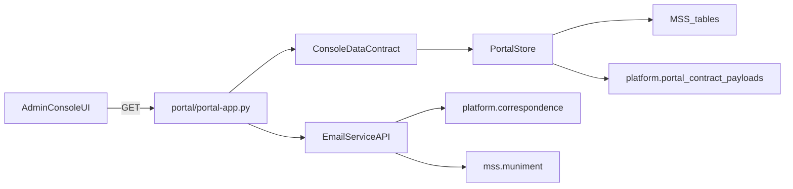

# Platform Correspondence Payload Spec

This document defines a canonical payload structure for
`platform.correspondence.<msn_id>` records. The payload mirrors the current
AWS SES/Route53/Lambda/S3 setup and scales to multi-tenant use without storing
secrets in Postgres.

## Reference-First Storage Pattern

The recommended structure is:
- `platform.correspondence.<msn_id>.json` contains **references** to canonical
  payload files (one per service user or domain).
- Each canonical payload JSON can include secret references or assumed secrets.

Example reference entry:

```json
{
  "config_ref": "platform.correspondence_payload.fnd_primary.json",
  "label": "FND primary email control-plane",
  "owner_email": "dcmontgomery@fruitfulnetworkdevelopment.com"
}
```

## Goals

- Keep the SQL schema stable while the email model evolves.
- Store only references to secrets (never access keys or SMTP passwords).
- Support multi-tenant operation with per-domain configuration.
- Allow admin console CRUD without coupling to AWS control-plane logic.

## Canonical Payload (JSON)

```json
{
  "schema_version": "1.0",
  "msn_id": "3_2_3_17_77_6_32_1_4",
  "domain": "fruitfulnetworkdevelopment.com",
  "tenant_label": "fruitful_network_development",
  "aws": {
    "account_id": "065948377733",
    "account_alias": "primary",
    "region": "us-east-1",
    "assume_role_arn": "arn:aws:iam::065948377733:role/fnd-email-controlplane",
    "external_id_secret_ref": "secretsmanager://fnd/prod/controlplane/external_id"
  },
  "dns": {
    "provider": "route53",
    "hosted_zone_id": "Z123EXAMPLE",
    "required_records": {
      "mx": [
        { "name": "@", "type": "MX", "value": "10 inbound-smtp.us-east-1.amazonaws.com" }
      ],
      "dkim_cname": [
        { "name": "abc._domainkey", "type": "CNAME", "value": "abc.dkim.amazonses.com" },
        { "name": "def._domainkey", "type": "CNAME", "value": "def.dkim.amazonses.com" },
        { "name": "ghi._domainkey", "type": "CNAME", "value": "ghi.dkim.amazonses.com" }
      ],
      "spf_txt": [
        { "name": "@", "type": "TXT", "value": "v=spf1 include:amazonses.com ~all" }
      ],
      "dmarc_txt": [
        { "name": "_dmarc", "type": "TXT", "value": "v=DMARC1; p=none; rua=mailto:dmarc@fruitfulnetworkdevelopment.com" }
      ]
    }
  },
  "ses_identity": {
    "identity_arn": "arn:aws:ses:us-east-1:065948377733:identity/fruitfulnetworkdevelopment.com",
    "verified": true,
    "dkim_enabled": true
  },
  "inbound": {
    "route_id": "inbound_fnd_default",
    "receipt_rule_set": {
      "name": "default-receive",
      "arn": "arn:aws:ses:us-east-1:065948377733:receipt-rule-set/default-receive"
    },
    "receipt_rule": {
      "name": "to-s3-then-lambda",
      "enabled": true,
      "actions": [
        { "type": "s3", "bucket": "ses-inbound-fnd-mail", "prefix": "inbox/" },
        { "type": "lambda", "function_arn": "arn:aws:lambda:us-east-1:065948377733:function:ses-forwarder" }
      ]
    },
    "forwarding": {
      "primary_address": "dcmontgomery@fruitfulnetworkdevelopment.com",
      "forward_to": ["dylancarsonmontgomery@gmail.com"]
    }
  },
  "outbound": {
    "mode": "ses_api",
    "from_addresses": [
      "dcmontgomery@fruitfulnetworkdevelopment.com",
      "newsletter@fruitfulnetworkdevelopment.com"
    ],
    "configuration_set": {
      "name": "fnd-default",
      "event_destinations": [
        { "type": "cloudwatch", "namespace": "FND/Email" },
        { "type": "sns", "topic_arn": "arn:aws:sns:us-east-1:065948377733:fnd-ses-events" }
      ]
    },
    "iam_role_arn": "arn:aws:iam::065948377733:role/fnd-email-sender",
    "smtp_secret_ref": "secretsmanager://fnd/prod/ses/smtp_credentials"
  },
  "newsletters": [
    {
      "newsletter_id": "nl_fnd_monthly",
      "name": "FND Monthly",
      "from": "newsletter@fruitfulnetworkdevelopment.com",
      "reply_to": "dcmontgomery@fruitfulnetworkdevelopment.com",
      "audience": {
        "list_ref": "db://platform.opus_subscribers?list=fnd_monthly",
        "subscribed_field": "subscribed"
      },
      "delivery": {
        "schedule": "FREQ=MONTHLY;BYDAY=MO,TU,WE,TH,FR;BYSETPOS=1;BYHOUR=9;BYMINUTE=0",
        "rate_limit_per_second": 1
      },
      "compliance": {
        "list_unsubscribe": true,
        "footer_ref": "tpl_footer_can_spam",
        "physical_address_ref": "org_profile://fnd/postal_address"
      }
    }
  ]
}
```

## Notes on Multi-Tenant Scaling

Recommended per-tenant fields to keep stable:
- `msn_id`, `domain`, `aws.account_id`, `aws.region`
- `dns.hosted_zone_id`, `ses_identity.identity_arn`
- `inbound.receipt_rule_set`, `inbound.receipt_rule`, `inbound.forwarding`
- `outbound.from_addresses`, `outbound.configuration_set`, `outbound.iam_role_arn`
- `newsletters[].audience.list_ref` and `newsletters[].audience.subscribed_field`

Keep these as references only:
- `external_id_secret_ref`, `smtp_secret_ref`

## Where Secrets Should Live

Use secret references, not plaintext credentials:
- `secretsmanager://...`
- `ssm://...`
- `vault://...`

Never store access keys or SMTP passwords inside `payload`.

## AWS Console Considerations for Multi-Tenant Use

You will likely need per-tenant AWS configuration:
- SES domain identity verified per tenant domain.
- DKIM records published in DNS.
- Receipt rules + S3 + Lambda configured per domain if inbound routing is enabled.
- Configuration set(s) per tenant if you track bounces/complaints.
- IAM role boundaries per tenant for least-privilege access.

If you need strong isolation, use one AWS account per tenant and store only the
assume-role ARN and account ID in the payload.


---


# Planned Implementation (Email Service Module Plan)

## Scope

- Admin-only console UI + CRUD/API endpoints for email domain management, with AWS SES/Route53/IAM/Lambda **references only** (no secrets in DB).
- New platform standardization `platform.correspondence.<msn_id>` with migration `006_...` and demo-data example.
- Keep runtime strictly DB-backed; demo-data only for ingestion scripts.

## Architecture Sketch



## Implementation Steps

1. **Define schema + demo-data**

   - Add migration `006_platform_correspondence.sql` under `platform-schema/` for `platform.correspondence` (jsonb payload, msn_id scoping, standardization metadata, references to AWS resources).
   - Extend demo-data with `platform.correspondence.<msn_id>.json` to mirror the new schema and SES references.
   - Update ingestion mappings so `platform.correspondence.*` is stored as `portal_configuration` payloads and optionally mirrored into the new `platform.correspondence` table.

2. **Data access + contract shape**

   - Add PortalStore helpers for `platform.correspondence` reads/writes (admin-only).
   - Extend `ConsoleDataContract` to include correspondence payload(s) for admin view.
   - Ensure reads do **not** default to `demo-data` ingest source for runtime queries (explicitly accept all or a configured source).

3. **Admin console UI (new module)**

   - Add admin route and template for Email Service overview: list domains, identities, inbound/outbound handlers, and newsletter configs.
   - Provide CRUD forms (create/update/delete) that hit the admin API endpoints.
   - Keep tenant console unchanged for now.

4. **API blueprints (admin-only)**

   - Add admin API endpoints for `platform.correspondence` CRUD (JSON only).
   - Add muniment-aware public endpoints for subscribe/unsubscribe stubs (no live AWS calls yet).
   - Guard all admin endpoints with `is_root_admin`.

5. **Documentation**

   - Update `/srv/compose/platform/README.md` with new `platform.correspondence` scope and admin-only email module.
   - Update `/srv/compose/platform/flask-bff/README.md` for runbook changes (migration `006`, demo-data ingestion notes, API endpoint list).

## Files to Touch

- [`platform-schema/006_platform_correspondence.sql`](/srv/compose/platform/platform-schema/006_platform_correspondence.sql)
- [`flask-bff/demo-data/platform.correspondence.<msn_id>.json`](/srv/compose/platform/flask-bff/demo-data/platform.correspondence.3_2_3_17_77_6_32_1_4.json)
- [`flask-bff/scripts/demo_data_common.py`](/srv/compose/platform/flask-bff/scripts/demo_data_common.py)
- [`flask-bff/scripts/ingest_demo_data.py`](/srv/compose/platform/flask-bff/scripts/ingest_demo_data.py)
- [`flask-bff/portal/portal_store.py`](/srv/compose/platform/flask-bff/portal/portal_store.py)
- [`flask-bff/portal/console/console_data.py`](/srv/compose/platform/flask-bff/portal/console/console_data.py)
- [`flask-bff/portal/portal-app.py`](/srv/compose/platform/flask-bff/portal/portal-app.py)
- [`flask-bff/portal/console/UI/`](/srv/compose/platform/flask-bff/portal/console/UI/)
- [`README.md`](/srv/compose/platform/README.md), [`flask-bff/README.md`](/srv/compose/platform/flask-bff/README.md)

## Todos

- **schema-006**: Add `platform.correspondence` migration and demo-data example.
- **ingest-map**: Map `platform.correspondence.*` into ingestion + new table.
- **store-access**: Add `PortalStore` CRUD helpers for correspondence records.
- **admin-ui**: Build admin email module templates + route wiring.
- **admin-api**: Add admin CRUD endpoints + muniment-aware public stubs.
- **docs**: Update platform and BFF READMEs with new module + runbook steps.